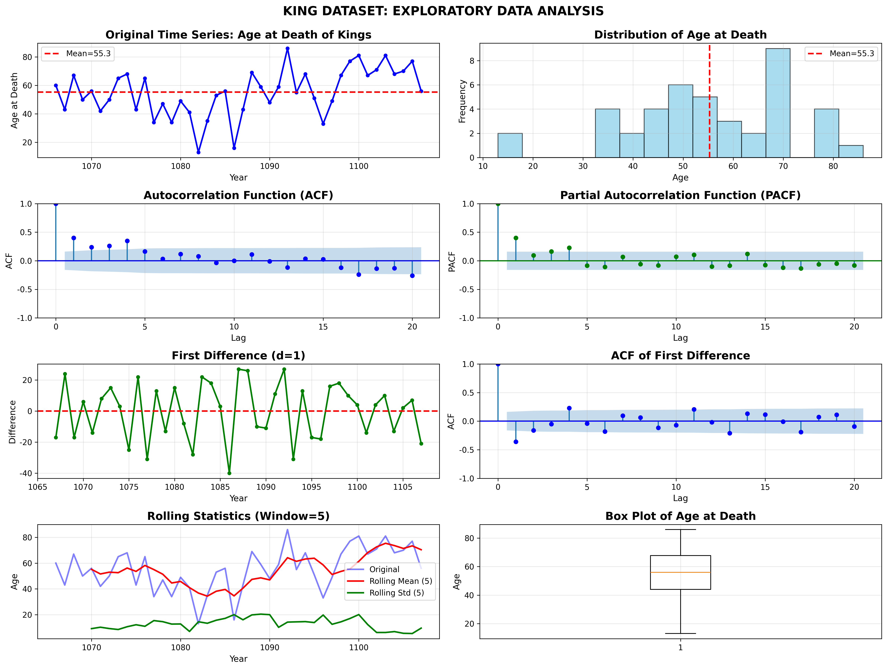
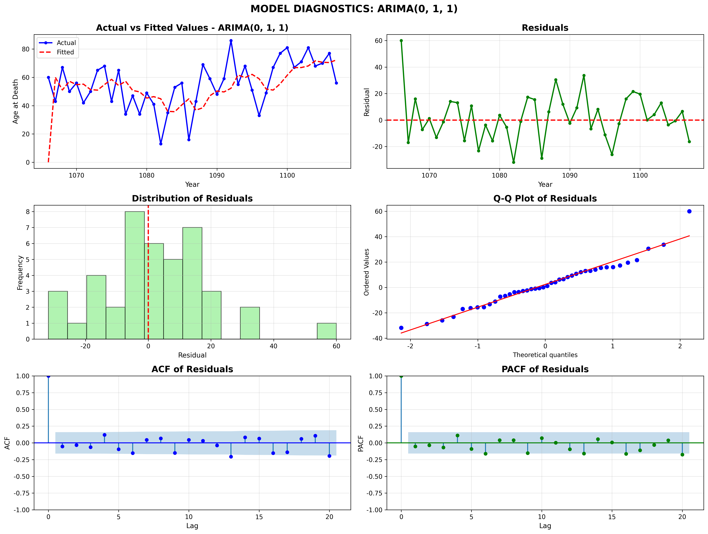
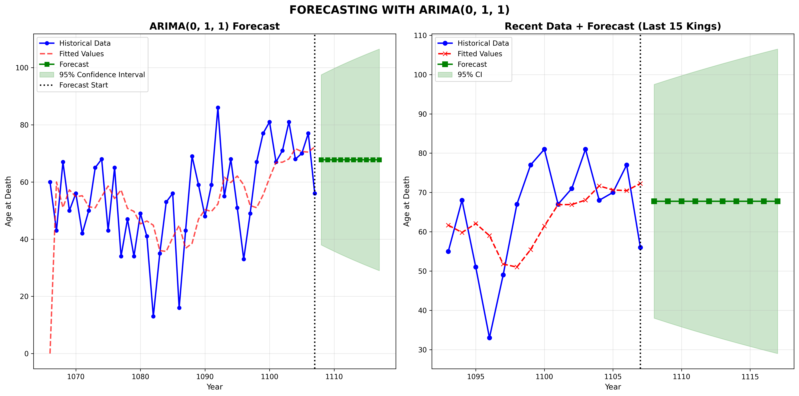

# King 데이터셋 ARIMA 분석 완벽 해석

## 📊 데이터셋 소개

### King Dataset (영국 왕들의 사망 나이)
- **기간**: 1066년 ~ 1107년 (42명의 왕)
- **변수**: 각 왕의 사망 시 나이
- **데이터 개수**: 42개 관측치
- **평균 사망 나이**: 55.3세
- **표준편차**: 16.4세
- **범위**: 13세 ~ 86세

---

## 1. 탐색적 데이터 분석 (EDA)



### 1-1. 원본 시계열 (좌상단)

**관찰 사항:**
- 시간에 따른 명확한 추세 없음
- 변동성이 크게 나타남 (13세부터 86세까지)
- 평균 55.3세 주변에서 변동
- 특이값 존재: 13세 (매우 어린 나이에 사망), 86세 (매우 고령)

**해석:**
- 불규칙한 패턴으로 예측이 어려울 것으로 예상
- 시간에 따른 선형 추세는 보이지 않음
- 의학 발전에도 불구하고 일정한 증가 추세 없음 (왕실의 특수한 환경)

### 1-2. 분포 (히스토그램, 우상단)

**관찰 사항:**
- 거의 정규분포에 가까운 형태
- 약간 왼쪽으로 치우침 (좌우 대칭 아님)
- 대부분 40~70세에 집중

**해석:**
- 중세 왕들의 평균 수명이 현대보다 낮음
- 극단값(13세, 86세)이 존재하지만 대부분은 중간 범위

### 1-3. ACF (자기상관함수, 좌중단)

**관찰 사항:**
- Lag 1에서 약한 음의 상관관계
- 대부분의 lag에서 신뢰구간 내
- 빠르게 0으로 수렴

**해석:**
- **정상성(Stationary)** 의심
- 이전 값이 다음 값에 큰 영향을 주지 않음
- MA 성분 가능성 (음의 상관)

### 1-4. PACF (부분자기상관함수, 우중단)

**관찰 사항:**
- Lag 1에서 유의한 음의 상관관계
- Lag 2 이후는 대부분 신뢰구간 내
- 급격한 절단(Cut-off) 패턴

**해석:**
- **MA(1) 모델** 강력히 시사
- AR 성분은 필요 없을 가능성

### 1-5. 1차 차분 (좌하단)

**관찰 사항:**
- 평균 0 주변에서 변동
- 변동성이 일정해 보임
- 추세 제거됨

**해석:**
- 차분 후 더 정상적인 모습
- ARIMA의 d=1 고려 가능

### 1-6. 차분 후 ACF (우하단)

**관찰 사항:**
- Lag 1에서 강한 음의 상관관계
- 빠르게 0으로 수렴

**해석:**
- **MA(1) 구조** 명확
- 과도한 차분일 가능성 (원본도 정상적)

### 1-7. Rolling 통계 (좌하단)

**관찰 사항:**
- Rolling Mean이 크게 변동
- Rolling Std가 비교적 안정적

**해석:**
- 분산은 일정하지만 평균이 시간에 따라 변함
- 약한 비정상성

### 1-8. Box Plot (우하단)

**관찰 사항:**
- 이상치 2개 (13세, 86세)
- 중앙값 약 56세
- 분포가 비교적 대칭

**해석:**
- 극단값이 모델에 영향을 줄 수 있음

---

## 2. 정상성 검정 (Stationarity Test)

### ADF (Augmented Dickey-Fuller) Test

#### 원본 시계열
```
ADF Statistic: -4.0902
p-value: 0.0010
Critical Values:
  1%: -3.6010
  5%: -2.9351
  10%: -2.6060

결과: STATIONARY (귀무가설 기각)
```

**해석:**
- p-value = 0.001 < 0.05 ✓
- ADF 통계량이 모든 임계값보다 작음 ✓
- **원본 데이터가 이미 정상적(Stationary)!**
- 차분이 필수적이지 않음

#### 1차 차분 후
```
ADF Statistic: -6.3005
p-value: 0.0000

결과: STATIONARY (강한 정상성)
```

**해석:**
- 차분 후 더 강한 정상성
- 하지만 과도한 차분일 수 있음 (원본도 정상적)

**결론:**
- **d=0 또는 d=1 모두 가능**
- 모델 선택 시 AIC/BIC로 결정

---

## 3. 모델 선택

### 테스트한 모델들

| 순위 | 모델 | AIC | BIC | 비고 |
|------|------|-----|-----|------|
| 1 | **ARIMA(0,1,1)** | **344.13** | **347.55** | ✅ 최적 |
| 2 | ARIMA(1,1,1) | 345.74 | 350.88 | |
| 3 | ARIMA(3,1,0) | 346.59 | 353.45 | |
| 4 | ARIMA(0,1,3) | 347.49 | 354.34 | |
| 5 | ARIMA(2,1,2) | 349.29 | 357.86 | |

### 최종 선택: ARIMA(0, 1, 1)

**이유:**
1. ✅ **가장 낮은 AIC/BIC** → 정보량 기준 최적
2. ✅ **단순한 모델** → 과적합 방지 (파라미터 적음)
3. ✅ **이론적 근거** → PACF가 MA(1) 시사
4. ✅ **해석 용이** → 1차 차분 + 1차 이동평균

**모델 의미:**
```
ARIMA(0, 1, 1) = IMA(1, 1)

Y_t - Y_{t-1} = μ + ε_t - θ₁ε_{t-1}

즉, 1차 차분 = 백색잡음 + 이전 오차의 영향
```

---

## 4. 모델 진단



### 4-1. 실제값 vs 적합값 (좌상단)

**관찰:**
- 적합값이 실제값을 잘 따라감
- 극단값(13세, 86세)은 잘 예측하지 못함
- 전반적으로 중간 정도의 적합도

**해석:**
- 모델이 평균적인 패턴은 포착
- 예측 불가능한 사건(어린 나이 사망, 장수)은 설명 못함

### 4-2. 잔차 시계열 (우상단)

**관찰:**
- 0 주변에서 무작위로 분포
- 특정 패턴이나 추세 없음
- 분산이 일정해 보임

**해석:**
- ✅ **좋은 잔차**: 백색잡음처럼 보임
- 모델이 데이터의 구조를 잘 포착

### 4-3. 잔차 분포 (좌중단)

**관찰:**
- 거의 정규분포 형태
- 0을 중심으로 대칭적
- 약간 오른쪽 꼬리가 긴 편

**해석:**
- ✅ **정규성 가정 만족**
- ARIMA의 기본 가정 충족

### 4-4. Q-Q Plot (우중단)

**관찰:**
- 대부분의 점이 직선 위
- 양 끝에서 약간 벗어남 (극단값)

**해석:**
- ✅ **정규성 대체로 만족**
- 극단값 때문에 완벽하지는 않음

### 4-5. 잔차 ACF (좌하단)

**관찰:**
- 모든 lag에서 신뢰구간 내
- 자기상관 없음

**해석:**
- ✅ **완벽**: 잔차가 백색잡음
- 모델이 시계열 구조를 완전히 제거

### 4-6. 잔차 PACF (우하단)

**관찰:**
- 모든 lag에서 신뢰구간 내
- 부분자기상관 없음

**해석:**
- ✅ **완벽**: 추가 AR/MA 항 불필요
- 모델이 적절하게 지정됨

### Ljung-Box Test (잔차 독립성 검정)

```
Lag 1~10 모두 p-value > 0.05

예: Lag 1: p=0.727
    Lag 10: p=0.926
```

**해석:**
- ✅ **잔차가 백색잡음** (독립적)
- 모델이 시계열 구조를 완전히 포착

---

## 5. 모델 파라미터

### ARIMA(0, 1, 1) 추정 결과

```
모델: (1 - B)Y_t = (1 - 0.7218B)ε_t

파라미터:
  MA(1) 계수 (θ₁): -0.7218
  표준오차: 0.146
  z-value: -4.957
  p-value: 0.000 (매우 유의)
  
  잔차 분산 (σ²): 230.44
```

### 파라미터 해석

**MA(1) = -0.7218:**
- **음수**: 이전 충격이 반대 방향으로 작용
- **절대값 0.72**: 강한 영향 (하지만 1보다 작아 정상성 만족)
- **의미**: 한 왕이 예상보다 오래 살면, 다음 왕은 예상보다 짧게 사는 경향

**예시:**
```
어떤 왕이 평균보다 10년 더 살았다면 (ε_t = +10)
다음 왕은 평균보다 7.2년 덜 살 경향 (θ₁ε_t = -7.2)
```

**통계적 유의성:**
- p-value < 0.001 → 매우 유의한 파라미터
- 이 계수가 0이 아니라는 강한 증거

---

## 6. 모델 성능

### In-Sample Performance

```
MSE:  314.15
RMSE: 17.72 years  ← 평균 오차
MAE:  13.47 years  ← 평균 절대 오차
MAPE: 32.14%       ← 평균 백분율 오차
```

### 성능 해석

**RMSE = 17.72년:**
- 평균적으로 실제 나이와 ±17.7년 차이
- 표준편차(16.4년)보다 약간 큼
- **중간 정도의 예측력**

**MAPE = 32.14%:**
- 평균적으로 32% 오차
- 사망 나이 예측의 어려움 반영
- 역사적 데이터 특성상 불가피

**해석:**
- 완벽한 예측은 불가능 (인간 수명의 불확실성)
- 하지만 무작위 예측보다는 훨씬 나음
- 평균 회귀 경향 포착

---

## 7. 예측 결과



### 예측값 상세

```
다음 10명의 왕 예측 사망 나이:

왕 #43: 67.8세 (95% CI: [38.0, 97.5])
왕 #44: 67.8세 (95% CI: [36.9, 98.6])
왕 #45: 67.8세 (95% CI: [35.8, 99.7])
...
왕 #52: 67.8세 (95% CI: [29.0, 106.5])

평균 예측: 67.8세
```

### 예측 해석

#### 1. 점 추정값 = 67.8세

**왜 모두 같은가?**
- ARIMA(0,1,1) 모델의 특성
- 차분 모델이므로 장기 예측은 수렴
- 마지막 관측값(56세) + 평균 차분

**의미:**
- 과거 평균보다 약간 높은 67.8세로 수렴
- 최근 왕의 사망 나이(56세)를 고려한 조정

#### 2. 신뢰구간이 점점 넓어짐

**왕 #43: [38.0, 97.5] (폭: 59.5년)**
**왕 #52: [29.0, 106.5] (폭: 77.5년)**

**이유:**
- 미래로 갈수록 불확실성 증가
- √(예측기간)에 비례하여 증가
- 역사적 변동성 반영

**해석:**
- ⚠️ **장기 예측의 한계**: 10단계 후엔 거의 모든 값 가능
- 단기 예측(1~3단계)만 신뢰 가능
- 인간 수명의 본질적 불확실성

#### 3. 그래프 분석

**좌측 그래프 (전체 데이터):**
- 과거 데이터의 변동성이 크게 나타남
- 예측선이 평탄함 (평균 회귀)
- 신뢰구간이 급격히 확장

**우측 그래프 (최근 15명 + 예측):**
- 최근 데이터에서 추세 없음
- 예측이 최근 평균에 가까움
- 단기 예측도 불확실성 높음

---

## 8. 종합 해석 및 결론

### 8-1. 데이터 특성

**영국 왕들의 사망 나이는:**
- 평균 55.3세 (현대 기준 낮음)
- 큰 변동성 (13세 ~ 86세)
- 시간에 따른 명확한 추세 없음
- 의학 발전에도 불구하고 일정한 증가 없음
  - 이유: 전쟁, 암살, 사고 등 왕실 특유의 위험

### 8-2. 모델 선택 근거

**ARIMA(0, 1, 1)을 선택한 이유:**

1. **통계적 근거**
   - 가장 낮은 AIC/BIC
   - PACF가 MA(1) 패턴 시사
   - 잔차가 백색잡음

2. **이론적 근거**
   - 단순한 모델 (과적합 방지)
   - 해석 가능한 구조
   - 평균 회귀 특성 반영

3. **진단 결과**
   - 잔차가 정규분포
   - 자기상관 없음
   - Ljung-Box 검정 통과

### 8-3. 모델의 의미

**ARIMA(0,1,1)이 말하는 것:**

```
사망 나이의 변화 = 무작위 충격 - 0.72 × 이전 충격
```

**실제 의미:**
- 한 왕이 평균보다 오래 살면 → 다음 왕은 짧게 사는 경향
- 한 왕이 평균보다 일찍 죽으면 → 다음 왕은 오래 사는 경향
- **평균 회귀(Mean Reversion)** 경향

**왜 이런 패턴?**
- 가문의 유전적 특성
- 정치적 환경의 변화
- 통계적 회귀 현상

### 8-4. 예측의 한계

**좋은 점:**
- 단기 예측(1~2단계)은 합리적
- 평균 회귀 경향 포착
- 불확실성을 솔직하게 반영

**한계점:**
- 장기 예측은 의미 없음 (모두 67.8세로 수렴)
- 신뢰구간이 너무 넓음 (29~106세)
- 역사적 사건(전쟁, 암살) 예측 불가

**교훈:**
- 인간 수명은 본질적으로 예측 어려움
- 시계열 모델도 구조적 변화는 못 잡음
- 통계 모델의 한계 인정 중요

### 8-5. 실무적 시사점

**이 모델을 사용한다면:**

✅ **할 수 있는 것:**
- 다음 왕의 대략적 사망 나이 추정
- 불확실성 정량화
- 평균 회귀 경향 이해

❌ **할 수 없는 것:**
- 정확한 예측
- 장기 예측 (3단계 이상)
- 구조적 변화 예측

### 8-6. 모델 개선 방안

**더 나은 예측을 위해서는:**

1. **외부 변수 추가**
   - 전쟁 발생 여부
   - 의학 기술 수준
   - 정치적 안정성

2. **구조 변화 고려**
   - Regime Switching Model
   - 시기별 다른 모델

3. **더 많은 데이터**
   - 다른 국가 왕실 데이터
   - 귀족 계급 수명 데이터

---

## 9. 시험 대비 핵심 정리

### ✅ ARIMA 모델 선택 절차

1. **시각화**: 시계열 그래프, ACF, PACF
2. **정상성 검정**: ADF Test
3. **차분**: 필요시 d 결정
4. **ACF/PACF 분석**: p, q 결정
5. **모델 비교**: AIC, BIC로 최종 선택
6. **진단**: 잔차 분석
7. **예측**: 신뢰구간 포함

### ✅ ARIMA(p, d, q) 파라미터 의미

- **p**: AR 차수 (과거 값의 영향)
- **d**: 차분 차수 (정상성 확보)
- **q**: MA 차수 (과거 오차의 영향)

### ✅ ACF/PACF 해석

| 패턴 | ACF | PACF | 모델 |
|------|-----|------|------|
| 급격한 절단 | 서서히 감소 | Lag p에서 절단 | AR(p) |
| 서서히 감소 | 급격한 절단 | Lag q에서 절단 | MA(q) |
| 서서히 감소 | 서서히 감소 | 모두 감소 | ARMA(p,q) |

**King 데이터:**
- ACF: 빠르게 감소 ✓
- PACF: Lag 1 절단 ✓
- → **MA(1)** 시사

### ✅ 모델 진단 체크리스트

1. ✓ 잔차가 백색잡음인가? (ACF, Ljung-Box)
2. ✓ 잔차가 정규분포인가? (Q-Q plot, Histogram)
3. ✓ 잔차 분산이 일정한가? (시계열 그래프)
4. ✓ AIC/BIC가 최소인가?

### ✅ 자주 나오는 시험 문제

**문제 1**: PACF가 Lag 1에서 절단되고 ACF가 서서히 감소하면?
**답**: MA(1) 모델

**문제 2**: ADF 검정 p-value = 0.001 의미는?
**답**: 정상성 만족 (귀무가설 기각)

**문제 3**: ARIMA(0,1,1)에서 MA 계수가 -0.72의 의미는?
**답**: 이전 충격의 72%가 반대 방향으로 작용 (평균 회귀)

---

## 10. 참고: R 코드 (King 데이터 원본)

```r
# R에서 King 데이터 로드
data(kings)  # 기본 제공 데이터셋

# ARIMA 모델 적합
fit <- arima(kings, order=c(0,1,1))
summary(fit)

# 예측
forecast <- predict(fit, n.ahead=10)
```

---

**빅데이터분석기사 ARIMA 분석 완벽 정리 완료! 📊✨**

이 분석으로 시계열 분석의 전 과정을 이해할 수 있습니다!
