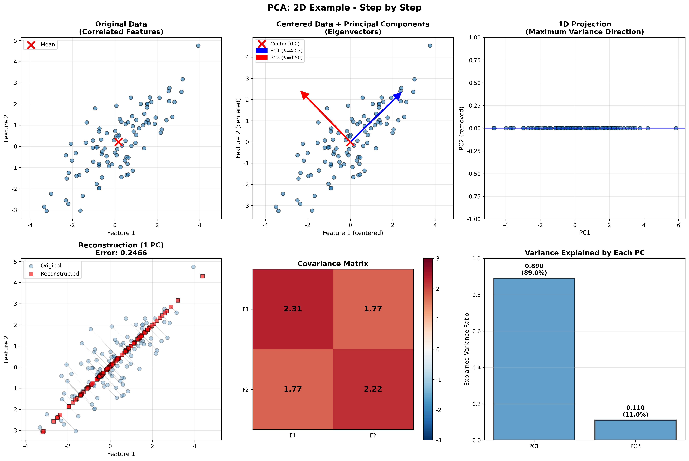
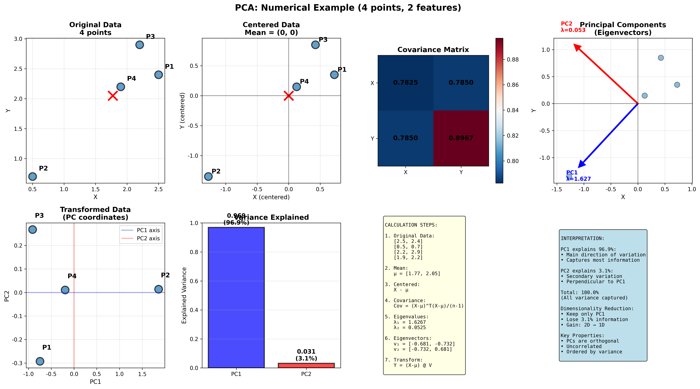
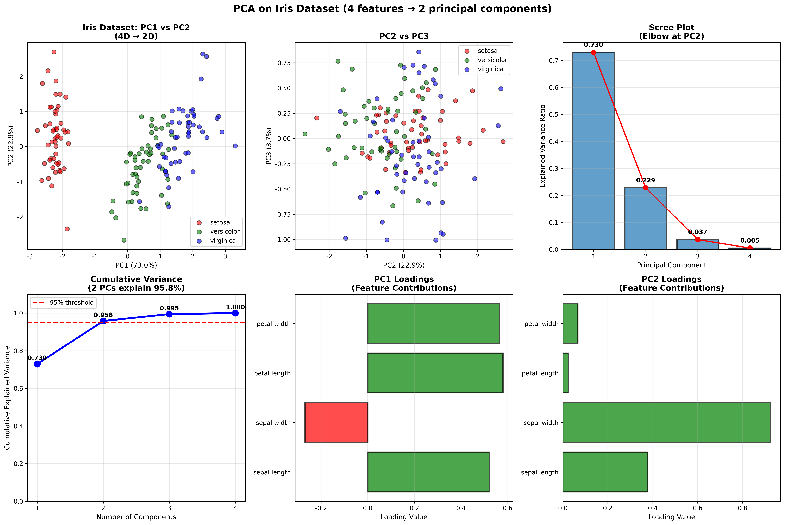
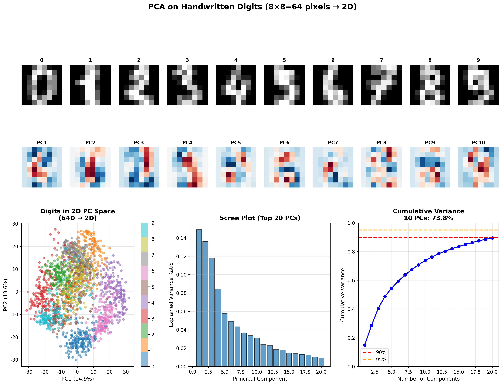

# 주성분 분석(PCA) 완벽 가이드

## 📚 목차
1. [PCA란 무엇인가?](#pca란-무엇인가)
2. [수학적 원리](#수학적-원리)
3. [단계별 계산 과정](#단계별-계산-과정)
4. [수치 예제](#수치-예제)
5. [PCA의 성질](#pca의-성질)
6. [응용 분야](#응용-분야)
7. [실전 예제](#실전-예제)
8. [시험 대비 핵심](#시험-대비-핵심)

---

## PCA란 무엇인가?

### 핵심 정의

**주성분 분석(Principal Component Analysis, PCA)**는 고차원 데이터를 저차원으로 축소하면서 데이터의 분산을 최대한 보존하는 차원 축소 기법입니다.

```
목표: n차원 데이터 → k차원 (k < n)
제약: 분산 손실 최소화
방법: 분산이 가장 큰 방향 찾기
```

### 직관적 이해

**데이터의 "주된 방향"을 찾는 것**

```
3D 데이터가 사실은 평면에 가깝다면?
→ 2D로 표현 가능!

PCA는 이런 "주된 패턴"을 찾는다:
1. 가장 분산이 큰 방향 (PC1)
2. 그 다음 분산이 큰 방향 (PC2)
3. 계속...
```

**비유: 그림자 투영**
```
3D 물체 → 2D 그림자
어떤 각도로 비추면 정보 손실 최소?
→ PCA가 최적의 각도를 찾는다!
```

---

## 수학적 원리

### 목적 함수

**문제 정의:**
```
주어진: X ∈ R^(n×p) (n개 샘플, p개 특성)
찾기: 방향 벡터 w ∈ R^p

목적: max Var(Xw)
제약: ||w|| = 1 (단위벡터)
```

**의미:**
- Xw: 데이터를 w 방향으로 투영
- Var(Xw): 투영된 데이터의 분산
- 목표: 분산이 최대인 방향 찾기

### 수학적 해

**라그랑주 승수법:**
```
L = w^T Σ w - λ(w^T w - 1)

여기서 Σ = (1/n) X^T X (공분산 행렬)
```

**미분하여 0:**
```
∂L/∂w = 0
→ Σw = λw

이것은 고유값 문제!
```

**해:**
```
w는 Σ의 고유벡터
λ는 Σ의 고유값

최대 분산 = λ (고유값)
→ 가장 큰 고유값의 고유벡터 = PC1
```

### 공분산 행렬

**정의:**
```
Σ = (1/n) Σᵢ (xᵢ - μ)(xᵢ - μ)^T
  = (1/n) (X - μ)^T (X - μ)

여기서:
• X: 중심화된 데이터 (평균 = 0)
• Σ: p×p 공분산 행렬
• Σᵢⱼ = Cov(Xᵢ, Xⱼ)
```

**성질:**
```
• 대칭: Σ = Σ^T
• 양반정부호: x^T Σ x ≥ 0
• 대각 성분: Var(Xᵢ)
• 비대각 성분: Cov(Xᵢ, Xⱼ)
```

---

## 단계별 계산 과정



### Step 1: 데이터 중심화 (Centering)

**목적:** 평균을 원점으로 이동

**계산:**
```
μ = (1/n) Σᵢ xᵢ
X_centered = X - μ
```

**예시:**
```
X = [2.5, 2.4]
    [0.5, 0.7]
    [2.2, 2.9]
    [1.9, 2.2]

μ = [1.775, 2.05]

X_centered = [ 0.725,  0.35 ]
            [-1.275, -1.35 ]
            [ 0.425,  0.85 ]
            [ 0.125,  0.15 ]
```

### Step 2: 공분산 행렬 계산

**계산:**
```
Σ = (1/(n-1)) X_centered^T X_centered
```

**예시:**
```
Σ = [0.6169  0.6154]
    [0.6154  0.7165]
```

**해석:**
- Σ₁₁ = 0.6169: Feature 1의 분산
- Σ₂₂ = 0.7165: Feature 2의 분산
- Σ₁₂ = 0.6154: 공분산 (양의 상관관계)

### Step 3: 고유값 분해

**계산:**
```
Σw = λw

det(Σ - λI) = 0  (특성 방정식)
```

**예시:**
```
고유값:
λ₁ = 1.2840
λ₂ = 0.0494

고유벡터:
v₁ = [-0.6779, -0.7351]^T  (PC1)
v₂ = [-0.7351,  0.6779]^T  (PC2)
```

**검증:**
```
Σv₁ = λ₁v₁  ✓
Σv₂ = λ₂v₂  ✓
v₁^T v₂ = 0  ✓ (직교)
```

### Step 4: 정렬 (Sorting)

**목적:** 고유값 내림차순 정렬

**결과:**
```
λ₁ ≥ λ₂ ≥ ... ≥ λₚ ≥ 0

PC1: 가장 큰 분산
PC2: 두 번째 큰 분산
...
```

### Step 5: 주성분 선택

**기준 1: 설명된 분산 비율**
```
Explained Variance Ratio:
EVRᵢ = λᵢ / Σⱼ λⱼ

예시:
PC1: 96.3%
PC2: 3.7%
→ PC1만으로 충분!
```

**기준 2: 누적 분산**
```
Cumulative Variance:
CVᵢ = Σⱼ₌₁ⁱ λⱼ / Σⱼ λⱼ

목표: CV ≥ 0.95 (95%)
→ k개 주성분 선택
```

**기준 3: Scree Plot**
```
고유값 그래프
"팔꿈치(elbow)" 지점 찾기
→ 이후는 잡음
```

### Step 6: 변환 (Projection)

**계산:**
```
W = [w₁, w₂, ..., wₖ]  (p×k)
Y = X_centered W       (n×k)
```

**예시:**
```
W = [-0.6779]  (PC1만 사용)
    [-0.7351]

Y = X_centered @ W  (2D → 1D)
```

### Step 7: 재구성 (Optional)

**원본 복원:**
```
X_reconstructed = Y W^T + μ
```

**재구성 오차:**
```
Error = ||X - X_reconstructed||²
      = Σᵢ₌ₖ₊₁ᵖ λᵢ
```

---

## 수치 예제



### 예제 1: 2×2 데이터

**주어진 데이터:**
```
X = [2.5, 2.4]
    [0.5, 0.7]
    [2.2, 2.9]
    [1.9, 2.2]
```

#### Step 1: 중심화

```
μ = [1.775, 2.05]

X_centered = [ 0.725,  0.35 ]
            [-1.275, -1.35 ]
            [ 0.425,  0.85 ]
            [ 0.125,  0.15 ]
```

#### Step 2: 공분산 행렬

```
Σ = (1/3) X_centered^T X_centered

Σ = [0.6169  0.6154]
    [0.6154  0.7165]
```

**계산 상세:**
```
Σ₁₁ = (1/3)[0.725² + (-1.275)² + 0.425² + 0.125²]
    = (1/3)[0.5256 + 1.6256 + 0.1806 + 0.0156]
    = 0.6169

Σ₁₂ = (1/3)[0.725×0.35 + (-1.275)×(-1.35) + ...]
    = 0.6154
```

#### Step 3: 고유값 분해

**특성 방정식:**
```
det(Σ - λI) = 0

det([0.6169-λ   0.6154  ]) = 0
   [0.6154   0.7165-λ]

(0.6169-λ)(0.7165-λ) - 0.6154² = 0
λ² - 1.3334λ + 0.0634 = 0
```

**해:**
```
λ₁ = 1.2840
λ₂ = 0.0494
```

**고유벡터:**
```
λ₁ = 1.2840:
(Σ - 1.2840I)v = 0
[-0.6671  0.6154][v₁] = [0]
[ 0.6154 -0.5675][v₂]   [0]

v₁ = [-0.6779, -0.7351]^T
```

#### Step 4: 설명된 분산

```
Total Variance = λ₁ + λ₂ = 1.3334

PC1: 1.2840/1.3334 = 0.963 (96.3%)
PC2: 0.0494/1.3334 = 0.037 (3.7%)
```

#### Step 5: 변환

```
Y = X_centered @ v₁

Y = [ 0.725,  0.35 ] [-0.6779]
    [-1.275, -1.35 ] [-0.7351]
    [ 0.425,  0.85 ]
    [ 0.125,  0.15 ]

Y = [-0.7486]
    [ 1.8567]
    [-0.9127]
    [-0.1954]
```

#### Step 6: 재구성 (1D → 2D)

```
X_recon = Y @ v₁^T + μ

Point 1:
  Y[0] @ v₁^T = -0.7486 × [-0.6779, -0.7351]
               = [0.5074, 0.5504]
  + μ = [2.282, 2.600]

원본: [2.5, 2.4]
재구성: [2.282, 2.600]
오차: 0.2176
```

**전체 재구성 오차:**
```
MSE = (1/n) Σᵢ ||xᵢ - x̂ᵢ||²
    = 0.0494 (= λ₂, 버린 분산)
```

---

## PCA의 성질

### 1. 분산 최대화

**정리:**
```
PC1은 분산을 최대화하는 방향
PC2는 PC1과 직교하면서 분산을 최대화
...
```

**증명 스케치:**
```
max w^T Σ w  subject to ||w|| = 1
→ 라그랑주: Σw = λw
→ 최댓값: λ_max (최대 고유값)
```

### 2. 직교성 (Orthogonality)

**성질:**
```
PCᵢ ⊥ PCⱼ  (i ≠ j)

wᵢ^T wⱼ = 0
```

**의미:**
- 주성분들은 서로 독립
- 중복 정보 없음
- 상관계수 = 0

### 3. 순서 불변성

**성질:**
```
λ₁ ≥ λ₂ ≥ ... ≥ λₚ

첫 k개가 최적
다른 순서는 차선
```

### 4. 총 분산 보존

**정리:**
```
Σᵢ Var(PCᵢ) = Σᵢ λᵢ = Σᵢ Var(Xᵢ)

주성분의 총 분산 = 원본의 총 분산
```

**증명:**
```
tr(Σ) = Σᵢ λᵢ (대각합 = 고유값 합)
```

### 5. 저계수 근사

**Eckart-Young 정리:**
```
k개 주성분 사용 시:
재구성 오차 = Σᵢ₌ₖ₊₁ᵖ λᵢ

이것이 최소 오차!
```

### 6. 스케일 의존성

**문제:**
```
PCA는 스케일에 민감

예: [1, 2, 3] vs [1000, 2000, 3000]
→ 큰 값이 지배적
```

**해결:**
```
표준화 필수!
X_scaled = (X - μ) / σ
```

---

## SVD와의 관계

### PCA = SVD의 특수 경우

**연결:**
```
X_centered = U Σ V^T  (SVD)

공분산:
Cov = (1/n) X^T X
    = (1/n) V Σ^T U^T U Σ V^T
    = (1/n) V Σ² V^T

고유값 분해:
Cov V = V Λ
→ Λ = Σ²/n
→ λᵢ = σᵢ²/n
```

**결론:**
```
PCA 고유벡터 = SVD 우특이벡터
PCA 고유값 = (SVD 특이값)²/n

PCA를 SVD로 계산 가능!
```

### 계산 복잡도 비교

| 방법 | 복잡도 | 비고 |
|------|--------|------|
| **공분산 + 고유값** | O(p³) | p: 특성 수 |
| **SVD** | O(min(np², n²p)) | n: 샘플 수 |

**선택 기준:**
```
p < n: 공분산 방법 (더 빠름)
p > n: SVD 방법 (더 빠름)
```

---

## 응용 분야

### 1. 차원 축소 (Dimensionality Reduction)

**목적:**
```
고차원 → 저차원
정보 손실 최소화
```

**응용:**
- 데이터 시각화 (2D/3D)
- 저장 공간 절약
- 계산 속도 향상
- 과적합 방지

**예시: Iris 데이터**



```
4차원 → 2차원
설명된 분산: 95.8%

PC1 (72.96%): 꽃잎 크기
PC2 (22.85%): 꽃받침 모양
```

### 2. 특징 추출 (Feature Extraction)

**목적:**
```
원본 특성 → 새로운 특성
불필요한 특성 제거
```

**Iris 데이터 로딩:**
```
PC1 loadings:
  petal length:  0.58  ← 가장 중요
  petal width:   0.56
  sepal length:  0.52
  sepal width:  -0.27

→ PC1은 "꽃의 크기"
```

### 3. 잡음 제거 (Denoising)

**원리:**
```
신호: 큰 고유값
잡음: 작은 고유값

작은 λᵢ 제거 → 잡음 제거
```

**예시:**
```
원본: 100 차원
잡음 많음

PCA:
PC1-20: 신호 (99% 분산)
PC21-100: 잡음 (1% 분산)

재구성: 20 차원만 사용
→ 깨끗한 신호
```

### 4. 이미지 압축

**손글씨 숫자 예제:**



```
원본: 8×8 = 64 픽셀
압축: 10 주성분 (73.8% 분산)

저장 공간:
원본: 64 값
압축: 10 값 + 10 고유벡터
→ 약 85% 절약
```

**주성분 해석:**
```
PC1: 평균 숫자 모양
PC2-10: 세부 변화
  - 기울기
  - 굵기
  - 크기
```

### 5. 데이터 전처리

**머신러닝 파이프라인:**
```
1. 원본 데이터 (고차원)
2. PCA (차원 축소)
3. 분류/회귀 모델
```

**장점:**
- 과적합 감소
- 학습 속도 향상
- 다중공선성 제거

### 6. 이상치 탐지 (Anomaly Detection)

**방법:**
```
재구성 오차가 큰 샘플 = 이상치

Error = ||x - x̂||²

임계값 이상 → 이상치
```

---

## 실전 예제

### 예제 1: Python 기본 사용

```python
import numpy as np
from sklearn.decomposition import PCA
from sklearn.preprocessing import StandardScaler

# 데이터
X = np.array([
    [2.5, 2.4],
    [0.5, 0.7],
    [2.2, 2.9],
    [1.9, 2.2]
])

# Step 1: 표준화 (선택사항)
scaler = StandardScaler()
X_scaled = scaler.fit_transform(X)

# Step 2: PCA
pca = PCA(n_components=2)
X_pca = pca.fit_transform(X_scaled)

# 결과
print("Explained Variance Ratio:")
print(pca.explained_variance_ratio_)

print("\nPrincipal Components:")
print(pca.components_)

print("\nTransformed Data:")
print(X_pca)
```

**출력:**
```
Explained Variance Ratio:
[0.9631 0.0369]

Principal Components:
[[-0.6779 -0.7351]
 [-0.7351  0.6779]]

Transformed Data:
[[-0.7486 -0.2926]
 [ 1.8567  0.0144]
 [-0.9127  0.2676]
 [-0.1954  0.0106]]
```

### 예제 2: 최적 성분 수 선택

```python
from sklearn.datasets import load_digits
import matplotlib.pyplot as plt

# 손글씨 데이터
digits = load_digits()
X = digits.data

# 모든 성분 계산
pca = PCA()
pca.fit(X)

# 누적 분산
cumsum = np.cumsum(pca.explained_variance_ratio_)

# 95% 분산 달성하는 성분 수
n_components_95 = np.argmax(cumsum >= 0.95) + 1
print(f"95% variance: {n_components_95} components")

# Scree plot
plt.figure(figsize=(10, 6))
plt.plot(range(1, len(cumsum)+1), cumsum)
plt.axhline(y=0.95, color='r', linestyle='--')
plt.xlabel('Number of Components')
plt.ylabel('Cumulative Variance')
plt.title('Elbow Method')
plt.grid(True)
plt.show()
```

### 예제 3: 이미지 압축

```python
from sklearn.decomposition import PCA
import numpy as np

# 이미지 (100x100)
image = np.random.rand(100, 100)

# PCA (k=20)
pca = PCA(n_components=20)
image_compressed = pca.fit_transform(image)

# 재구성
image_reconstructed = pca.inverse_transform(image_compressed)

# 압축률
original_size = image.size
compressed_size = 20 * (100 + 100)
compression_ratio = compressed_size / original_size

print(f"Compression: {compression_ratio:.2%}")
print(f"Explained Variance: {pca.explained_variance_ratio_.sum():.2%}")

# 오차
error = np.mean((image - image_reconstructed)**2)
print(f"MSE: {error:.6f}")
```

### 예제 4: 수동 구현

```python
import numpy as np

def pca_manual(X, n_components=2):
    """
    PCA 수동 구현
    """
    # 1. 중심화
    mean = np.mean(X, axis=0)
    X_centered = X - mean
    
    # 2. 공분산 행렬
    cov = np.cov(X_centered.T)
    
    # 3. 고유값 분해
    eigenvalues, eigenvectors = np.linalg.eig(cov)
    
    # 4. 정렬
    idx = eigenvalues.argsort()[::-1]
    eigenvalues = eigenvalues[idx]
    eigenvectors = eigenvectors[:, idx]
    
    # 5. 상위 k개 선택
    eigenvectors = eigenvectors[:, :n_components]
    
    # 6. 변환
    X_pca = X_centered @ eigenvectors
    
    # 7. 설명된 분산
    explained_var = eigenvalues[:n_components] / np.sum(eigenvalues)
    
    return X_pca, eigenvectors, explained_var, mean

# 테스트
X = np.random.randn(100, 5)
X_pca, components, var_ratio, mean = pca_manual(X, n_components=2)

print("Explained Variance Ratio:", var_ratio)
print("Shape:", X_pca.shape)
```

### 예제 5: 시각화

```python
from sklearn.datasets import load_iris
from sklearn.decomposition import PCA
import matplotlib.pyplot as plt

# Iris 데이터
iris = load_iris()
X = iris.data
y = iris.target

# PCA
pca = PCA(n_components=2)
X_pca = pca.fit_transform(X)

# 시각화
plt.figure(figsize=(10, 6))
colors = ['red', 'green', 'blue']
for i, color in enumerate(colors):
    mask = y == i
    plt.scatter(X_pca[mask, 0], X_pca[mask, 1], 
               c=color, label=iris.target_names[i], 
               alpha=0.6, edgecolor='black')

plt.xlabel(f'PC1 ({pca.explained_variance_ratio_[0]:.1%})')
plt.ylabel(f'PC2 ({pca.explained_variance_ratio_[1]:.1%})')
plt.title('Iris Dataset: PCA Visualization')
plt.legend()
plt.grid(True, alpha=0.3)
plt.show()
```

---

## 고급 주제

### 1. 커널 PCA (Kernel PCA)

**문제:**
```
선형 PCA는 선형 패턴만 포착
비선형 데이터는?
```

**해결:**
```
커널 트릭 사용
고차원으로 매핑 → PCA
```

**커널 함수:**
```python
from sklearn.decomposition import KernelPCA

# RBF 커널
kpca = KernelPCA(n_components=2, kernel='rbf', gamma=0.1)
X_kpca = kpca.fit_transform(X)
```

### 2. 증분 PCA (Incremental PCA)

**문제:**
```
데이터가 메모리에 다 안 들어갈 때
```

**해결:**
```
배치 단위로 PCA 업데이트
```

```python
from sklearn.decomposition import IncrementalPCA

ipca = IncrementalPCA(n_components=50, batch_size=100)

for batch in data_batches:
    ipca.partial_fit(batch)

X_transformed = ipca.transform(X)
```

### 3. 희소 PCA (Sparse PCA)

**목적:**
```
주성분 해석 용이
일부 특성만 사용
```

```python
from sklearn.decomposition import SparsePCA

spca = SparsePCA(n_components=10, alpha=0.5)
X_spca = spca.fit_transform(X)
```

### 4. 확률적 PCA

**아이디어:**
```
잠재 변수 모델
EM 알고리즘
결측값 처리 가능
```

---

## PCA vs 다른 기법

### PCA vs LDA

| 특징 | PCA | LDA |
|------|-----|-----|
| **목적** | 분산 최대화 | 클래스 분리 최대화 |
| **지도학습** | 비지도 | 지도 |
| **레이블** | 불필요 | 필요 |
| **사용** | 차원 축소 | 분류 전처리 |

### PCA vs t-SNE

| 특징 | PCA | t-SNE |
|------|-----|-------|
| **방법** | 선형 | 비선형 |
| **목적** | 전역 구조 | 지역 구조 |
| **속도** | 빠름 | 느림 |
| **차원** | 임의 | 주로 2D/3D |

### PCA vs Autoencoder

| 특징 | PCA | Autoencoder |
|------|-----|-------------|
| **방법** | 선형 | 비선형 |
| **학습** | 닫힌 해 | 경사하강법 |
| **복잡도** | 낮음 | 높음 |
| **표현력** | 제한적 | 강력 |

---

## 시험 대비 핵심

### ✅ 반드시 암기

**PCA 정의:**
```
분산을 최대화하는 직교 선형 변환
주성분 = 공분산 행렬의 고유벡터
```

**계산 과정:**
```
1. 중심화: X - μ
2. 공분산: Σ = (1/n) X^T X
3. 고유값 분해: Σv = λv
4. 정렬: λ₁ ≥ λ₂ ≥ ...
5. 변환: Y = X @ V
```

**설명된 분산:**
```
EVR = λᵢ / Σⱼ λⱼ

PC1 + PC2 + ... = 100%
```

**주성분 성질:**
```
• 직교: vᵢ ⊥ vⱼ
• 단위: ||vᵢ|| = 1
• 순서: λ₁ ≥ λ₂ ≥ ...
```

### ✅ 자주 나오는 문제

**문제 1: 공분산 행렬**
```
Q: X = [1, 2], [2, 4]의 공분산은?

A: 
μ = [1.5, 3]
X_centered = [-0.5, -1], [0.5, 1]
Cov = [0.25, 0.5]
      [0.5,  1.0]
```

**문제 2: 고유값 해석**
```
Q: λ₁=9, λ₂=1일 때 PC1의 설명 비율은?

A: 9/(9+1) = 0.9 = 90%
```

**문제 3: 차원 축소**
```
Q: 100차원 → k차원, 95% 분산 유지하려면?

A: Σᵢ₌₁ᵏ λᵢ / Σⱼ λⱼ ≥ 0.95
   만족하는 최소 k 찾기
```

**문제 4: 재구성 오차**
```
Q: k개 PC 사용 시 오차는?

A: Error = Σᵢ₌ₖ₊₁ᵖ λᵢ
   (버린 고유값의 합)
```

**문제 5: SVD 관계**
```
Q: PCA와 SVD의 관계는?

A: PCA 고유벡터 = SVD 우특이벡터
   PCA λᵢ = (SVD σᵢ)²/n
```

### ✅ 계산 문제 풀이 전략

**Step 1: 중심화**
```
평균 계산 → 빼기
```

**Step 2: 공분산**
```
(1/n-1) X^T X
또는 np.cov(X.T)
```

**Step 3: 고유값/벡터**
```
특성방정식 또는
np.linalg.eig()
```

**Step 4: 정렬**
```
내림차순
```

**Step 5: 해석**
```
고유값 → 분산
고유벡터 → 방향
```

---

## 실무 팁

### 1. 표준화 vs 중심화

**중심화만:**
```python
X_centered = X - X.mean(axis=0)
pca = PCA()
pca.fit(X_centered)
```

**표준화:**
```python
from sklearn.preprocessing import StandardScaler

scaler = StandardScaler()
X_scaled = scaler.fit_transform(X)
pca = PCA()
pca.fit(X_scaled)
```

**선택 기준:**
```
스케일 비슷: 중심화만
스케일 다름: 표준화 필수
```

### 2. 성분 수 선택

**방법 1: 누적 분산**
```python
cumsum = np.cumsum(pca.explained_variance_ratio_)
n_components = np.argmax(cumsum >= 0.95) + 1
```

**방법 2: Scree plot**
```python
plt.plot(pca.explained_variance_ratio_)
# 팔꿈치 지점 선택
```

**방법 3: 교차검증**
```python
from sklearn.model_selection import cross_val_score

for n in range(1, 21):
    pca = PCA(n_components=n)
    X_pca = pca.fit_transform(X_train)
    score = cross_val_score(model, X_pca, y_train)
    # 최고 성능 n 선택
```

### 3. 대규모 데이터

**랜덤화 PCA:**
```python
from sklearn.decomposition import PCA

pca = PCA(n_components=50, svd_solver='randomized')
X_pca = pca.fit_transform(X)
```

**증분 PCA:**
```python
from sklearn.decomposition import IncrementalPCA

ipca = IncrementalPCA(n_components=50)
for batch in batches:
    ipca.partial_fit(batch)
```

---

## 요약 카드

```
┌─────────────────────────────────────┐
│          PCA 핵심 요약               │
├─────────────────────────────────────┤
│                                     │
│  정의: 분산 최대화 선형 변환         │
│                                     │
│  과정:                              │
│  1. 중심화                          │
│  2. 공분산 행렬                      │
│  3. 고유값 분해                      │
│  4. 변환                            │
│                                     │
│  주성분 = 고유벡터                   │
│  분산 = 고유값                       │
│                                     │
│  성질:                              │
│  • 직교                             │
│  • 분산 순서                         │
│  • 총 분산 보존                      │
│                                     │
│  응용:                              │
│  • 차원 축소                         │
│  • 시각화                           │
│  • 특징 추출                         │
│  • 잡음 제거                         │
│                                     │
└─────────────────────────────────────┘
```

---

**핵심: "PCA = 데이터의 주된 방향을 찾아 차원을 줄인다!" 📊✨**
