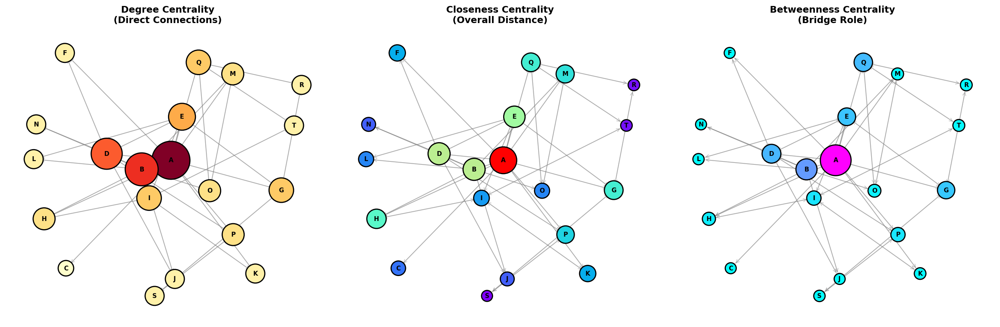

# 사회연결망 분석 (Social Network Analysis, SNA) 완벽 가이드

## 목차
1. [SNA 기본 개념](#1-sna-기본-개념)
2. [Degree Centrality (연결 중심성)](#2-degree-centrality-연결-중심성)
3. [In-Degree & Out-Degree](#3-in-degree--out-degree)
4. [PageRank 알고리즘](#4-pagerank-알고리즘)
5. [중심성 지표 비교](#5-중심성-지표-비교)
6. [실제 응용 예제](#6-실제-응용-예제)
7. [ADP 시험 대비](#7-adp-시험-대비)

---

## 1. SNA 기본 개념

### 1.1 사회연결망(Social Network)이란?

**정의:** 개체(노드)들과 그들 간의 관계(엣지)로 이루어진 구조

```
실생활 예시:
🌐 SNS: 사람(노드) + 친구관계(엣지)
💻 웹: 웹페이지(노드) + 하이퍼링크(엣지)
🏢 조직: 직원(노드) + 업무협력(엣지)
📚 논문: 논문(노드) + 인용관계(엣지)
🛫 항공: 공항(노드) + 항로(엣지)
```

### 1.2 네트워크 구성요소

#### 📍 노드(Node, Vertex)
- 네트워크의 개체/행위자
- 예: 사람, 웹페이지, 도시

#### 🔗 엣지(Edge, Link, Tie)
- 노드 간의 관계/연결
- **무방향(Undirected)**: A ↔ B (친구 관계)
- **방향(Directed)**: A → B (팔로우 관계)

### 1.3 네트워크 종류

| 종류 | 엣지 특성 | 예시 |
|------|-----------|------|
| **무방향 네트워크** | 방향 없음 | Facebook 친구, 협업 관계 |
| **방향 네트워크** | 방향 있음 | Twitter 팔로우, 웹 링크 |
| **가중 네트워크** | 가중치 있음 | 통화빈도, 거래금액 |
| **이분 네트워크** | 두 종류 노드 | 고객-상품, 배우-영화 |

---

## 2. Degree Centrality (연결 중심성)

### 2.1 개념

**Degree**: 한 노드에 직접 연결된 엣지의 개수

**의미:**
- 높은 degree = 많은 연결 = 중심적 위치
- 네트워크에서의 활동성, 인기도 측정

### 2.2 무방향 네트워크의 Degree


#### 계산 방법

```
Degree(노드) = 해당 노드와 연결된 엣지 개수

예시:
- 노드 D: Degree = 3 (B, C, E와 연결)
- 노드 A: Degree = 2 (B, C와 연결)
- 노드 F: Degree = 2 (C, E와 연결)
```

#### Degree Centrality (정규화)

```
CD(i) = Degree(i) / (n-1)

여기서 n = 전체 노드 수

정규화 범위: 0 ~ 1
- 1에 가까울수록 중심적
- 0에 가까울수록 고립적
```

**예제 계산:**
```
노드가 6개(A, B, C, D, E, F)인 네트워크에서
노드 D의 Degree = 3

CD(D) = 3 / (6-1) = 3/5 = 0.6
```

---

## 3. In-Degree & Out-Degree

### 3.1 개념

방향 네트워크에서는 Degree를 두 가지로 구분:

**📥 In-Degree (내향 연결정도)**
- 노드로 **들어오는** 엣지 개수
- "나를 선택한 사람"
- 예: 팔로워 수, 인용된 횟수, 받은 전화

**📤 Out-Degree (외향 연결정도)**
- 노드에서 **나가는** 엣지 개수
- "내가 선택한 사람"
- 예: 팔로잉 수, 인용한 횟수, 건 전화


### 3.2 계산 예제

```
네트워크: A→B, A→C, B→C, B→D, C→D, C→E, D→E, D→F, E→F, E→A

노드 A:
  In-Degree  = 1 (E→A)
  Out-Degree = 2 (A→B, A→C)

노드 C:
  In-Degree  = 2 (A→C, B→C)
  Out-Degree = 2 (C→D, C→E)

노드 E:
  In-Degree  = 2 (C→E, D→E)
  Out-Degree = 2 (E→F, E→A)
```

### 3.3 해석

#### In-Degree가 높은 노드
```
✅ 인기 있는 노드
✅ 정보를 많이 받는 노드
✅ 영향력 있는 노드 (다른 노드들이 주목)

예시:
- SNS: 유명인 (팔로워 多)
- 웹: 인기 사이트 (링크 많이 받음)
- 논문: 중요 논문 (많이 인용됨)
```

#### Out-Degree가 높은 노드
```
✅ 적극적인 노드
✅ 정보를 많이 전파하는 노드
✅ 허브 역할 (다른 노드들과 연결)

예시:
- SNS: 활발한 사용자 (많이 팔로우)
- 웹: 포털 사이트 (많은 링크 제공)
- 논문: 리뷰 논문 (많은 논문 인용)
```

### 3.4 중요한 관계

```
∑(모든 노드의 In-Degree) = ∑(모든 노드의 Out-Degree) = 총 엣지 수

이유: 모든 엣지는 정확히 한 번 나가고, 한 번 들어옴
```

---

## 4. PageRank 알고리즘

### 4.1 배경

**Google의 웹 페이지 랭킹 알고리즘**

**문제:** In-Degree만으로는 부족
- 스팸 페이지도 In-Degree를 높일 수 있음
- 누가 링크하는지가 중요함!

**해결:** **연결의 "질"을 고려**

```
중요한 페이지로부터 받은 링크 = 가치가 높음
덜 중요한 페이지로부터 받은 링크 = 가치가 낮음
```


### 4.2 핵심 아이디어

> **"중요한 노드로부터 링크를 받은 노드는 중요하다"**

**재귀적 정의:**
- A의 중요도 = A에 링크한 모든 노드들의 중요도의 합
- 각 노드는 자신의 중요도를 Out-Degree로 나눠서 전달

### 4.3 PageRank 공식

```
PR(A) = (1-d)/N + d × Σ(PR(Ti)/C(Ti))

여기서:
- PR(A): 페이지 A의 PageRank
- d: Damping factor (보통 0.85)
  → 사용자가 링크를 따라갈 확률
  → 85% 확률로 링크 클릭, 15% 확률로 랜덤 이동
- N: 전체 페이지 수
- Ti: A로 링크하는 페이지 i
- C(Ti): 페이지 Ti의 Out-Degree
```

### 4.4 간단한 예제


```
네트워크:
  A→B
  B→C, B→A
  C→A
  D→A, D→B, D→C

계산 결과:
노드 A: In=3, PageRank=35.4% ⭐ (최고!)
노드 B: In=2, PageRank=19.8%
노드 C: In=2, PageRank=19.8%
노드 D: In=0, PageRank=25.0% (놀랍게도 높음!)
```

**분석:**
- **노드 A**: In-Degree도 높고, 중요한 노드들(B, C, D)로부터 링크받음 → **최고 PageRank**
- **노드 D**: In-Degree는 0이지만, 모든 노드에 링크를 제공하므로 중요도 높음
- **노드 B, C**: In-Degree는 같지만, A로부터 직접 링크받은 B가 약간 높음

### 4.5 In-Degree vs PageRank 차이

| 노드 | In-Degree | In-Degree 순위 | PageRank | PageRank 순위 | 차이점 |
|------|-----------|----------------|----------|---------------|--------|
| A | 3 | 1위 | 35.4% | 1위 | 일치 ✓ |
| B | 2 | 2위(동률) | 19.8% | 2위(동률) | 일치 ✓ |
| C | 2 | 2위(동률) | 19.8% | 2위(동률) | 일치 ✓ |
| D | 0 | 4위 | 25.0% | 2위 | **역전!** ⚠️ |

**핵심:** D는 In-Degree가 0이지만, 네트워크에서 정보 전파자 역할을 하므로 PageRank는 높음!

### 4.6 Damping Factor (d)

```
d = 0.85 (Google 기본값)

의미:
- 85% 확률: 사용자가 현재 페이지의 링크를 클릭
- 15% 확률: 사용자가 랜덤하게 다른 페이지로 이동 (텔레포트)

효과:
- 막다른 페이지(Out-Degree=0) 문제 해결
- 모든 페이지가 최소한의 PageRank 보장: (1-d)/N
```

### 4.7 PageRank 계산 알고리즘

**반복 계산 (Power Iteration):**

```python
# 초기화
PR = [1/N for all nodes]

# 수렴할 때까지 반복
while not converged:
    for each node i:
        PR_new(i) = (1-d)/N + d × Σ(PR(j)/OutDegree(j))
                                  j→i
    PR = PR_new
```

**수렴 조건:** 보통 100회 이하 반복으로 수렴

---

## 5. 중심성 지표 비교

네트워크에서 "중요한" 노드를 찾는 다양한 방법들:



### 5.1 Degree Centrality (연결 중심성)

**정의:** 직접 연결된 노드의 개수

```
CD(i) = degree(i) / (n-1)
```

**의미:**
- ✅ 가장 단순하고 직관적
- ✅ 직접적인 영향력 측정
- ❌ 간접 연결 고려 안 함

**예시:** 친구가 많은 사람, 허브 공항

---

### 5.2 Closeness Centrality (근접 중심성)

**정의:** 다른 모든 노드까지의 최단거리 합의 역수

```
CC(i) = (n-1) / Σ d(i,j)
              j≠i

여기서 d(i,j) = 노드 i에서 j까지의 최단 경로 길이
```

**의미:**
- ✅ 전체 네트워크에서의 접근성
- ✅ 정보 전파 속도 측정
- ❌ 끊어진 네트워크에서 사용 불가

**예시:** 물류 센터, 정보 중개자

**특징:**
- 높을수록 다른 노드들과 가까움
- 정보를 빠르게 전파하거나 받을 수 있음

---

### 5.3 Betweenness Centrality (매개 중심성)

**정의:** 다른 노드들 간 최단경로에 포함되는 정도

```
CB(i) = Σ    σst(i) / σst
       s≠i≠t

여기서:
- σst: s에서 t로 가는 최단 경로 개수
- σst(i): 그 중 노드 i를 거치는 경로 개수
```

**의미:**
- ✅ **"다리" 역할** 측정
- ✅ 정보 흐름 통제력
- ✅ 커뮤니티 간 연결자 찾기

**예시:** 중개인, 게이트키퍼, 교량 도시

**특징:**
- 높을수록 네트워크에서 중요한 매개 역할
- 제거 시 네트워크가 분리될 가능성 높음

---

### 5.4 Eigenvector Centrality (고유벡터 중심성)

**정의:** 연결된 노드들의 중요도를 고려한 중심성

```
CE(i) = (1/λ) × Σ aij × CE(j)
                j

여기서:
- aij: 인접행렬 (i→j 연결 시 1)
- λ: 최대 고유값
```

**의미:**
- ✅ **"누구와 연결되었는가"** 중요
- ✅ PageRank의 기반
- ❌ 방향 네트워크에서 문제 발생 가능

**예시:** 영향력 있는 사람들과 친한 사람

---

### 5.5 중심성 지표 비교표

| 중심성 | 질문 | 강점 | 약점 | 응용 |
|--------|------|------|------|------|
| **Degree** | 얼마나 많이 연결? | 단순, 빠름 | 질 무시 | 인기도, 활동성 |
| **Closeness** | 얼마나 가까이? | 접근성 | 끊김 문제 | 정보 전파 |
| **Betweenness** | 얼마나 사이? | 매개 역할 | 계산 느림 | 중개자, 병목 |
| **Eigenvector** | 누구와 연결? | 질 고려 | 복잡함 | 영향력 |
| **PageRank** | 얼마나 중요한가? | 질+방향 | 계산 복잡 | 웹 랭킹 |

---

## 6. 실제 응용 예제

### 6.1 Twitter 팔로우 네트워크


#### 분석 결과

**In-Degree (팔로워 수) 분석:**
```
영희: 3명 팔로워 → 인플루언서!
지영: 3명 팔로워 → 인플루언서!
철수: 2명 팔로워
준호: 2명 팔로워
민수: 1명 팔로워
수진: 1명 팔로워
```

**Out-Degree (팔로잉 수) 분석:**
```
철수: 3명 팔로잉 → 적극적 사용자
영희: 3명 팔로잉 → 적극적 사용자
수진: 2명 팔로잉
민수: 1명 팔로잉 → 소극적 사용자
지영: 2명 팔로잉
준호: 1명 팔로잉 → 소극적 사용자
```

**인사이트:**
- **영희**: In/Out 모두 높음 → 활발한 인플루언서
- **지영**: In은 높지만 Out은 보통 → 수동적 인플루언서
- **철수**: Out은 높지만 In은 보통 → 적극적이지만 영향력 중간
- **준호**: In은 있지만 Out 낮음 → 소극적

---

### 6.2 논문 인용 네트워크

```
네트워크: A, B, C, D, E (논문)
인용 관계:
  B → A (B가 A를 인용)
  C → A
  D → A, D → B
  E → B, E → C

In-Degree (피인용 수):
  A: 3 (가장 많이 인용된 중요 논문)
  B: 2
  C: 1
  D: 0 (누구도 인용 안 함, 최신 논문?)
  E: 0

Out-Degree (인용한 수):
  D: 2 (리뷰 논문?)
  E: 2
  B: 1
  C: 1
  A: 0 (오래된 기초 논문?)

PageRank:
  A: 가장 높음 (많은 논문들이 인용)
  B: 높음 (A가 인용하고, 다른 논문들도 인용)
  D: 낮음 (최신이라 아직 인용 안 됨)
```

---

### 6.3 조직 커뮤니케이션 네트워크

```
노드: 직원
엣지: 업무 협력, 이메일 교환

분석 목적:
1. Degree: 누가 가장 활발하게 소통?
2. Betweenness: 누가 부서 간 연결자?
3. Closeness: 누가 정보에 빠르게 접근?
4. 커뮤니티: 비공식 그룹 발견

활용:
- 핵심 인재 파악
- 조직 개편 설계
- 지식 전파 경로 설계
```

---

## 7. ADP 시험 대비

### 7.1 핵심 개념 정리

#### 용어 정리

| 용어 | 영문 | 정의 | 비고 |
|------|------|------|------|
| 노드 | Node, Vertex | 네트워크의 개체 | 점 |
| 엣지 | Edge, Link, Tie | 노드 간 관계 | 선 |
| 연결정도 | Degree | 직접 연결 개수 | |
| 내향연결정도 | In-Degree | 들어오는 엣지 | 방향 O |
| 외향연결정도 | Out-Degree | 나가는 엣지 | 방향 O |
| 최단경로 | Shortest Path | 최소 엣지 경로 | |
| 지름 | Diameter | 최장 최단경로 | |
| 밀도 | Density | 실제/가능 엣지 비율 | |

---

### 7.2 계산 문제 유형

#### 유형 1: Degree 계산

**문제:**
다음 무방향 네트워크에서 각 노드의 Degree와 Degree Centrality를 구하시오.

```
엣지: (A,B), (A,C), (B,C), (B,D), (C,D)
```

**풀이:**
```
Degree:
  A: 2 (B, C)
  B: 3 (A, C, D)
  C: 3 (A, B, D)
  D: 2 (B, C)

Degree Centrality (n=4):
  CD(A) = 2/(4-1) = 2/3 = 0.667
  CD(B) = 3/(4-1) = 3/3 = 1.000 ⭐
  CD(C) = 3/(4-1) = 3/3 = 1.000 ⭐
  CD(D) = 2/(4-1) = 2/3 = 0.667
```

**답:** B와 C가 가장 중심적 (CD=1.0)

---

#### 유형 2: In-Degree & Out-Degree

**문제:**
다음 방향 네트워크에서 In-Degree와 Out-Degree가 가장 높은 노드는?

```
엣지: A→B, A→C, B→D, C→B, C→D, D→A
```

**풀이:**

| 노드 | In-Degree | Out-Degree | Total |
|------|-----------|------------|-------|
| A | 1 (D→A) | 2 (A→B, A→C) | 3 |
| B | 2 (A→B, C→B) | 1 (B→D) | 3 |
| C | 1 (A→C) | 2 (C→B, C→D) | 3 |
| D | 2 (B→D, C→D) | 1 (D→A) | 3 |

```
In-Degree 최고: B, D (2개)
Out-Degree 최고: A, C (2개)
```

**검증:**
```
∑In-Degree = 1+2+1+2 = 6
∑Out-Degree = 2+1+2+1 = 6
총 엣지 수 = 6 ✓
```

---

#### 유형 3: PageRank 개념

**문제:**
두 웹페이지 A와 B가 있다.
- A: In-Degree = 10 (모두 중요도 낮은 페이지)
- B: In-Degree = 3 (모두 중요도 높은 페이지)

PageRank가 더 높을 가능성이 있는 것은?

**답:** B

**이유:**
PageRank는 단순 링크 개수가 아니라 **연결의 질**을 고려.
중요한 페이지로부터의 링크가 더 가치 있음.

---

#### 유형 4: 중심성 해석

**문제:**
소셜 네트워크에서 Betweenness Centrality가 높은 노드의 특징은?

**답:**
- 서로 다른 그룹을 연결하는 **"다리"** 역할
- 정보 흐름을 **통제**할 수 있는 위치
- 제거 시 네트워크가 **분리**될 가능성 높음
- 예: 중개인, 게이트키퍼

---

### 7.3 서술형 답안 템플릿

#### In-Degree vs Out-Degree 설명

```
[정의]
- In-Degree: 노드로 들어오는 엣지 개수
- Out-Degree: 노드에서 나가는 엣지 개수

[의미]
- In-Degree: 인기도, 영향력, 수신 정도
- Out-Degree: 활동성, 전파력, 송신 정도

[예시]
Twitter:
- In-Degree = 팔로워 수 (나를 팔로우)
- Out-Degree = 팔로잉 수 (내가 팔로우)

[관계]
∑In-Degree = ∑Out-Degree = 총 엣지 수
```

---

#### PageRank 설명

```
[배경]
In-Degree만으로는 웹페이지 중요도 측정 불충분

[핵심 아이디어]
"중요한 페이지로부터 받은 링크가 더 가치 있다"

[공식]
PR(A) = (1-d)/N + d × Σ(PR(Ti)/C(Ti))

[특징]
1. 재귀적 정의 (반복 계산)
2. Damping factor (d=0.85)로 랜덤 이동 모델링
3. 모든 페이지가 최소값 보장: (1-d)/N

[응용]
Google 검색, 논문 중요도, 영향력 측정
```

---

### 7.4 R 코드 (시험 참고용)

```r
# 패키지
library(igraph)

# 그래프 생성
# 무방향
g1 <- graph(edges=c("A","B", "A","C", "B","C"), directed=FALSE)

# 방향
g2 <- graph(edges=c("A","B", "B","C", "C","A"), directed=TRUE)

# Degree
degree(g1)                    # 무방향
degree(g2, mode="in")         # In-Degree
degree(g2, mode="out")        # Out-Degree
degree(g2, mode="all")        # Total

# 중심성
closeness(g2)                 # Closeness
betweenness(g2)               # Betweenness
eigen_centrality(g2)$vector   # Eigenvector

# PageRank
page_rank(g2)$vector

# 시각화
plot(g2,
     vertex.size=degree(g2)*10,
     vertex.color="lightblue",
     edge.arrow.size=0.5)
```

---

### 7.5 암기 사항

#### 공식

```
1. Degree Centrality
   CD(i) = degree(i) / (n-1)

2. Closeness Centrality
   CC(i) = (n-1) / Σ d(i,j)

3. PageRank
   PR(A) = (1-d)/N + d × Σ(PR(Ti)/C(Ti))
   (d = 0.85)

4. 네트워크 밀도
   Density = 2E / (N(N-1))    # 무방향
   Density = E / (N(N-1))     # 방향
```

#### 관계식

```
∑In-Degree = ∑Out-Degree = E (총 엣지 수)

무방향 그래프:
∑Degree = 2E (각 엣지가 2번 카운트)
```

---

### 7.6 실전 팁

1. **그림 그리기**
   - 작은 네트워크는 직접 그려서 확인
   - 노드 이름, 화살표 방향 명확히

2. **검산 습관**
   - In-Degree 합 = Out-Degree 합 확인
   - 전체 엣지 수와 일치하는지 확인

3. **개념 설명**
   - 정의 → 의미 → 예시 순서
   - 실생활 예시 활용 (SNS, 웹)

4. **R 코드**
   - directed=TRUE/FALSE 주의
   - mode="in"/"out"/"all" 구분
   - 패키지 이름 정확히 (igraph)

---

## 8. 종합 정리

### 8.1 핵심 요약

| 개념 | 정의 | 질문 | 응용 |
|------|------|------|------|
| **Degree** | 직접 연결 개수 | 얼마나 많이? | 인기도, 활동성 |
| **In-Degree** | 들어오는 연결 | 누가 나를 선택? | 팔로워, 피인용 |
| **Out-Degree** | 나가는 연결 | 내가 누구를 선택? | 팔로잉, 인용 |
| **PageRank** | 질 고려한 중요도 | 얼마나 중요한가? | 검색 랭킹 |
| **Closeness** | 전체 접근성 | 얼마나 가까운가? | 정보 전파 |
| **Betweenness** | 매개 역할 | 얼마나 사이에? | 중개자, 병목 |

---

### 8.2 학습 체크리스트

#### 이론
- ☐ 무방향 vs 방향 네트워크 구분
- ☐ Degree 계산 (무방향)
- ☐ In-Degree, Out-Degree 계산 및 해석
- ☐ PageRank 개념 이해
- ☐ 중심성 지표 차이 설명

#### 계산
- ☐ Degree Centrality 정규화
- ☐ In/Out-Degree 합 검증
- ☐ 최단경로 찾기
- ☐ 밀도 계산

#### 응용
- ☐ SNS 네트워크 분석
- ☐ 웹 네트워크 분석
- ☐ 조직 네트워크 분석
- ☐ R 코드 작성

---

### 8.3 추가 학습 자료

**R 패키지:**
- `igraph`: 네트워크 분석
- `sna`: 사회연결망 분석
- `network`: 네트워크 객체
- `ggraph`: 네트워크 시각화

**Python 패키지:**
- `networkx`: 네트워크 분석
- `graph-tool`: 대규모 네트워크
- `python-louvain`: 커뮤니티 탐지

---

## 마무리

사회연결망 분석의 핵심:

1. **Degree**: 얼마나 연결되어 있는가?
2. **In/Out-Degree**: 방향을 구분하여 역할 파악
3. **PageRank**: 단순 개수가 아닌 질을 고려
4. **다양한 중심성**: 다각도로 중요도 측정

**ADP 시험 핵심:**
- In-Degree vs Out-Degree **명확히 구분**
- PageRank **개념 이해** (질적 평가)
- 중심성 지표 **비교 및 해석**
- 실생활 예시로 **설명**

---

**작성일:** 2026-02-04  
**용도:** ADP 필기 사회연결망 분석 완벽 대비
