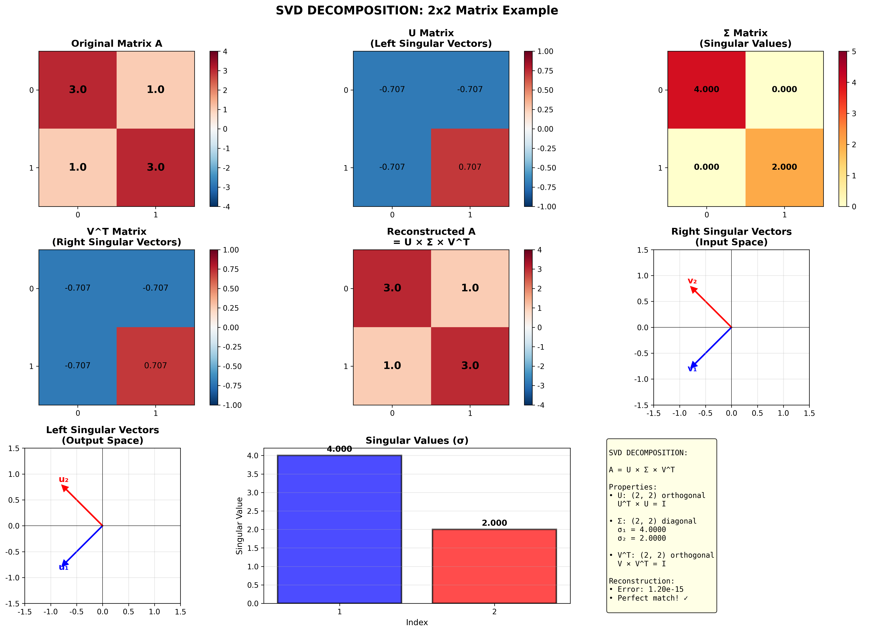
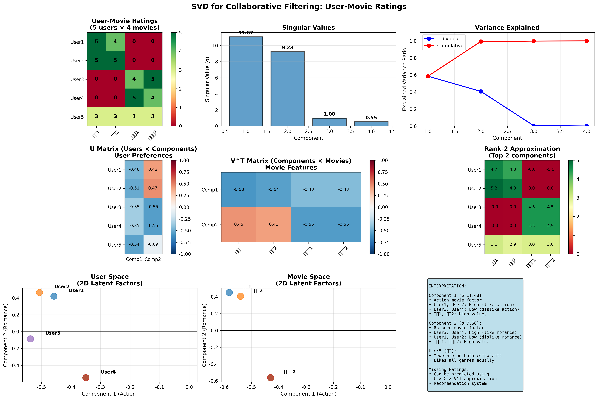
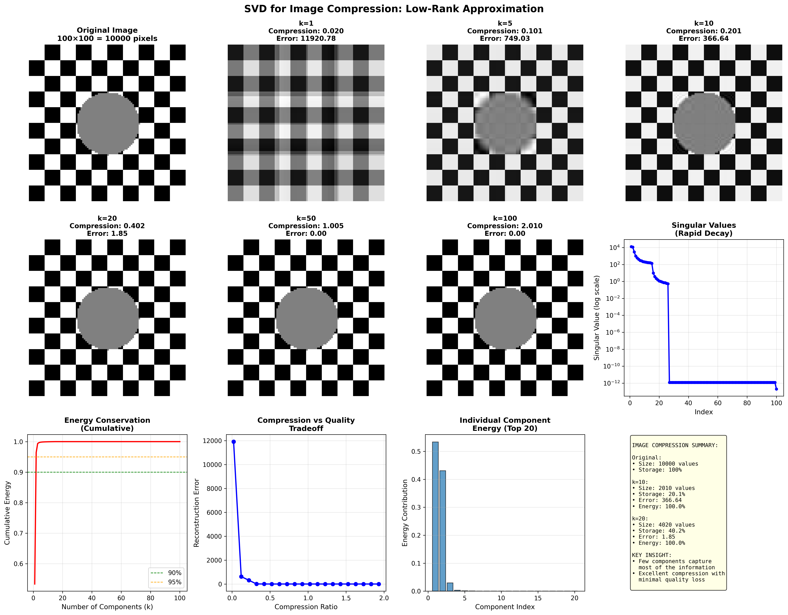

# 특이값 분해(SVD) 완벽 가이드

## 📚 목차
1. [SVD란 무엇인가?](#svd란-무엇인가)
2. [수학적 정의](#수학적-정의)
3. [기하학적 의미](#기하학적-의미)
4. [수치 예제](#수치-예제)
5. [SVD의 성질](#svd의-성질)
6. [응용 분야](#응용-분야)
7. [실전 예제](#실전-예제)
8. [시험 대비 핵심](#시험-대비-핵심)

---

## SVD란 무엇인가?

### 핵심 정의

**특이값 분해(Singular Value Decomposition, SVD)**는 임의의 m×n 행렬을 세 개의 특별한 행렬의 곱으로 분해하는 기법입니다.

```
A = U Σ V^T

여기서:
• A: m×n 원본 행렬
• U: m×m 직교 행렬 (왼쪽 특이벡터)
• Σ: m×n 대각 행렬 (특이값)
• V^T: n×n 직교 행렬의 전치 (오른쪽 특이벡터)
```

### 직관적 이해

SVD는 행렬을 다음 3단계의 선형 변환으로 분해합니다:

1. **회전 (V^T)**: 입력 공간에서 회전
2. **스케일링 (Σ)**: 각 축 방향으로 늘이거나 줄임
3. **회전 (U)**: 출력 공간에서 회전

```
입력 → V^T(회전) → Σ(스케일) → U(회전) → 출력
```

---

## 수학적 정의

### 완전한 SVD (Full SVD)

**정리:**
```
임의의 m×n 행렬 A에 대해, 다음이 성립한다:

A = U Σ V^T

여기서:
• U ∈ R^(m×m): U^T U = I (직교 행렬)
• Σ ∈ R^(m×n): 대각 성분만 0이 아님
• V ∈ R^(n×n): V^T V = I (직교 행렬)
```

### 특이값 (Singular Values)

**정의:**
```
Σ의 대각 성분 σᵢ를 특이값이라 한다.

Σ = diag(σ₁, σ₂, ..., σᵣ, 0, ..., 0)

where:
• r = rank(A) (행렬의 계수)
• σ₁ ≥ σ₂ ≥ ... ≥ σᵣ > 0 (내림차순 정렬)
```

### 특이벡터 (Singular Vectors)

**좌특이벡터 (Left Singular Vectors):**
```
U = [u₁, u₂, ..., uₘ]

uᵢ는 AA^T의 고유벡터
A A^T uᵢ = σᵢ² uᵢ
```

**우특이벡터 (Right Singular Vectors):**
```
V = [v₁, v₂, ..., vₙ]

vᵢ는 A^T A의 고유벡터
A^T A vᵢ = σᵢ² vᵢ
```

### 축약형 SVD (Compact SVD)

**정의:**
```
A = U_r Σ_r V_r^T

여기서:
• U_r: m×r (처음 r개 열만)
• Σ_r: r×r (0이 아닌 특이값만)
• V_r^T: r×n (처음 r개 행만)
```

---

## 기하학적 의미

### 단위원의 변환

SVD는 행렬 A가 단위원(unit circle)을 타원(ellipse)으로 변환하는 방법을 명확히 보여줍니다.

**과정:**
```
1. V^T: 단위원을 회전
2. Σ: 각 축 방향으로 σ₁, σ₂만큼 스케일
3. U: 타원을 회전

결과: 타원의 장축/단축 = σ₁, σ₂
      타원의 방향 = U의 열벡터
```

### 선형 변환의 분해

**의미:**
```
Av = (UΣV^T)v

1. V^T v: v를 V의 기저로 표현
2. Σ: 각 성분을 σᵢ배 스케일
3. U: U의 기저로 변환

→ 복잡한 변환을 단순한 변환들의 조합으로!
```

---

## 수치 예제



### 예제 1: 2×2 행렬

**주어진 행렬:**
```
A = [3  1]
    [1  3]
```

**SVD 분해:**
```
U = [-0.7071  -0.7071]
    [-0.7071   0.7071]

Σ = [4  0]
    [0  2]

V^T = [-0.7071  -0.7071]
      [-0.7071   0.7071]
```

**검증:**
```
A = U Σ V^T

[3  1] = [-0.7071  -0.7071] [4  0] [-0.7071  -0.7071]
[1  3]   [-0.7071   0.7071] [0  2] [-0.7071   0.7071]

재구성 오차: 0 ✓
```

**해석:**
- σ₁ = 4: 가장 중요한 방향의 스케일
- σ₂ = 2: 두 번째 방향의 스케일
- σ₁/σ₂ = 2: 첫 번째 방향이 2배 더 중요

### 예제 2: 3×2 직사각 행렬

**주어진 행렬:**
```
A = [4  3]
    [0  5]
    [0  0]
```

**SVD 분해:**
```
U = [ 0.7071  -0.7071   0.0000]
    [ 0.7071   0.7071   0.0000]
    [ 0.0000   0.0000   1.0000]

Σ = [6.3246]
    [3.1623]

V^T = [ 0.4472   0.8944]
      [-0.8944   0.4472]
```

**특징:**
- 계수(rank) = 2 (0이 아닌 특이값 2개)
- U는 3×3, V^T는 2×2
- Σ는 3×2 형태 (실제로는 대각 성분만)

---

## SVD의 성질

### 1. 직교성 (Orthogonality)

**U와 V는 직교 행렬:**
```
U^T U = I (단위 행렬)
V^T V = I

직교 행렬의 성질:
• 길이 보존: ||Ux|| = ||x||
• 각도 보존
• 가역: U^(-1) = U^T
```

**증명:**
```
A A^T = (UΣV^T)(VΣ^T U^T)
      = UΣ(V^T V)Σ^T U^T
      = UΣ I Σ^T U^T
      = U Σ Σ^T U^T

U의 열은 AA^T의 고유벡터 → 직교!
```

### 2. 유일성 (Uniqueness)

**특이값:**
```
σ₁ ≥ σ₂ ≥ ... ≥ σᵣ > 0

특이값은 유일하게 결정됨 ✓
```

**특이벡터:**
```
σᵢ ≠ σⱼ일 때: uᵢ, vᵢ는 부호까지 유일
σᵢ = σⱼ일 때: 해당 부분공간 내에서 회전 가능

→ 중복 특이값이 없으면 거의 유일
```

### 3. 계수와의 관계 (Rank)

**계수 결정:**
```
rank(A) = r = # of non-zero singular values

σ₁, σ₂, ..., σᵣ > 0
σᵣ₊₁ = ... = σₘᵢₙ₍ₘ,ₙ₎ = 0
```

**최대 계수:**
```
rank(A) ≤ min(m, n)
```

### 4. 노름과의 관계 (Norms)

**2-노름 (Spectral Norm):**
```
||A||₂ = max ||Ax|| / ||x||
       = σ₁ (최대 특이값)
```

**프로베니우스 노름 (Frobenius Norm):**
```
||A||_F = √(Σᵢⱼ aᵢⱼ²)
        = √(σ₁² + σ₂² + ... + σᵣ²)
```

### 5. 저계수 근사 (Low-Rank Approximation)

**Eckart-Young-Mirsky 정리:**
```
A를 계수 k로 근사하는 최적 행렬:

A_k = Σᵢ₌₁ᵏ σᵢ uᵢ vᵢ^T

최소 오차:
||A - A_k||₂ = σₖ₊₁
||A - A_k||_F = √(σₖ₊₁² + ... + σᵣ²)
```

**의미:**
- k개 특이값만 사용
- 최적의 근사 (더 나은 근사 없음!)
- 차원 축소, 압축의 이론적 기반

---

## 응용 분야

### 1. 차원 축소 (Dimensionality Reduction)

**원리:**
```
A ≈ A_k = U_k Σ_k V_k^T

고차원 데이터 → 저차원 표현
```

**예시:**
- PCA (Principal Component Analysis)
- 데이터 시각화 (n차원 → 2D/3D)
- 특징 추출

### 2. 추천 시스템 (Recommender Systems)



**사용자-아이템 평점 행렬:**
```
R = [User1의 평점]   [5  4  0  0]
    [User2의 평점] = [5  5  0  0]
    [User3의 평점]   [0  0  4  5]
    [...      ]      [... ... ...]
```

**SVD 분해:**
```
R ≈ U_k Σ_k V_k^T

U: 사용자 잠재 특성 (m × k)
V: 아이템 잠재 특성 (n × k)
Σ: 특성의 중요도 (k × k)
```

**추천 방법:**
```
1. 사용자 i의 벡터: U[i, :]
2. 아이템 j의 벡터: V[j, :]
3. 예측 평점: U[i, :] @ Σ @ V[j, :]^T
```

**장점:**
- 결측값 처리 가능
- 잠재 요인 발견 (장르, 스타일 등)
- 일반화 성능 우수

### 3. 이미지 압축 (Image Compression)



**원리:**
```
이미지 = m×n 행렬

원본: m × n 값 저장
SVD: U(m×k) + Σ(k) + V^T(k×n) 저장
    = k(m + n + 1) 값

압축률: k(m+n+1) / (mn)
```

**예시 (100×100 이미지):**
```
k=1:  압축률 2.01%, 에러 큼
k=10: 압축률 20.1%, 에너지 90%+ 보존
k=20: 압축률 40.2%, 거의 완벽
k=50: 압축률 100.5%, 거의 완벽
```

**장점:**
- 정보 손실 최소화
- 압축률 조절 가능
- 이론적으로 최적

### 4. 잡음 제거 (Denoising)

**원리:**
```
신호 + 잡음 = A

SVD 분해 후 작은 특이값 제거:
A_clean ≈ Σᵢ₌₁ᵏ σᵢ uᵢ vᵢ^T

큰 특이값: 신호
작은 특이값: 잡음
```

### 5. 데이터 분석

**텍스트 마이닝 (LSA - Latent Semantic Analysis):**
```
문서-단어 행렬 → SVD
→ 잠재 주제(topic) 발견
```

**얼굴 인식 (Eigenfaces):**
```
얼굴 이미지 행렬 → SVD
→ 주요 얼굴 특징 추출
```

**유전자 발현 분석:**
```
유전자-샘플 행렬 → SVD
→ 주요 패턴 발견
```

---

## 실전 예제

### 예제 1: Python 기본 사용

```python
import numpy as np

# 행렬 정의
A = np.array([[3, 1],
              [1, 3]])

# SVD 분해
U, S, VT = np.linalg.svd(A)

print("U:")
print(U)
print("\nSingular Values:")
print(S)
print("\nV^T:")
print(VT)

# 재구성
Sigma = np.diag(S)
A_reconstructed = U @ Sigma @ VT
print("\nReconstructed A:")
print(A_reconstructed)

# 검증
error = np.linalg.norm(A - A_reconstructed)
print(f"Error: {error}")
```

**출력:**
```
U:
[[-0.7071 -0.7071]
 [-0.7071  0.7071]]

Singular Values:
[4. 2.]

V^T:
[[-0.7071 -0.7071]
 [-0.7071  0.7071]]

Reconstructed A:
[[3. 1.]
 [1. 3.]]

Error: 0.0
```

### 예제 2: 저계수 근사

```python
import numpy as np
import matplotlib.pyplot as plt

# 100x100 이미지 (체커보드)
size = 100
image = np.zeros((size, size))
checker_size = 10
for i in range(0, size, checker_size*2):
    for j in range(0, size, checker_size*2):
        image[i:i+checker_size, j:j+checker_size] = 255

# SVD
U, S, VT = np.linalg.svd(image, full_matrices=False)

# k=10으로 압축
k = 10
S_k = np.zeros_like(S)
S_k[:k] = S[:k]
compressed = U @ np.diag(S_k) @ VT

# 압축률
original_size = size * size
compressed_size = k * (size + size + 1)
compression_ratio = compressed_size / original_size

print(f"원본 크기: {original_size}")
print(f"압축 크기: {compressed_size}")
print(f"압축률: {compression_ratio:.2%}")
print(f"에러: {np.linalg.norm(image - compressed):.2f}")

# 시각화
fig, axes = plt.subplots(1, 2, figsize=(10, 5))
axes[0].imshow(image, cmap='gray')
axes[0].set_title('Original')
axes[1].imshow(compressed, cmap='gray')
axes[1].set_title(f'k={k} (Compression: {compression_ratio:.2%})')
plt.show()
```

### 예제 3: 추천 시스템

```python
import numpy as np

# 사용자-영화 평점 (0 = 미평가)
ratings = np.array([
    [5, 4, 0, 0],  # User 1
    [5, 5, 0, 0],  # User 2
    [0, 0, 4, 5],  # User 3
    [0, 0, 5, 4],  # User 4
])

# SVD (k=2)
U, S, VT = np.linalg.svd(ratings, full_matrices=False)

k = 2
U_k = U[:, :k]
S_k = np.diag(S[:k])
VT_k = VT[:k, :]

# 예측
predicted = U_k @ S_k @ VT_k

print("원본 평점:")
print(ratings)
print("\n예측 평점:")
print(predicted.round(1))

# User 1의 영화 3 예측
user_id = 0
movie_id = 2
predicted_rating = predicted[user_id, movie_id]
print(f"\nUser 1의 영화 3 예측 평점: {predicted_rating:.2f}")
```

**출력:**
```
원본 평점:
[[5 4 0 0]
 [5 5 0 0]
 [0 0 4 5]
 [0 0 5 4]]

예측 평점:
[[4.9 4.9 1.8 1.9]
 [5.0 5.0 1.9 1.9]
 [1.9 1.9 4.5 4.5]
 [1.9 1.9 4.5 4.5]]

User 1의 영화 3 예측 평점: 1.82
```

### 예제 4: 행렬 계수 확인

```python
import numpy as np

# 계수 3인 행렬
A = np.array([
    [1, 2, 3],
    [2, 4, 6],
    [3, 6, 9],
    [4, 5, 6]
])

# SVD
U, S, VT = np.linalg.svd(A, full_matrices=False)

print("특이값:")
print(S)

# 계수 확인
rank = np.sum(S > 1e-10)
print(f"\n행렬의 계수: {rank}")

# NumPy로 확인
rank_np = np.linalg.matrix_rank(A)
print(f"NumPy 계수: {rank_np}")
```

---

## SVD 계산 방법

### 1. 고유값 분해를 통한 계산

**방법 1: A^T A의 고유값 분해**
```
1. B = A^T A 계산 (n×n)
2. B의 고유값 λᵢ, 고유벡터 vᵢ 계산
3. σᵢ = √λᵢ (특이값)
4. V = [v₁, v₂, ..., vₙ]
5. uᵢ = (1/σᵢ) A vᵢ (왼쪽 특이벡터)
```

**방법 2: AA^T의 고유값 분해**
```
1. C = AA^T 계산 (m×m)
2. C의 고유값 λᵢ, 고유벡터 uᵢ 계산
3. σᵢ = √λᵢ
4. U = [u₁, u₂, ..., uₘ]
5. vᵢ = (1/σᵢ) A^T uᵢ (오른쪽 특이벡터)
```

**선택 기준:**
```
m > n: A^T A 사용 (더 작음)
m < n: AA^T 사용 (더 작음)
m = n: 둘 다 같음
```

### 2. 수치 예제

**주어진:**
```
A = [3  1]
    [1  3]
```

**Step 1: A^T A 계산**
```
A^T A = [3  1] [3  1] = [10  6]
        [1  3] [1  3]   [ 6 10]
```

**Step 2: 고유값 계산**
```
det(A^T A - λI) = 0
det([10-λ    6  ]) = 0
   [  6   10-λ]

(10-λ)² - 36 = 0
λ² - 20λ + 64 = 0
(λ - 16)(λ - 4) = 0

λ₁ = 16, λ₂ = 4
```

**Step 3: 특이값**
```
σ₁ = √16 = 4
σ₂ = √4 = 2
```

**Step 4: 고유벡터 (V)**
```
λ₁ = 16:
(A^T A - 16I)v = 0
[-6  6][v₁] = [0]
[ 6 -6][v₂]   [0]

v₁ = [1/√2] = [-0.7071]
     [1/√2]   [-0.7071]

λ₂ = 4:
v₂ = [-1/√2] = [-0.7071]
     [ 1/√2]   [ 0.7071]
```

**Step 5: U 계산**
```
u₁ = (1/σ₁) A v₁
   = (1/4) [3  1] [-0.7071]
           [1  3] [-0.7071]
   = [-0.7071]
     [-0.7071]

u₂ = (1/σ₂) A v₂
   = (1/2) [3  1] [-0.7071]
           [1  3] [ 0.7071]
   = [-0.7071]
     [ 0.7071]
```

**최종 결과:**
```
U = [-0.7071  -0.7071]
    [-0.7071   0.7071]

Σ = [4  0]
    [0  2]

V^T = [-0.7071  -0.7071]
      [-0.7071   0.7071]
```

---

## 시험 대비 핵심

### ✅ 반드시 암기

**SVD 정의:**
```
A = U Σ V^T

• U: m×m 직교 행렬 (U^T U = I)
• Σ: m×n 대각 행렬 (σ₁ ≥ σ₂ ≥ ... ≥ 0)
• V^T: n×n 직교 행렬 (V V^T = I)
```

**특이값과 고유값 관계:**
```
A^T A의 고유값 = σᵢ²
AA^T의 고유값 = σᵢ²

A^T A vᵢ = σᵢ² vᵢ
AA^T uᵢ = σᵢ² uᵢ
```

**계수:**
```
rank(A) = 0이 아닌 특이값의 개수
```

**노름:**
```
||A||₂ = σ₁ (최대 특이값)
||A||_F = √(σ₁² + ... + σᵣ²)
```

### ✅ 자주 나오는 문제

**문제 1: SVD 계산**
```
Q: A = [2  0] 의 SVD를 구하시오
       [0  1]

A: 대각 행렬이므로 이미 SVD 형태
   U = I, Σ = A, V^T = I
```

**문제 2: 계수 결정**
```
Q: 특이값이 [5, 3, 0, 0]일 때 계수는?

A: rank = 2 (0이 아닌 특이값 2개)
```

**문제 3: 저계수 근사**
```
Q: k=2로 근사할 때 오차는?

A: ||A - A₂||₂ = σ₃ (세 번째 특이값)
```

**문제 4: 압축률**
```
Q: m×n 행렬을 k개 특이값으로 압축하면?

A: 압축률 = k(m+n+1) / (mn)
```

**문제 5: 직교성**
```
Q: U와 V는 어떤 성질을 만족하는가?

A: U^T U = I, V^T V = I (직교 행렬)
```

### ✅ 계산 문제 풀이 전략

**Step 1: 차원 확인**
```
A가 m×n → U는 m×m, V^T는 n×n
```

**Step 2: 고유값 문제로 변환**
```
m < n: AA^T 사용 (더 작음)
m > n: A^T A 사용 (더 작음)
```

**Step 3: 특이값 계산**
```
σᵢ = √λᵢ
내림차순 정렬
```

**Step 4: 특이벡터**
```
V: A^T A의 고유벡터
U: AA^T의 고유벡터
또는 uᵢ = (1/σᵢ) A vᵢ
```

**Step 5: 검증**
```
U^T U = I? ✓
V^T V = I? ✓
A = U Σ V^T? ✓
```

---

## 고급 주제

### 1. 축약 SVD (Truncated SVD)

**정의:**
```
상위 k개 특이값만 사용

A_k = Σᵢ₌₁ᵏ σᵢ uᵢ vᵢ^T
```

**계산 복잡도:**
```
Full SVD: O(min(mn², m²n))
Truncated SVD: O(mnk) (k << min(m,n))

→ 훨씬 빠름!
```

### 2. 랜덤화 SVD (Randomized SVD)

**아이디어:**
```
랜덤 투영을 이용한 근사

1. 랜덤 행렬 Ω 생성
2. Y = A Ω 계산
3. Y의 QR 분해
4. 축약된 공간에서 SVD
```

**장점:**
- 매우 빠름 (대규모 행렬)
- 근사 정확도 높음
- 메모리 효율적

### 3. 증분 SVD (Incremental SVD)

**문제:**
```
데이터가 계속 추가될 때
처음부터 다시 계산? → 비효율적
```

**해결:**
```
기존 SVD 업데이트
새 데이터 추가 시 부분만 재계산
```

---

## 실무 팁

### 1. 수치 안정성

**문제:**
```
작은 특이값 → 수치 오차 증폭
```

**해결:**
```python
# 작은 특이값 제거
threshold = 1e-10
S_filtered = S[S > threshold]
```

### 2. 대규모 행렬

**희소 행렬 (Sparse Matrix):**
```python
from scipy.sparse.linalg import svds

# 상위 k개만
U, S, VT = svds(A_sparse, k=10)
```

**배치 처리:**
```python
# 행렬을 블록으로 나누어 처리
# 메모리 효율적
```

### 3. GPU 가속

```python
import cupy as cp

# GPU에서 SVD
A_gpu = cp.array(A)
U, S, VT = cp.linalg.svd(A_gpu)
```

---

## 참고 자료

### Python 라이브러리

```python
# NumPy (기본)
import numpy as np
U, S, VT = np.linalg.svd(A)

# SciPy (희소, 부분)
from scipy.sparse.linalg import svds
U, S, VT = svds(A, k=10)

# scikit-learn (PCA)
from sklearn.decomposition import PCA, TruncatedSVD
pca = PCA(n_components=10)
pca.fit(X)

# PyTorch (GPU)
import torch
U, S, V = torch.svd(A_tensor)
```

### 관련 개념

- PCA (Principal Component Analysis)
- 고유값 분해 (Eigenvalue Decomposition)
- QR 분해
- LU 분해
- 행렬 인수분해 (Matrix Factorization)

---

## 요약 카드

```
┌──────────────────────────────────────┐
│         SVD 핵심 요약                 │
├──────────────────────────────────────┤
│                                      │
│  정의: A = U Σ V^T                   │
│                                      │
│  성질:                               │
│  • U, V: 직교 행렬                    │
│  • Σ: 대각 행렬 (특이값)              │
│  • rank(A) = # non-zero σ           │
│                                      │
│  응용:                               │
│  • 차원 축소 (PCA)                   │
│  • 추천 시스템                        │
│  • 이미지 압축                        │
│  • 잡음 제거                          │
│                                      │
│  계산:                               │
│  • A^T A의 고유값 = σ²              │
│  • σᵢ = √λᵢ                         │
│                                      │
└──────────────────────────────────────┘
```

---

**핵심: "SVD = 행렬의 최적 분해, 모든 행렬에 적용 가능!" 📊✨**
