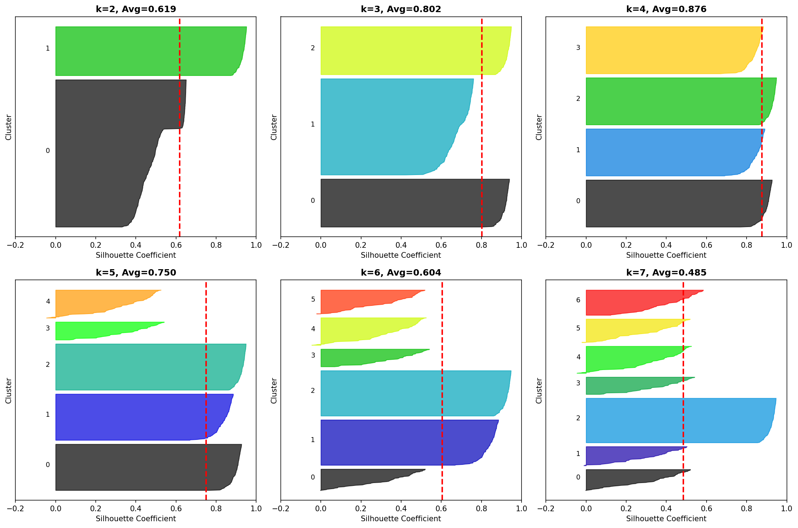

# 군집분석 완전 정리
## Clustering Analysis & Validity Evaluation

---

## 📊 군집분석 개요

### 📌 정의
**군집분석(Clustering)**은 비슷한 특성을 가진 개체들을 그룹으로 묶는 **비지도 학습(Unsupervised Learning)** 기법입니다.

### 🎯 목적
- 데이터의 내재된 구조 파악
- 유사한 객체들을 자동으로 분류
- 패턴 발견 및 데이터 압축
- 이상치 탐지

### 🔍 특징
| 특성 | 설명 |
|------|------|
| **학습 방식** | 비지도 학습 (정답 레이블 없음) |
| **목표** | 군집 내 유사도 최대화, 군집 간 유사도 최소화 |
| **결과** | 각 데이터 포인트의 군집 레이블 |
| **평가** | 내부 타당성 지표 사용 (정답 없음) |

---

## 📚 주요 군집분석 알고리즘 비교

| 알고리즘 | 유형 | 군집 형태 | 군집 수 | 장점 | 단점 |
|---------|------|----------|---------|------|------|
| **K-Means** | 분할 기반 | 구형 | 사전 지정 필요 | 빠르고 간단, 대용량 데이터 적합 | 이상치 민감, 구형 군집만 가능 |
| **계층적 군집** | 계층 기반 | 다양함 | 자동 결정 가능 | 덴드로그램 제공, 군집 수 유연 | 느림, 대용량 부적합 |
| **DBSCAN** | 밀도 기반 | 임의 형태 | 자동 결정 | 임의 형태, 이상치 탐지 | 파라미터 민감, 밀도 차이 어려움 |
| **GMM** | 확률 기반 | 타원형 | 사전 지정 필요 | 확률적 할당, 부드러운 경계 | 느림, 초기값 민감 |

---

## 1️⃣ K-Means 군집분석

### 📌 알고리즘 과정

```
1. k개의 초기 중심점(centroid) 랜덤 선택
2. 각 데이터를 가장 가까운 중심점에 할당
3. 각 군집의 중심점을 다시 계산 (평균)
4. 2-3단계를 중심점이 변하지 않을 때까지 반복
```

### 📐 목적 함수

```
J = Σ(i=1 to k) Σ(x∈Ci) ||x - μi||²

최소화 목표:
- 군집 내 분산(Within-Cluster Sum of Squares, WCSS)
- 각 점과 중심점 간의 거리 제곱합

μi: i번째 군집의 중심점
Ci: i번째 군집
```

### 💻 Python 예제

```python
from sklearn.cluster import KMeans
from sklearn.datasets import make_blobs
import numpy as np
import matplotlib.pyplot as plt

# 샘플 데이터 생성
X, y_true = make_blobs(n_samples=300, centers=4, 
                       cluster_std=0.60, random_state=42)

# K-Means 적용
kmeans = KMeans(n_clusters=4, random_state=42)
y_pred = kmeans.fit_predict(X)

# 결과 확인
print("군집 중심점:")
print(kmeans.cluster_centers_)
print(f"\nInertia (WCSS): {kmeans.inertia_:.2f}")

# 시각화
plt.figure(figsize=(10, 5))

plt.subplot(1, 2, 1)
plt.scatter(X[:, 0], X[:, 1], c=y_true, cmap='viridis')
plt.title('True Labels')

plt.subplot(1, 2, 2)
plt.scatter(X[:, 0], X[:, 1], c=y_pred, cmap='viridis')
plt.scatter(kmeans.cluster_centers_[:, 0], 
           kmeans.cluster_centers_[:, 1],
           marker='X', s=200, c='red', edgecolors='black')
plt.title('K-Means Clustering')
plt.show()
```

### 🎯 최적 k 결정: Elbow Method

```python
import matplotlib.pyplot as plt
from sklearn.cluster import KMeans

# 다양한 k값에 대해 WCSS 계산
wcss = []
K_range = range(2, 11)

for k in K_range:
    kmeans = KMeans(n_clusters=k, random_state=42)
    kmeans.fit(X)
    wcss.append(kmeans.inertia_)

# Elbow 그래프
plt.figure(figsize=(8, 5))
plt.plot(K_range, wcss, 'bo-', linewidth=2, markersize=8)
plt.xlabel('Number of Clusters (k)', fontsize=12)
plt.ylabel('WCSS (Inertia)', fontsize=12)
plt.title('Elbow Method For Optimal k', fontsize=14, fontweight='bold')
plt.grid(True, alpha=0.3)
plt.show()
```

---

## 2️⃣ 계층적 군집분석 (Hierarchical Clustering)

### 📌 유형

#### 1. **응집형 (Agglomerative)** - Bottom-up
- 각 데이터를 개별 군집으로 시작
- 가장 가까운 군집을 반복적으로 병합
- 전체가 하나의 군집이 될 때까지 진행

#### 2. **분할형 (Divisive)** - Top-down
- 모든 데이터를 하나의 군집으로 시작
- 가장 이질적인 군집을 반복적으로 분할

### 📏 거리 측정 방법

| 연결 방법 | 설명 | 특징 |
|----------|------|------|
| **Single Linkage** | 두 군집의 최단 거리 | min(d(a,b)) | 긴 체인 형태, 이상치 민감 |
| **Complete Linkage** | 두 군집의 최장 거리 | max(d(a,b)) | 구형 군집, 이상치 둔감 |
| **Average Linkage** | 두 군집의 평균 거리 | mean(d(a,b)) | 균형잡힌 결과 |
| **Ward's Method** | 분산 증가 최소화 | ESS 기준 | K-Means와 유사, 구형 선호 |

### 💻 Python 예제

```python
from scipy.cluster.hierarchy import dendrogram, linkage
from sklearn.cluster import AgglomerativeClustering
import matplotlib.pyplot as plt

# 계층적 군집 수행
linkage_matrix = linkage(X, method='ward')

# 덴드로그램 그리기
plt.figure(figsize=(12, 6))
dendrogram(linkage_matrix, truncate_mode='lastp', p=30)
plt.title('Hierarchical Clustering Dendrogram', fontsize=14, fontweight='bold')
plt.xlabel('Sample Index or Cluster Size')
plt.ylabel('Distance')
plt.axhline(y=10, color='r', linestyle='--', label='Cut-off')
plt.legend()
plt.show()

# AgglomerativeClustering 사용
agg_clustering = AgglomerativeClustering(n_clusters=4, linkage='ward')
y_agg = agg_clustering.fit_predict(X)

print(f"Labels: {y_agg}")
```

---

## 3️⃣ DBSCAN (Density-Based Spatial Clustering)

### 📌 핵심 개념

- **Epsilon (ε)**: 이웃 반경
- **MinPts**: 핵심 포인트가 되기 위한 최소 이웃 수
- **핵심 포인트**: ε 내에 MinPts개 이상의 이웃을 가진 점
- **경계 포인트**: 핵심 포인트의 이웃이지만 자신은 핵심이 아닌 점
- **잡음 포인트**: 어떤 군집에도 속하지 않는 점 (이상치)

### 🎯 장점
- 군집 수를 미리 정할 필요 없음
- 임의 형태의 군집 발견 가능
- 이상치를 자동으로 탐지

### 💻 Python 예제

```python
from sklearn.cluster import DBSCAN
from sklearn.datasets import make_moons

# 초승달 모양 데이터
X_moon, _ = make_moons(n_samples=200, noise=0.05, random_state=42)

# DBSCAN 적용
dbscan = DBSCAN(eps=0.3, min_samples=5)
y_dbscan = dbscan.fit_predict(X_moon)

# 결과 시각화
plt.figure(figsize=(10, 5))

plt.subplot(1, 2, 1)
plt.scatter(X_moon[:, 0], X_moon[:, 1])
plt.title('Original Data')

plt.subplot(1, 2, 2)
plt.scatter(X_moon[:, 0], X_moon[:, 1], c=y_dbscan, cmap='viridis')
plt.title(f'DBSCAN (eps={0.3}, min_samples={5})')
plt.show()

print(f"Number of clusters: {len(set(y_dbscan)) - (1 if -1 in y_dbscan else 0)}")
print(f"Number of noise points: {list(y_dbscan).count(-1)}")
```

---

## 🎯 군집 타당성 평가 지표

### 📊 평가 지표 분류

| 유형 | 지표 | 특징 | 사용 시기 |
|------|------|------|----------|
| **내부 지표** | Silhouette, Calinski-Harabasz, Davies-Bouldin, Dunn Index | 데이터만으로 평가 | 정답 레이블 없음 |
| **외부 지표** | ARI, NMI, Purity, F-measure | 정답과 비교 | 정답 레이블 있음 |
| **상대 지표** | Elbow Method, Gap Statistic | 여러 k 비교 | 최적 k 탐색 |

---

## 4️⃣ 실루엣 계수 (Silhouette Coefficient)

### 📌 정의
각 데이터 포인트가 자신의 군집에 얼마나 잘 속해 있는지를 측정하는 지표입니다.

### 📐 수식

```
s(i) = (b(i) - a(i)) / max(a(i), b(i))

여기서:
a(i): 같은 군집 내 다른 점들과의 평균 거리 (응집도)
b(i): 가장 가까운 다른 군집의 점들과의 평균 거리 (분리도)

범위: -1 ≤ s(i) ≤ 1
```

### 🔍 해석

| 값 범위 | 의미 | 해석 |
|---------|------|------|
| **0.7 ~ 1.0** | 매우 좋음 | 명확한 군집 구조 |
| **0.5 ~ 0.7** | 적절함 | 합리적인 군집 구조 |
| **0.25 ~ 0.5** | 약함 | 군집이 약간 겹침 |
| **< 0.25** | 구조 없음 | 인위적인 군집 |
| **음수** | 잘못된 군집 | 다른 군집에 더 가까움 |

### 💡 계산 예제

```
군집 1: {A, B, C}
군집 2: {D, E}

점 A에 대해:
a(A) = (d(A,B) + d(A,C)) / 2  # 같은 군집
b(A) = (d(A,D) + d(A,E)) / 2  # 다른 군집

s(A) = (b(A) - a(A)) / max(a(A), b(A))
```

### 💻 Python 예제

```python
from sklearn.metrics import silhouette_score, silhouette_samples
import matplotlib.pyplot as plt
import numpy as np

# K-Means 군집화
kmeans = KMeans(n_clusters=4, random_state=42)
y_pred = kmeans.fit_predict(X)

# 전체 실루엣 점수
silhouette_avg = silhouette_score(X, y_pred)
print(f"평균 실루엣 점수: {silhouette_avg:.3f}")

# 각 샘플의 실루엣 점수
sample_silhouette_values = silhouette_samples(X, y_pred)

# 실루엣 다이어그램
fig, ax = plt.subplots(figsize=(10, 6))
y_lower = 10

for i in range(4):
    # i번째 군집의 실루엣 값들
    ith_cluster_silhouette_values = sample_silhouette_values[y_pred == i]
    ith_cluster_silhouette_values.sort()
    
    size_cluster_i = ith_cluster_silhouette_values.shape[0]
    y_upper = y_lower + size_cluster_i
    
    color = plt.cm.nipy_spectral(float(i) / 4)
    ax.fill_betweenx(np.arange(y_lower, y_upper),
                      0, ith_cluster_silhouette_values,
                      facecolor=color, edgecolor=color, alpha=0.7)
    
    # 군집 레이블
    ax.text(-0.05, y_lower + 0.5 * size_cluster_i, str(i))
    y_lower = y_upper + 10

ax.set_title('Silhouette Plot', fontsize=14, fontweight='bold')
ax.set_xlabel('Silhouette Coefficient')
ax.set_ylabel('Cluster Label')
ax.axvline(x=silhouette_avg, color="red", linestyle="--", 
           label=f'Average: {silhouette_avg:.3f}')
ax.legend()
plt.show()
```

### 🎯 최적 k 찾기

```python
from sklearn.metrics import silhouette_score

silhouette_scores = []
K_range = range(2, 11)

for k in K_range:
    kmeans = KMeans(n_clusters=k, random_state=42)
    y_pred = kmeans.fit_predict(X)
    score = silhouette_score(X, y_pred)
    silhouette_scores.append(score)
    print(f"k={k}: Silhouette Score = {score:.3f}")

# 시각화
plt.figure(figsize=(8, 5))
plt.plot(K_range, silhouette_scores, 'bo-', linewidth=2, markersize=8)
plt.xlabel('Number of Clusters (k)')
plt.ylabel('Silhouette Score')
plt.title('Silhouette Score by k')
plt.grid(True, alpha=0.3)
plt.show()

# 최적 k
optimal_k = K_range[np.argmax(silhouette_scores)]
print(f"\n최적 군집 수: {optimal_k}")
```

---

## 5️⃣ 칼린스키-하라바츠 지수 (Calinski-Harabasz Index)

### 📌 정의
**분산비 기준(Variance Ratio Criterion)**이라고도 하며, 군집 간 분산과 군집 내 분산의 비율을 측정합니다.

### 📐 수식

```
CH = (SSB / (k-1)) / (SSW / (n-k))

여기서:
SSB (Between-cluster sum of squares): 군집 간 제곱합
SSW (Within-cluster sum of squares): 군집 내 제곱합
k: 군집 수
n: 전체 데이터 수

SSB = Σ(i=1 to k) ni × ||ci - c||²
SSW = Σ(i=1 to k) Σ(x∈Ci) ||x - ci||²

ni: i번째 군집의 데이터 수
ci: i번째 군집의 중심
c: 전체 데이터의 중심
```

### 🔍 해석

| 특징 | 설명 |
|------|------|
| **범위** | 0 ~ ∞ (클수록 좋음) |
| **의미** | 군집이 조밀하고 잘 분리될수록 높은 값 |
| **최적화** | CH 값을 최대화하는 k 선택 |
| **장점** | 계산이 빠르고 직관적 |
| **단점** | 구형 군집에 유리 |

### 💡 F-통계량과의 관계

칼린스키-하라바츠 지수는 본질적으로 **일원분산분석(ANOVA)의 F-통계량**과 유사합니다.
- 높은 CH = 군집 간 차이가 군집 내 차이보다 훨씬 큼

### 💻 Python 예제

```python
from sklearn.metrics import calinski_harabasz_score

# K-Means 적용
kmeans = KMeans(n_clusters=4, random_state=42)
y_pred = kmeans.fit_predict(X)

# CH 지수 계산
ch_score = calinski_harabasz_score(X, y_pred)
print(f"Calinski-Harabasz Index: {ch_score:.2f}")

# 다양한 k에 대한 CH 점수
ch_scores = []
K_range = range(2, 11)

for k in K_range:
    kmeans = KMeans(n_clusters=k, random_state=42)
    y_pred = kmeans.fit_predict(X)
    ch_score = calinski_harabasz_score(X, y_pred)
    ch_scores.append(ch_score)
    print(f"k={k}: CH Index = {ch_score:.2f}")

# 시각화
plt.figure(figsize=(8, 5))
plt.plot(K_range, ch_scores, 'go-', linewidth=2, markersize=8)
plt.xlabel('Number of Clusters (k)')
plt.ylabel('Calinski-Harabasz Index')
plt.title('Calinski-Harabasz Index by k')
plt.grid(True, alpha=0.3)
plt.show()

optimal_k = K_range[np.argmax(ch_scores)]
print(f"\n최적 군집 수: {optimal_k}")
```

---

## 6️⃣ 던 지수 (Dunn Index)

### 📌 정의
군집의 **컴팩트성(compactness)**과 **분리도(separation)**를 동시에 고려하는 지표입니다.

### 📐 수식

```
DI = min(i=1 to k) min(j=i+1 to k) δ(Ci, Cj) / max(l=1 to k) Δ(Cl)

여기서:
δ(Ci, Cj): 군집 i와 j 사이의 최소 거리 (군집 간 분리도)
Δ(Cl): 군집 l의 최대 직경 (군집 내 최대 거리)

δ(Ci, Cj) = min{d(x, y) : x∈Ci, y∈Cj}  # 가장 가까운 점 간 거리
Δ(Cl) = max{d(x, y) : x,y∈Cl}          # 가장 먼 점 간 거리
```

### 🔍 해석

| 특징 | 설명 |
|------|------|
| **범위** | 0 ~ ∞ (클수록 좋음) |
| **분자** | 군집 간 최소 거리 (클수록 좋음) |
| **분모** | 군집 내 최대 직경 (작을수록 좋음) |
| **의미** | 군집이 조밀하고 잘 분리될수록 높은 값 |
| **장점** | 군집의 질을 직관적으로 평가 |
| **단점** | 계산 복잡도 높음 O(n²) |

### 💡 직관적 이해

```
좋은 군집:
- 군집 간 거리 ↑ (잘 분리됨)
- 군집 내 거리 ↓ (조밀함)
→ Dunn Index ↑

나쁜 군집:
- 군집 간 거리 ↓ (겹침)
- 군집 내 거리 ↑ (퍼져있음)
→ Dunn Index ↓
```

### 💻 Python 예제

```python
from sklearn.metrics.pairwise import pairwise_distances
import numpy as np

def dunn_index(X, labels):
    """
    Dunn Index 계산
    
    Parameters:
    X: 데이터
    labels: 군집 레이블
    
    Returns:
    dunn_idx: Dunn Index
    """
    # 거리 행렬 계산
    distances = pairwise_distances(X)
    
    unique_labels = np.unique(labels)
    n_clusters = len(unique_labels)
    
    # 군집 내 최대 거리 (직경)
    max_intra_cluster_distance = 0
    for label in unique_labels:
        cluster_points = np.where(labels == label)[0]
        if len(cluster_points) > 1:
            cluster_distances = distances[np.ix_(cluster_points, cluster_points)]
            max_dist = np.max(cluster_distances)
            max_intra_cluster_distance = max(max_intra_cluster_distance, max_dist)
    
    # 군집 간 최소 거리
    min_inter_cluster_distance = np.inf
    for i in range(n_clusters):
        for j in range(i + 1, n_clusters):
            cluster_i = np.where(labels == unique_labels[i])[0]
            cluster_j = np.where(labels == unique_labels[j])[0]
            inter_distances = distances[np.ix_(cluster_i, cluster_j)]
            min_dist = np.min(inter_distances)
            min_inter_cluster_distance = min(min_inter_cluster_distance, min_dist)
    
    # Dunn Index
    if max_intra_cluster_distance > 0:
        dunn_idx = min_inter_cluster_distance / max_intra_cluster_distance
    else:
        dunn_idx = 0
    
    return dunn_idx

# 사용 예제
kmeans = KMeans(n_clusters=4, random_state=42)
y_pred = kmeans.fit_predict(X)

dunn_idx = dunn_index(X, y_pred)
print(f"Dunn Index: {dunn_idx:.4f}")

# 다양한 k에 대한 Dunn Index
dunn_scores = []
K_range = range(2, 11)

for k in K_range:
    kmeans = KMeans(n_clusters=k, random_state=42)
    y_pred = kmeans.fit_predict(X)
    dunn_idx = dunn_index(X, y_pred)
    dunn_scores.append(dunn_idx)
    print(f"k={k}: Dunn Index = {dunn_idx:.4f}")

# 시각화
plt.figure(figsize=(8, 5))
plt.plot(K_range, dunn_scores, 'mo-', linewidth=2, markersize=8)
plt.xlabel('Number of Clusters (k)')
plt.ylabel('Dunn Index')
plt.title('Dunn Index by k')
plt.grid(True, alpha=0.3)
plt.show()
```

---

## 7️⃣ 데이비스-볼딘 지수 (Davies-Bouldin Index)

### 📌 정의
각 군집의 응집도와 분리도의 비율을 평균한 지표입니다.

### 📐 수식

```
DB = (1/k) Σ(i=1 to k) max(j≠i) Rij

Rij = (Si + Sj) / dij

여기서:
Si: i번째 군집의 평균 거리 (응집도)
dij: 군집 i와 j의 중심 간 거리 (분리도)
```

### 🔍 해석

| 특징 | 설명 |
|------|------|
| **범위** | 0 ~ ∞ (작을수록 좋음) |
| **의미** | 군집이 조밀하고 잘 분리될수록 낮은 값 |
| **장점** | 계산이 빠름 |
| **단점** | 구형 군집에 유리 |

### 💻 Python 예제

```python
from sklearn.metrics import davies_bouldin_score

# Davies-Bouldin Index 계산
kmeans = KMeans(n_clusters=4, random_state=42)
y_pred = kmeans.fit_predict(X)

db_score = davies_bouldin_score(X, y_pred)
print(f"Davies-Bouldin Index: {db_score:.3f}")

# 다양한 k에 대한 DB 점수
db_scores = []
K_range = range(2, 11)

for k in K_range:
    kmeans = KMeans(n_clusters=k, random_state=42)
    y_pred = kmeans.fit_predict(X)
    db_score = davies_bouldin_score(X, y_pred)
    db_scores.append(db_score)
    print(f"k={k}: DB Index = {db_score:.3f}")

# 시각화
plt.figure(figsize=(8, 5))
plt.plot(K_range, db_scores, 'ro-', linewidth=2, markersize=8)
plt.xlabel('Number of Clusters (k)')
plt.ylabel('Davies-Bouldin Index')
plt.title('Davies-Bouldin Index by k (Lower is Better)')
plt.grid(True, alpha=0.3)
plt.show()

optimal_k = K_range[np.argmin(db_scores)]
print(f"\n최적 군집 수: {optimal_k}")
```

---

## 📊 타당성 지표 종합 비교

### 지표별 특성 비교표

| 지표 | 범위 | 최적값 | 계산 속도 | 장점 | 단점 |
|------|------|--------|----------|------|------|
| **Silhouette** | [-1, 1] | 높을수록 | 느림 O(n²) | 직관적, 시각화 가능 | 계산 복잡 |
| **Calinski-Harabasz** | [0, ∞) | 높을수록 | 빠름 O(nk) | 빠른 계산 | 구형 군집 편향 |
| **Dunn Index** | [0, ∞) | 높을수록 | 매우 느림 O(n²) | 군집 질 정확 | 계산 비용 높음 |
| **Davies-Bouldin** | [0, ∞) | 낮을수록 | 빠름 O(nk) | 빠른 계산 | 구형 군집 편향 |

### 🎯 지표 선택 가이드

```
대규모 데이터:
→ Calinski-Harabasz, Davies-Bouldin

정확한 평가 필요:
→ Silhouette, Dunn Index

빠른 비교 필요:
→ Calinski-Harabasz

시각화 필요:
→ Silhouette Plot

종합 평가:
→ 여러 지표를 함께 사용
```

---

## 💻 통합 예제: 모든 지표 비교

```python
from sklearn.cluster import KMeans
from sklearn.metrics import (silhouette_score, calinski_harabasz_score, 
                             davies_bouldin_score)
from sklearn.datasets import make_blobs
import pandas as pd
import matplotlib.pyplot as plt

# 데이터 생성
X, y_true = make_blobs(n_samples=300, centers=4, 
                       cluster_std=0.60, random_state=42)

# 다양한 k에 대해 모든 지표 계산
results = []
K_range = range(2, 11)

for k in K_range:
    kmeans = KMeans(n_clusters=k, random_state=42)
    y_pred = kmeans.fit_predict(X)
    
    # 지표 계산
    silhouette = silhouette_score(X, y_pred)
    calinski = calinski_harabasz_score(X, y_pred)
    davies = davies_bouldin_score(X, y_pred)
    dunn = dunn_index(X, y_pred)
    inertia = kmeans.inertia_
    
    results.append({
        'k': k,
        'Silhouette': silhouette,
        'Calinski-Harabasz': calinski,
        'Davies-Bouldin': davies,
        'Dunn': dunn,
        'Inertia': inertia
    })

# DataFrame으로 변환
df_results = pd.DataFrame(results)
print(df_results.to_string(index=False))

# 시각화
fig, axes = plt.subplots(2, 3, figsize=(15, 10))

# 1. Silhouette
axes[0, 0].plot(df_results['k'], df_results['Silhouette'], 'bo-', linewidth=2)
axes[0, 0].set_title('Silhouette Score (Higher is Better)')
axes[0, 0].set_xlabel('k')
axes[0, 0].grid(True, alpha=0.3)

# 2. Calinski-Harabasz
axes[0, 1].plot(df_results['k'], df_results['Calinski-Harabasz'], 'go-', linewidth=2)
axes[0, 1].set_title('Calinski-Harabasz Index (Higher is Better)')
axes[0, 1].set_xlabel('k')
axes[0, 1].grid(True, alpha=0.3)

# 3. Davies-Bouldin
axes[0, 2].plot(df_results['k'], df_results['Davies-Bouldin'], 'ro-', linewidth=2)
axes[0, 2].set_title('Davies-Bouldin Index (Lower is Better)')
axes[0, 2].set_xlabel('k')
axes[0, 2].grid(True, alpha=0.3)

# 4. Dunn Index
axes[1, 0].plot(df_results['k'], df_results['Dunn'], 'mo-', linewidth=2)
axes[1, 0].set_title('Dunn Index (Higher is Better)')
axes[1, 0].set_xlabel('k')
axes[1, 0].grid(True, alpha=0.3)

# 5. Inertia (Elbow)
axes[1, 1].plot(df_results['k'], df_results['Inertia'], 'co-', linewidth=2)
axes[1, 1].set_title('Inertia/WCSS (Elbow Method)')
axes[1, 1].set_xlabel('k')
axes[1, 1].grid(True, alpha=0.3)

# 6. 최적 k 추천
optimal_k_silhouette = df_results.loc[df_results['Silhouette'].idxmax(), 'k']
optimal_k_calinski = df_results.loc[df_results['Calinski-Harabasz'].idxmax(), 'k']
optimal_k_davies = df_results.loc[df_results['Davies-Bouldin'].idxmin(), 'k']
optimal_k_dunn = df_results.loc[df_results['Dunn'].idxmax(), 'k']

summary_text = f"""
최적 군집 수 추천:

Silhouette: k = {int(optimal_k_silhouette)}
Calinski-Harabasz: k = {int(optimal_k_calinski)}
Davies-Bouldin: k = {int(optimal_k_davies)}
Dunn Index: k = {int(optimal_k_dunn)}

권장: k = {int(optimal_k_silhouette)}
(대부분의 지표가 동의)
"""

axes[1, 2].text(0.1, 0.5, summary_text, fontsize=11, 
               verticalalignment='center',
               bbox=dict(boxstyle='round', facecolor='wheat', alpha=0.5))
axes[1, 2].axis('off')

plt.tight_layout()
plt.savefig('clustering_evaluation.png', dpi=150, bbox_inches='tight')
plt.show()

print("\n" + "="*50)
print("최적 군집 수 요약")
print("="*50)
print(f"Silhouette Score → k = {int(optimal_k_silhouette)}")
print(f"Calinski-Harabasz → k = {int(optimal_k_calinski)}")
print(f"Davies-Bouldin → k = {int(optimal_k_davies)}")
print(f"Dunn Index → k = {int(optimal_k_dunn)}")
```

---

## 🎯 ADP 실전 문제

### 📝 문제 1: 실루엣 계수 계산 (난이도: ★★☆)

**질문**: 다음은 3개의 데이터 포인트와 2개의 군집에 대한 정보입니다.

```
군집 1: {A, B}
군집 2: {C}

거리:
d(A, B) = 2
d(A, C) = 5
d(B, C) = 6
```

점 A의 실루엣 계수는?

A) 0.4  
B) 0.5  
C) 0.6  
D) 0.7  

<details>
<summary>정답 및 해설</summary>

**정답: C) 0.6**

**해설**:

**Step 1**: a(A) 계산 (같은 군집 내 평균 거리)
```
a(A) = d(A, B) = 2
(군집 1에는 A와 B만 있음)
```

**Step 2**: b(A) 계산 (가장 가까운 다른 군집과의 평균 거리)
```
b(A) = d(A, C) = 5
(군집 2에는 C만 있음)
```

**Step 3**: 실루엣 계수 계산
```
s(A) = (b(A) - a(A)) / max(a(A), b(A))
     = (5 - 2) / max(2, 5)
     = 3 / 5
     = 0.6
```

**해석**: s(A) = 0.6으로 양수이고 비교적 높은 값이므로, A는 자신의 군집에 잘 할당되어 있습니다.
</details>

---

### 📝 문제 2: 칼린스키-하라바츠 지수 해석 (난이도: ★★☆)

**질문**: 칼린스키-하라바츠 지수(Calinski-Harabasz Index)에 대한 설명으로 올바르지 않은 것은?

A) 군집 간 분산과 군집 내 분산의 비율을 측정한다  
B) 값이 클수록 좋은 군집을 의미한다  
C) F-통계량과 유사한 형태이다  
D) 실루엣 계수와 동일한 범위를 가진다  

<details>
<summary>정답 및 해설</summary>

**정답: D) 실루엣 계수와 동일한 범위를 가진다**

**해설**:

**각 선택지 분석**:

**A) 정답**: 
```
CH = (SSB / (k-1)) / (SSW / (n-k))
군집 간 분산 / 군집 내 분산
```

**B) 정답**: CH 값이 클수록 군집이 조밀하고 잘 분리되어 있음

**C) 정답**: 
```
CH ∝ F-통계량
분자: 군집 간 평균제곱
분모: 군집 내 평균제곱
```

**D) 틀림**: 
```
Silhouette: [-1, 1]
Calinski-Harabasz: [0, ∞)

완전히 다른 범위!
```

**정리**:
| 지표 | 범위 | 최적값 |
|------|------|--------|
| Silhouette | [-1, 1] | 높을수록 |
| Calinski-Harabasz | [0, ∞) | 높을수록 |
| Davies-Bouldin | [0, ∞) | 낮을수록 |
| Dunn Index | [0, ∞) | 높을수록 |
</details>

---

### 📝 문제 3: 던 지수 이해 (난이도: ★★★)

**질문**: 던 지수(Dunn Index)를 최대화하기 위한 조건으로 올바른 것은?

A) 군집 간 거리를 최소화하고 군집 내 거리를 최대화  
B) 군집 간 거리를 최대화하고 군집 내 거리를 최소화  
C) 군집 간 거리와 군집 내 거리를 모두 최소화  
D) 군집 간 거리와 군집 내 거리를 모두 최대화  

<details>
<summary>정답 및 해설</summary>

**정답: B) 군집 간 거리를 최대화하고 군집 내 거리를 최소화**

**해설**:

**던 지수 공식**:
```
DI = min(i,j) δ(Ci, Cj) / max(l) Δ(Cl)

분자: 군집 간 최소 거리 (클수록 좋음)
분모: 군집 내 최대 직경 (작을수록 좋음)
```

**최대화 조건**:

1. **분자 ↑**: 군집 간 거리를 크게
   - 군집들이 서로 멀리 떨어져 있어야 함
   - 분리도(separation) 증가

2. **분모 ↓**: 군집 내 거리를 작게
   - 군집 내 점들이 서로 가까이 있어야 함
   - 응집도(compactness) 증가

**직관적 이해**:
```
좋은 군집:
┌────┐        ┌────┐
│ •• │←멀리→│ •• │  군집 간 거리 큼
│••••│        │••••│  군집 내 거리 작음
└────┘        └────┘

나쁜 군집:
┌──────┐  ┌──────┐
│ •  • │←가까움→│•    •│  군집 간 거리 작음
│•    •│  │  •  •│  군집 내 거리 큼
└──────┘  └──────┘
```

**각 선택지 분석**:
- **A) 틀림**: 군집이 겹치고 퍼져있음 (DI ↓)
- **B) 정답**: 이상적인 군집 (DI ↑)
- **C) 틀림**: 모든 점이 한 곳에 모임
- **D) 틀림**: 모든 점이 흩어짐
</details>

---

### 📝 문제 4: K-Means 수렴 (난이도: ★★☆)

**질문**: K-Means 알고리즘의 수렴 조건으로 옳은 것은?

A) 실루엣 계수가 최대가 될 때  
B) 중심점(centroid)이 더 이상 변하지 않을 때  
C) 던 지수가 최대가 될 때  
D) 군집 수가 데이터 수와 같아질 때  

<details>
<summary>정답 및 해설</summary>

**정답: B) 중심점(centroid)이 더 이상 변하지 않을 때**

**해설**:

**K-Means 알고리즘**:
```
1. k개의 초기 중심점 랜덤 선택
2. 각 데이터를 가장 가까운 중심점에 할당
3. 각 군집의 중심점을 다시 계산
4. 중심점이 변하지 않으면 종료, 아니면 2번으로
```

**수렴 조건**:
- 중심점의 위치가 더 이상 바뀌지 않음
- 또는 변화량이 임계값(threshold) 이하
- 또는 최대 반복 횟수 도달

**목적 함수**:
```
J = Σ(i=1 to k) Σ(x∈Ci) ||x - μi||²

목표: J 최소화
수렴: J가 더 이상 감소하지 않음
```

**각 선택지 분석**:
- **A) 틀림**: 실루엣은 평가 지표일 뿐
- **B) 정답**: K-Means의 정의상 수렴 조건
- **C) 틀림**: 던 지수도 평가 지표일 뿐
- **D) 틀림**: 이는 overfitting

**참고**:
- K-Means는 **항상 수렴**함 (지역 최적해)
- 하지만 전역 최적해는 보장 안 됨
- 따라서 여러 번 실행하여 가장 좋은 결과 선택
</details>

---

### 📝 문제 5: 군집 평가 종합 (난이도: ★★★)

**질문**: 다음 중 군집화 결과를 평가할 때 고려해야 할 사항으로 옳지 않은 것은?

A) 하나의 지표만으로 판단하지 않고 여러 지표를 종합적으로 고려한다  
B) 도메인 지식을 활용하여 군집의 의미를 해석한다  
C) 실루엣 계수가 음수이면 해당 데이터는 잘못 분류된 것이다  
D) Elbow Method에서 명확한 꺾이는 점이 항상 존재한다  

<details>
<summary>정답 및 해설</summary>

**정답: D) Elbow Method에서 명확한 꺾이는 점이 항상 존재한다**

**해설**:

**각 선택지 분석**:

**A) 정답**: 
```
권장 접근:
1. 여러 지표 계산 (Silhouette, CH, DB, Dunn)
2. 시각화 (Elbow, Silhouette Plot)
3. 도메인 지식 활용
4. 종합적 판단
```

**B) 정답**: 
```
예: 고객 군집화
- 군집 1: 고가치 고객
- 군집 2: 잠재 고객
- 군집 3: 이탈 위험 고객
→ 비즈니스 의미 부여 중요
```

**C) 정답**: 
```
s(i) < 0: 
해당 데이터가 다른 군집에 더 가까움
→ 잘못 분류되었을 가능성 높음
```

**D) 틀림**: 
```
Elbow Method의 한계:
- 명확한 꺾이는 점이 없을 수 있음
- 주관적 판단 필요
- 데이터에 따라 완만한 곡선만 나타남

예:
WCSS
  ↑
  |＼
  |  ＼___________  ← 명확한 elbow 없음
  |
  +─────────→ k
```

**실제 사례**:
```python
# 명확한 elbow가 없는 경우
wcss = [100, 85, 75, 68, 63, 59, 56, 54, 52, 50]
# 계속 완만하게 감소 → 최적 k 판단 어려움
```

**Best Practice**:
1. Elbow Method만 사용 X
2. 여러 지표 함께 사용
3. 실루엣 분석 추가
4. 도메인 지식 활용
5. 비즈니스 목적 고려
</details>

---

### 📝 문제 6: 계층적 군집 (난이도: ★★☆)

**질문**: 계층적 군집분석(Hierarchical Clustering)에서 Ward's method의 특징은?

A) 군집 간 최단 거리를 사용한다  
B) 군집 간 최장 거리를 사용한다  
C) 군집 병합 시 분산 증가를 최소화한다  
D) 밀도를 기반으로 군집을 형성한다  

<details>
<summary>정답 및 해설</summary>

**정답: C) 군집 병합 시 분산 증가를 최소화한다**

**해설**:

**계층적 군집 연결 방법**:

| 방법 | 거리 측정 | 특징 |
|------|----------|------|
| **Single** | min(d(a,b)) | 최단 거리, 체인 형태 |
| **Complete** | max(d(a,b)) | 최장 거리, 구형 군집 |
| **Average** | mean(d(a,b)) | 평균 거리, 균형 |
| **Ward** | ESS 증가량 | 분산 최소화, K-Means와 유사 |

**Ward's Method**:
```
ESS (Error Sum of Squares) = Σ ||xi - x̄||²

병합 기준:
두 군집을 병합했을 때 ESS 증가량이 
최소인 쌍을 선택

ΔESS = ESS(Ci ∪ Cj) - ESS(Ci) - ESS(Cj)
```

**직관적 이해**:
```
Ward's Method:
- 군집 내 분산을 최소화
- 조밀한 군집 생성
- K-Means와 결과가 유사
- 구형 군집에 적합

Single Linkage:
- 체인 형태 군집
- 이상치에 민감

Complete Linkage:
- 구형 군집
- 이상치에 둔감
```

**Python 예제**:
```python
from scipy.cluster.hierarchy import linkage

# Ward's method
linkage_matrix_ward = linkage(X, method='ward')

# Single linkage
linkage_matrix_single = linkage(X, method='single')

# Complete linkage
linkage_matrix_complete = linkage(X, method='complete')
```
</details>

---

### 📝 문제 7: DBSCAN 파라미터 (난이도: ★★★)

**질문**: DBSCAN 알고리즘에서 eps=0.5, min_samples=5로 설정했을 때, 다음 중 핵심 포인트(core point)가 되기 위한 조건은?

A) 반경 0.5 내에 5개 이상의 점이 있어야 한다  
B) 반경 0.5 내에 정확히 5개의 점이 있어야 한다  
C) 5개 이상의 군집에 속해야 한다  
D) 5번 이상 방문되어야 한다  

<details>
<summary>정답 및 해설</summary>

**정답: A) 반경 0.5 내에 5개 이상의 점이 있어야 한다**

**해설**:

**DBSCAN 핵심 개념**:

```
파라미터:
- eps (ε): 이웃을 정의하는 반경
- min_samples: 핵심 포인트가 되기 위한 최소 이웃 수

점의 분류:
1. 핵심 포인트 (Core Point):
   - eps 내에 min_samples개 이상의 이웃
   
2. 경계 포인트 (Border Point):
   - 핵심 포인트의 이웃이지만 자신은 핵심 아님
   
3. 잡음 포인트 (Noise Point):
   - 어떤 군집에도 속하지 않음
```

**예제**:
```
eps = 0.5, min_samples = 5

점 A를 중심으로 반경 0.5 내의 점들:
- A 자신 포함 총 6개
→ A는 핵심 포인트 ✓

점 B를 중심으로 반경 0.5 내의 점들:
- B 자신 포함 총 3개
→ B는 핵심 포인트가 아님 ✗
→ 만약 B가 핵심 포인트의 이웃이면 경계 포인트
→ 아니면 잡음 포인트
```

**각 선택지 분석**:
- **A) 정답**: 정확한 정의
- **B) 틀림**: "이상" (≥)이지 "정확히" (=)가 아님
- **C) 틀림**: 군집 수와 무관
- **D) 틀림**: 방문 횟수와 무관

**Python 예제**:
```python
from sklearn.cluster import DBSCAN

# DBSCAN 설정
dbscan = DBSCAN(eps=0.5, min_samples=5)
labels = dbscan.fit_predict(X)

# 핵심 포인트 확인
core_samples_mask = np.zeros_like(labels, dtype=bool)
core_samples_mask[dbscan.core_sample_indices_] = True

print(f"핵심 포인트 수: {sum(core_samples_mask)}")
print(f"잡음 포인트 수: {sum(labels == -1)}")
```
</details>

---

## 📊 시각화 자료

### 🎨 1. 군집 알고리즘 비교


**설명:**
- **행**: 다른 데이터 분포 (Blobs, Moons, Circles)
- **열**: 원본 데이터, K-Means, 계층적 군집, DBSCAN
- **관찰**: 
  - K-Means는 구형 군집(Blobs)에 적합
  - DBSCAN은 임의 형태(Moons, Circles)에 강점
  - 계층적 군집은 균형잡힌 결과

### 🎨 2. 실루엣 분석



**설명:**
- **각 그래프**: 서로 다른 k값 (2~7)
- **y축**: 군집별 샘플들
- **x축**: 실루엣 계수
- **빨간 선**: 평균 실루엣 점수
- **해석**: k=4일 때 가장 높고 균일한 실루엣 점수

### 🎨 3. 평가 지표 종합


**설명:**
- **Elbow Method**: k=4에서 꺾임
- **Silhouette**: k=4에서 최대
- **Calinski-Harabasz**: k=4에서 최대
- **Davies-Bouldin**: k=4에서 최소
- **결론**: 모든 지표가 k=4를 최적으로 지목

### 🎨 4. 계층적 군집 덴드로그램


**설명:**
- **Single Linkage**: 체인 형태, 이상치에 민감
- **Complete Linkage**: 구형 군집 선호
- **Average Linkage**: 균형잡힌 결과
- **Ward Method**: 분산 최소화, K-Means와 유사

### 🎨 5. DBSCAN 파라미터 효과


**설명:**
- **eps**: 이웃 반경 (작을수록 많은 군집/잡음)
- **min_samples**: 최소 이웃 수 (클수록 적은 군집/많은 잡음)
- **최적 조합**: eps=0.2, min_samples=5 (2개 군집, 적은 잡음)

---

## 🎓 시험 대비 핵심 요약

### 🔥 반드시 암기할 내용

#### 1. **실루엣 계수**
```
s(i) = (b(i) - a(i)) / max(a(i), b(i))

a(i): 같은 군집 내 평균 거리
b(i): 가장 가까운 다른 군집과의 평균 거리

범위: [-1, 1]
해석: 높을수록 좋음
```

#### 2. **칼린스키-하라바츠 지수**
```
CH = (SSB / (k-1)) / (SSW / (n-k))

SSB: 군집 간 제곱합
SSW: 군집 내 제곱합

범위: [0, ∞)
해석: 높을수록 좋음
```

#### 3. **던 지수**
```
DI = min(군집 간 거리) / max(군집 내 직경)

범위: [0, ∞)
해석: 높을수록 좋음
```

#### 4. **데이비스-볼딘 지수**
```
DB = (1/k) Σ max Rij

Rij = (Si + Sj) / dij

범위: [0, ∞)
해석: 낮을수록 좋음
```

### 📊 지표 비교표 (암기용)

| 지표 | 범위 | 최적 | 속도 | 핵심 |
|------|------|------|------|------|
| **Silhouette** | [-1,1] | ↑ | 느림 | 응집+분리 |
| **CH** | [0,∞) | ↑ | 빠름 | 분산비 |
| **Dunn** | [0,∞) | ↑ | 매우느림 | 거리비 |
| **DB** | [0,∞) | ↓ | 빠름 | 평균비 |

### 🎯 알고리즘별 특징 (암기용)

| 알고리즘 | k 지정 | 형태 | 장점 | 단점 |
|---------|--------|------|------|------|
| **K-Means** | O | 구형 | 빠름 | 이상치 |
| **계층적** | X | 다양 | 덴드로그램 | 느림 |
| **DBSCAN** | X | 임의 | 이상치탐지 | 파라미터 |

### ⚠️ 시험 주의사항

1. **범위와 최적값 방향 혼동 주의**
   - Silhouette: 높을수록 ↑
   - CH: 높을수록 ↑
   - Dunn: 높을수록 ↑
   - **DB: 낮을수록** ↓ (다름!)

2. **실루엣 계수 계산**
   - a(i): 같은 군집 (작을수록 좋음)
   - b(i): 다른 군집 (클수록 좋음)
   - 분자: b-a (클수록 좋음)

3. **K-Means 특징**
   - 목적: WCSS 최소화
   - 수렴: 중심점 불변
   - 초기값: 랜덤 (여러번 시도)

4. **DBSCAN 용어**
   - Core point: ≥ min_samples
   - Border point: 핵심의 이웃
   - Noise: -1 레이블

---

## 📖 참고자료

- scikit-learn Clustering: https://scikit-learn.org/stable/modules/clustering.html
- scikit-learn Metrics: https://scikit-learn.org/stable/modules/clustering.html#clustering-performance-evaluation
- scipy.cluster.hierarchy: https://docs.scipy.org/doc/scipy/reference/cluster.hierarchy.html

---

**작성일**: 2025-02-06  
**버전**: 1.0  
**용도**: 빅데이터분석기사/ADP 시험 대비 군집분석 완전 정리
