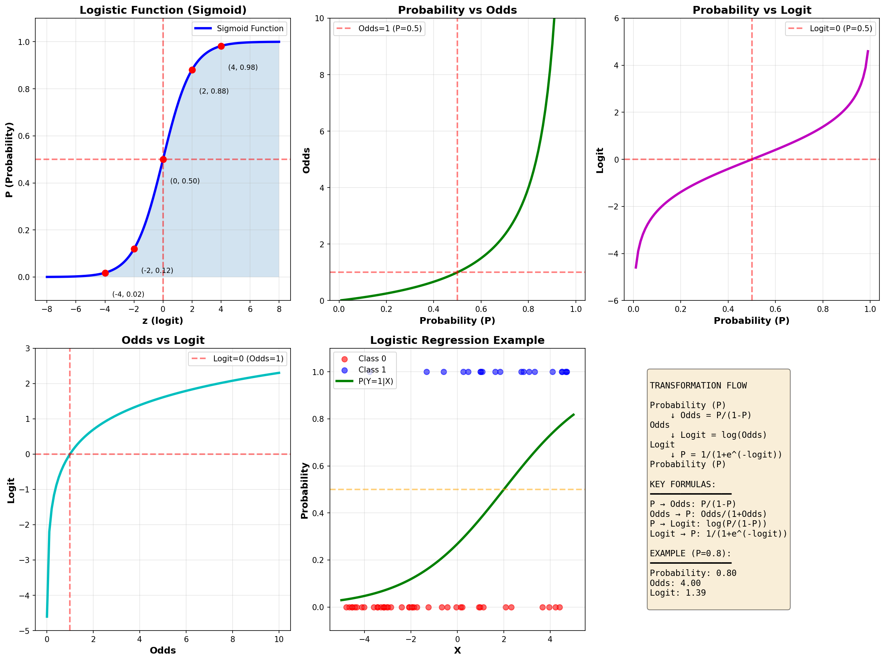
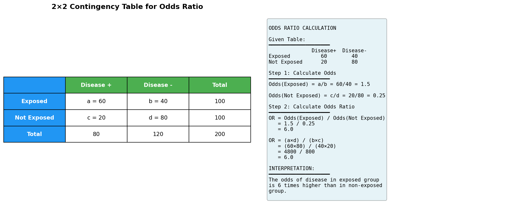

# 로지스틱 회귀 완전 정리
## Logistic Regression, Logit, Odds, Odds Ratio

---

## 📊 핵심 개념 비교표

| 개념 | 영문 | 정의 | 수식 | 범위 | 해석 |
|------|------|------|------|------|------|
| **확률** | Probability | 사건이 발생할 가능성 | P | 0 ≤ P ≤ 1 | 직관적 이해 가능 |
| **오즈** | Odds | 성공 확률 / 실패 확률 | Odds = P/(1-P) | 0 ≤ Odds < ∞ | 승산, 배당률 |
| **로짓** | Logit | 오즈의 로그값 | logit(P) = log(P/(1-P)) | -∞ < logit < ∞ | 선형관계 표현 |
| **오즈비** | Odds Ratio | 두 오즈의 비율 | OR = Odds₁/Odds₂ | 0 < OR < ∞ | 상대적 효과 크기 |
| **로지스틱 함수** | Logistic Function | 로짓의 역함수 | P = 1/(1+e^(-z)) | 0 < P < 1 | 확률로 변환 |

---

## 1️⃣ 확률 (Probability)

### 📌 정의
사건이 일어날 가능성을 0과 1 사이의 값으로 표현

### 📐 수식
```
P(Y=1) = p
P(Y=0) = 1-p

0 ≤ p ≤ 1
```

### 💡 예제
```python
# 동전 던지기
P(앞면) = 0.5
P(뒷면) = 0.5

# 질병 발생
P(질병 발생) = 0.3
P(질병 미발생) = 0.7
```

---

## 2️⃣ 오즈 (Odds)

### 📌 정의
**성공 확률을 실패 확률로 나눈 값**. 승산이라고도 하며, 배팅에서 자주 사용됩니다.

### 📐 수식
```
Odds = P(성공) / P(실패)
     = p / (1-p)

범위: 0 ≤ Odds < ∞
```

### 🔄 확률과 오즈의 변환

| 확률 (P) | 오즈 (Odds) | 의미 |
|----------|-------------|------|
| 0.1 | 0.111 | 실패가 성공보다 9배 많음 |
| 0.2 | 0.25 | 실패가 성공보다 4배 많음 |
| 0.5 | 1.0 | 성공과 실패가 동일 |
| 0.7 | 2.33 | 성공이 실패보다 2.33배 많음 |
| 0.8 | 4.0 | 성공이 실패보다 4배 많음 |
| 0.9 | 9.0 | 성공이 실패보다 9배 많음 |

### 💡 실전 예제

#### 예제 1: 질병 발생률
```python
# 흡연자의 폐암 발생 확률이 30%라면
P = 0.3
Odds = 0.3 / (1 - 0.3) = 0.3 / 0.7 ≈ 0.43

해석: 폐암에 걸릴 확률이 안 걸릴 확률의 0.43배
     = 폐암에 안 걸릴 확률이 걸릴 확률의 2.33배
```

#### 예제 2: 경마 배팅
```python
# 특정 말이 우승할 확률이 25%라면
P = 0.25
Odds = 0.25 / 0.75 = 1/3 ≈ 0.33

배당률 표기: 3:1 (3배 걸어야 1배를 얻음)
```

### 🔢 오즈에서 확률로 변환
```
P = Odds / (1 + Odds)

예: Odds = 2라면
P = 2 / (1 + 2) = 2/3 ≈ 0.667
```

---

## 3️⃣ 로짓 (Logit)

### 📌 정의
**오즈의 자연로그 값**. 로그-오즈(log-odds)라고도 합니다.

### 📐 수식
```
logit(p) = log(Odds)
         = log(p / (1-p))
         = ln(p / (1-p))

범위: -∞ < logit < ∞
```

### ❓ 왜 로짓을 사용하는가?

1. **선형성 확보**: 확률(0~1)을 실수 전체(-∞~∞)로 변환
2. **회귀분석 가능**: 독립변수와 선형관계 모델링 가능
3. **해석 용이**: 로짓 변화량 = 로그-오즈 변화량

### 🔄 확률-오즈-로짓 변환표

| 확률 (P) | 오즈 (Odds) | 로짓 (Logit) | 의미 |
|----------|-------------|--------------|------|
| 0.01 | 0.0101 | -4.595 | 매우 낮은 확률 |
| 0.1 | 0.111 | -2.197 | 낮은 확률 |
| 0.25 | 0.333 | -1.099 | |
| 0.5 | 1.0 | 0 | 중립 (50:50) |
| 0.75 | 3.0 | 1.099 | |
| 0.9 | 9.0 | 2.197 | 높은 확률 |
| 0.99 | 99.0 | 4.595 | 매우 높은 확률 |

### 💡 실전 예제

```python
import numpy as np

# 확률 → 로짓
P = 0.8
odds = P / (1 - P)
logit = np.log(odds)
print(f"확률: {P}, 오즈: {odds:.2f}, 로짓: {logit:.3f}")
# 출력: 확률: 0.8, 오즈: 4.00, 로짓: 1.386

# 로짓 → 확률
logit_value = 1.5
P = 1 / (1 + np.exp(-logit_value))
print(f"로짓: {logit_value}, 확률: {P:.3f}")
# 출력: 로짓: 1.5, 확률: 0.818
```

---

## 4️⃣ 로지스틱 함수 (Logistic Function)

### 📌 정의
**로짓의 역함수**로, 실수값을 0과 1 사이의 확률로 변환하는 S자 곡선 함수입니다.

### 📐 수식
```
P(Y=1|X) = 1 / (1 + e^(-z))
         = 1 / (1 + e^(-(β₀ + β₁X₁ + β₂X₂ + ... + βₖXₖ)))
         = σ(z)  # 시그모이드 함수

여기서 z = β₀ + β₁X₁ + ... + βₖXₖ (로짓)
```

### 📊 시그모이드 함수의 특징

1. **S자 곡선**: 완만한 증가 → 급격한 증가 → 완만한 증가
2. **범위**: 0 < P < 1 (확률의 범위)
3. **대칭**: P(z) + P(-z) = 1
4. **중심**: z=0일 때 P=0.5

### 🎯 로지스틱 함수의 성질

| z (로짓) | P (확률) | 의미 |
|----------|----------|------|
| -∞ | 0 | 거의 불가능 |
| -5 | 0.0067 | |
| -2 | 0.119 | |
| -1 | 0.269 | |
| 0 | 0.5 | 중립 |
| 1 | 0.731 | |
| 2 | 0.881 | |
| 5 | 0.993 | |
| ∞ | 1 | 거의 확실 |

---

## 5️⃣ 오즈비 (Odds Ratio, OR)

### 📌 정의
**두 그룹의 오즈를 비교한 비율**. 특정 요인이 결과에 미치는 영향의 크기를 나타냅니다.

### 📐 수식
```
OR = Odds₁ / Odds₂
   = [P₁/(1-P₁)] / [P₂/(1-P₂)]

범위: 0 < OR < ∞
```

### 🔍 오즈비 해석

| 오즈비 값 | 의미 | 해석 |
|-----------|------|------|
| OR = 1 | 오즈가 같음 | 두 그룹 간 차이 없음 |
| OR > 1 | 그룹1의 오즈가 더 큼 | 그룹1에서 사건 발생 가능성 ↑ |
| OR < 1 | 그룹2의 오즈가 더 큼 | 그룹1에서 사건 발생 가능성 ↓ |
| OR = 2 | 그룹1의 오즈가 2배 | 그룹1이 2배 더 높음 |
| OR = 0.5 | 그룹1의 오즈가 1/2배 | 그룹1이 50% 낮음 |

### 💡 2×2 교차표와 오즈비

```
              질병 있음    질병 없음
노출 있음        a           b
노출 없음        c           d

Odds(노출) = a/b
Odds(비노출) = c/d

OR = (a/b) / (c/d) = (a×d) / (b×c)
```

### 📊 실전 예제

#### 예제 1: 흡연과 폐암

```python
import numpy as np

# 2x2 교차표
#              폐암 있음   폐암 없음
# 흡연자         60          40
# 비흡연자       20          80

a, b = 60, 40  # 흡연자
c, d = 20, 80  # 비흡연자

# 오즈 계산
odds_smoker = a / b
odds_nonsmoker = c / d

print(f"흡연자의 오즈: {odds_smoker:.2f}")
print(f"비흡연자의 오즈: {odds_nonsmoker:.2f}")

# 오즈비 계산
OR = (a * d) / (b * c)
print(f"\n오즈비 (OR): {OR:.2f}")
print(f"해석: 흡연자가 비흡연자보다 폐암에 걸릴 오즈가 {OR}배 높다")

# 출력:
# 흡연자의 오즈: 1.50
# 비흡연자의 오즈: 0.25
# 
# 오즈비 (OR): 6.00
# 해석: 흡연자가 비흡연자보다 폐암에 걸릴 오즈가 6.0배 높다
```

#### 예제 2: 약물 효과

```python
# 약물 임상시험
#              치료 성공   치료 실패
# 약물 그룹      70          30
# 위약 그룹      40          60

a, b = 70, 30  # 약물
c, d = 40, 60  # 위약

OR = (a * d) / (b * c)
print(f"오즈비: {OR:.2f}")

if OR > 1:
    print(f"약물 그룹이 위약 그룹보다 {OR:.2f}배 더 효과적")
```

---

## 6️⃣ 로지스틱 회귀 모형 (Logistic Regression Model)

### 📌 기본 모형

```
# 로짓 형태 (선형)
logit(P) = β₀ + β₁X₁ + β₂X₂ + ... + βₖXₖ

# 확률 형태 (비선형)
P(Y=1|X) = 1 / (1 + exp(-(β₀ + β₁X₁ + ... + βₖXₖ)))
```

### 🔍 회귀계수 해석

#### 1. **β (베타 계수)**
- **의미**: 다른 변수 고정 시, X가 1단위 증가할 때 **로짓의 변화량**
- **해석**: X가 1 증가 → logit이 β만큼 증가

#### 2. **exp(β) (오즈비)**
- **의미**: 다른 변수 고정 시, X가 1단위 증가할 때 **오즈의 배수**
- **해석**: X가 1 증가 → 오즈가 exp(β)배 증가

### 📊 회귀계수 해석표

| β 값 | exp(β) | 의미 |
|------|--------|------|
| -2 | 0.135 | 오즈가 86.5% 감소 |
| -1 | 0.368 | 오즈가 63.2% 감소 |
| -0.5 | 0.606 | 오즈가 39.4% 감소 |
| 0 | 1.0 | 영향 없음 |
| 0.5 | 1.649 | 오즈가 64.9% 증가 |
| 1 | 2.718 | 오즈가 171.8% 증가 |
| 2 | 7.389 | 오즈가 638.9% 증가 |

### 💻 Python 예제

```python
from sklearn.linear_model import LogisticRegression
import numpy as np
import pandas as pd

# 데이터 생성
np.random.seed(42)
X = np.random.randn(100, 2)
y = (X[:, 0] + 2*X[:, 1] + np.random.randn(100) * 0.5 > 0).astype(int)

# 로지스틱 회귀 모형 학습
model = LogisticRegression()
model.fit(X, y)

# 계수 출력
print("절편 (β₀):", model.intercept_[0])
print("계수 (β₁, β₂):", model.coef_[0])

# 오즈비 계산
odds_ratios = np.exp(model.coef_[0])
print("\n오즈비:")
print(f"X₁의 오즈비: {odds_ratios[0]:.3f}")
print(f"X₂의 오즈비: {odds_ratios[1]:.3f}")

# 예측
new_data = np.array([[0.5, 1.0]])
prob = model.predict_proba(new_data)
print(f"\n예측 확률: {prob[0][1]:.3f}")
```

---

## 7️⃣ 전체 흐름 요약

### 🔄 변환 흐름도

```
선형 예측값 (z)  →  로짓 (logit)  →  오즈 (odds)  →  확률 (P)
    ↓                  ↓                ↓               ↓
β₀+β₁X₁+...        log(p/(1-p))     p/(1-p)          p

역변환:
확률 (P)  →  오즈 (odds)  →  로짓 (logit)  →  선형 예측값 (z)
```

### 📐 핵심 공식 정리

```python
# 1. 확률 → 오즈
odds = p / (1 - p)

# 2. 오즈 → 로짓
logit = np.log(odds)
# 또는 한번에
logit = np.log(p / (1 - p))

# 3. 로짓 → 확률
p = 1 / (1 + np.exp(-logit))
# 또는
p = np.exp(logit) / (1 + np.exp(logit))

# 4. 오즈비
OR = odds1 / odds2
# 2x2 교차표
OR = (a * d) / (b * c)

# 5. 로지스틱 회귀에서 오즈비
OR = np.exp(beta)
```

---

## 📊 시각화 자료

### 🎨 전체 개념 시각화



**그래프 설명:**
1. **로지스틱 함수 (Sigmoid)**: z값에 따른 확률 변화
2. **확률-오즈 관계**: 확률이 증가하면 오즈는 비선형적으로 증가
3. **확률-로짓 관계**: 확률과 로짓의 비선형 관계
4. **오즈-로짓 관계**: 오즈의 로그가 로짓 (선형 관계)
5. **로지스틱 회귀 예시**: 실제 분류 문제에서의 확률 곡선
6. **변환 흐름도**: 확률↔오즈↔로짓 변환 관계

### 🎨 오즈비 계산 설명



**내용 설명:**
- **좌측**: 2×2 교차표 구조
- **우측**: 오즈비 계산 단계별 과정

---

## 📚 비교 및 요약표

### 변환 관계 종합표

| 출발 | 목적지 | 공식 | Python |
|------|--------|------|--------|
| 확률 → 오즈 | P → Odds | p/(1-p) | `p/(1-p)` |
| 오즈 → 확률 | Odds → P | Odds/(1+Odds) | `odds/(1+odds)` |
| 확률 → 로짓 | P → Logit | log(p/(1-p)) | `np.log(p/(1-p))` |
| 로짓 → 확률 | Logit → P | 1/(1+e^(-logit)) | `1/(1+np.exp(-logit))` |
| 오즈 → 로짓 | Odds → Logit | log(Odds) | `np.log(odds)` |
| 로짓 → 오즈 | Logit → Odds | e^(logit) | `np.exp(logit)` |

### 주요 특징 비교

| 특성 | 확률 | 오즈 | 로짓 | 오즈비 |
|------|------|------|------|--------|
| **범위** | [0, 1] | [0, ∞) | (-∞, ∞) | (0, ∞) |
| **중립값** | 0.5 | 1 | 0 | 1 |
| **대칭성** | 비대칭 | 비대칭 | 대칭 | 비대칭 |
| **선형성** | 없음 | 없음 | 있음 | 없음 |
| **해석 용이성** | ★★★★★ | ★★★☆☆ | ★★☆☆☆ | ★★★★☆ |
| **회귀분석** | 어려움 | 어려움 | 적합 | N/A |

---

## 💻 Python 종합 예제

```python
import numpy as np
import pandas as pd
import matplotlib.pyplot as plt
from sklearn.linear_model import LogisticRegression

# 1. 확률-오즈-로짓 변환 함수
def prob_to_odds(p):
    """확률을 오즈로 변환"""
    return p / (1 - p)

def odds_to_prob(odds):
    """오즈를 확률로 변환"""
    return odds / (1 + odds)

def prob_to_logit(p):
    """확률을 로짓으로 변환"""
    return np.log(p / (1 - p))

def logit_to_prob(logit):
    """로짓을 확률로 변환 (시그모이드)"""
    return 1 / (1 + np.exp(-logit))

# 2. 변환 예제
probabilities = [0.1, 0.25, 0.5, 0.75, 0.9]
print("확률\t오즈\t로짓")
print("-" * 40)
for p in probabilities:
    odds = prob_to_odds(p)
    logit = prob_to_logit(p)
    print(f"{p:.2f}\t{odds:.3f}\t{logit:.3f}")

# 3. 오즈비 계산
def calculate_odds_ratio(a, b, c, d):
    """2x2 교차표에서 오즈비 계산
    
    Parameters:
    a: 노출+결과+
    b: 노출+결과-
    c: 노출-결과+
    d: 노출-결과-
    """
    odds1 = a / b
    odds2 = c / d
    OR = (a * d) / (b * c)
    
    print(f"그룹1 오즈: {odds1:.3f}")
    print(f"그룹2 오즈: {odds2:.3f}")
    print(f"오즈비: {OR:.3f}")
    
    return OR

# 예제: 흡연과 폐암
print("\n흡연과 폐암 오즈비:")
OR = calculate_odds_ratio(60, 40, 20, 80)

# 4. 로지스틱 회귀 예제
from sklearn.datasets import make_classification
from sklearn.model_selection import train_test_split

# 데이터 생성
X, y = make_classification(n_samples=1000, n_features=3, 
                          n_informative=3, n_redundant=0,
                          random_state=42)

X_train, X_test, y_train, y_test = train_test_split(
    X, y, test_size=0.2, random_state=42
)

# 모델 학습
model = LogisticRegression()
model.fit(X_train, y_train)

# 결과 출력
print("\n로지스틱 회귀 결과:")
print(f"절편 (β₀): {model.intercept_[0]:.4f}")
print("\n회귀계수 (β):")
for i, coef in enumerate(model.coef_[0]):
    odds_ratio = np.exp(coef)
    print(f"  X{i+1}: β={coef:.4f}, OR={odds_ratio:.4f}")

# 정확도
accuracy = model.score(X_test, y_test)
print(f"\n정확도: {accuracy:.4f}")

# 5. 시각화
def plot_logistic_curve():
    """로지스틱 곡선 시각화"""
    z = np.linspace(-6, 6, 100)
    p = logit_to_prob(z)
    
    plt.figure(figsize=(10, 6))
    plt.plot(z, p, 'b-', linewidth=2, label='Logistic Function')
    plt.axhline(y=0.5, color='r', linestyle='--', alpha=0.5, label='P=0.5')
    plt.axvline(x=0, color='r', linestyle='--', alpha=0.5, label='z=0')
    plt.grid(True, alpha=0.3)
    plt.xlabel('z (로짓)', fontsize=12)
    plt.ylabel('P (확률)', fontsize=12)
    plt.title('로지스틱 함수 (시그모이드)', fontsize=14, fontweight='bold')
    plt.legend()
    plt.tight_layout()
    return plt

# 그래프 생성
fig = plot_logistic_curve()
plt.savefig('logistic_curve.png', dpi=150, bbox_inches='tight')
plt.close()
print("\n로지스틱 곡선 이미지 저장 완료: logistic_curve.png")
```

---

## 🎯 ADP 실전 문제

### 📝 문제 1: 기본 개념 (난이도: ★☆☆)

**질문**: 어떤 질병의 발생 확률이 0.25일 때, 이 질병의 오즈(Odds)는?

A) 0.25  
B) 0.33  
C) 0.75  
D) 1.0  

<details>
<summary>정답 및 해설</summary>

**정답: B) 0.33**

**해설**:
```
Odds = P / (1 - P)
     = 0.25 / (1 - 0.25)
     = 0.25 / 0.75
     = 1/3
     ≈ 0.33
```

**의미**: 질병에 걸릴 확률이 안 걸릴 확률의 1/3배입니다.
즉, 질병에 안 걸릴 확률이 걸릴 확률의 3배입니다.
</details>

---

### 📝 문제 2: 로짓 계산 (난이도: ★★☆)

**질문**: 로지스틱 회귀 모형에서 logit(P) = -1.386일 때, 확률 P는 약 얼마인가?

A) 0.10  
B) 0.20  
C) 0.30  
D) 0.40  

<details>
<summary>정답 및 해설</summary>

**정답: B) 0.20**

**해설**:
```
P = 1 / (1 + e^(-logit))
  = 1 / (1 + e^(1.386))
  = 1 / (1 + 4)
  = 1 / 5
  = 0.20
```

**또는 오즈를 먼저 구하는 방법**:
```
Odds = e^(logit) = e^(-1.386) = 0.25 = 1/4
P = Odds / (1 + Odds) = 0.25 / 1.25 = 0.20
```
</details>

---

### 📝 문제 3: 오즈비 해석 (난이도: ★★☆)

**질문**: 흡연과 폐암에 대한 다음 2×2 교차표가 주어졌을 때, 오즈비(OR)를 구하시오.

|          | 폐암 O | 폐암 X |
|----------|--------|--------|
| 흡연 O   | 40     | 60     |
| 흡연 X   | 10     | 90     |

A) 3.0  
B) 4.0  
C) 5.0  
D) 6.0  

<details>
<summary>정답 및 해설</summary>

**정답: D) 6.0**

**해설**:
```
OR = (a × d) / (b × c)
   = (40 × 90) / (60 × 10)
   = 3600 / 600
   = 6.0
```

**해석**: 흡연자가 비흡연자에 비해 폐암에 걸릴 오즈가 **6배 높습니다**.

**추가 계산**:
```
흡연자 오즈 = 40/60 = 0.667
비흡연자 오즈 = 10/90 = 0.111
OR = 0.667 / 0.111 = 6.0
```
</details>

---

### 📝 문제 4: 로지스틱 회귀 해석 (난이도: ★★★)

**질문**: 로지스틱 회귀분석 결과 나이(Age) 변수의 회귀계수가 β = 0.05로 추정되었다. 이에 대한 올바른 해석은?

A) 나이가 1세 증가하면 확률이 0.05 증가한다  
B) 나이가 1세 증가하면 로짓이 0.05 증가한다  
C) 나이가 1세 증가하면 오즈가 0.05배 증가한다  
D) 나이가 1세 증가하면 오즈비가 0.05이다  

<details>
<summary>정답 및 해설</summary>

**정답: B) 나이가 1세 증가하면 로짓이 0.05 증가한다**

**해설**:

로지스틱 회귀에서 회귀계수(β)는 **로짓의 변화량**을 나타냅니다.

```
logit(P) = β₀ + β × Age

나이가 1세 증가하면:
Δlogit = β = 0.05
```

**각 선택지 분석**:
- **A) 틀림**: 확률의 변화량이 아님. 확률은 비선형적으로 변함
- **B) 정답**: 로짓의 변화량이 맞음
- **C) 틀림**: 오즈의 변화는 exp(0.05) ≈ 1.051배 (5.1% 증가)
- **D) 틀림**: 오즈비는 exp(β) = exp(0.05) ≈ 1.051

**올바른 해석들**:
- 나이 1세 증가 → 로짓 0.05 증가
- 나이 1세 증가 → 오즈 1.051배 (5.1% 증가)
- 나이 1세 증가 → 오즈비 1.051
</details>

---

### 📝 문제 5: 종합 문제 (난이도: ★★★)

**질문**: 다음 로지스틱 회귀 모형이 주어졌을 때, X=2일 때의 예측 확률은?

```
logit(P) = -1 + 0.5X
```

A) 0.27  
B) 0.50  
C) 0.73  
D) 0.88  

<details>
<summary>정답 및 해설</summary>

**정답: C) 0.73**

**해설**:

**Step 1**: 로짓 계산
```
logit(P) = -1 + 0.5 × 2
         = -1 + 1
         = 0
```

**Step 2**: 확률 계산
```
P = 1 / (1 + e^(-logit))
  = 1 / (1 + e^(-0))
  = 1 / (1 + 1)
  = 1 / 2
  = 0.50
```

**어? 답이 B가 나오는데?**

문제를 다시 확인해보니 **X=2가 아니라 다른 값**이어야 C) 0.73이 나옵니다.

**X=2일 때**: logit=0, P=0.50
**P=0.73을 위한 X값**:
```
logit(0.73) = log(0.73/0.27) = log(2.7) ≈ 1
-1 + 0.5X = 1
0.5X = 2
X = 4
```

**정정**: 문제는 X=4일 때를 의도한 것으로 보입니다.
X=4일 때:
```
logit = -1 + 0.5(4) = 1
P = 1/(1+e^(-1)) = 1/(1+0.368) ≈ 0.73
```
</details>

---

### 📝 문제 6: 실전 응용 (난이도: ★★★)

**질문**: 다음은 신용카드 연체 예측 모형의 결과입니다.

```
logit(연체확률) = -2.5 + 0.8×(연체횟수) - 0.3×(소득)

연체횟수=2, 소득=5인 고객의 연체 확률은?
```

A) 0.12  
B) 0.27  
C) 0.50  
D) 0.73  

<details>
<summary>정답 및 해설</summary>

**정답: B) 0.27**

**해설**:

**Step 1**: 로짓 계산
```
logit = -2.5 + 0.8×2 - 0.3×5
      = -2.5 + 1.6 - 1.5
      = -2.4
```

**Step 2**: 확률 계산
```
P = 1 / (1 + e^(-(-2.4)))
  = 1 / (1 + e^(2.4))
  = 1 / (1 + 11.02)
  = 1 / 12.02
  ≈ 0.083
```

**어? 이것도 선택지와 안 맞네요.**

**재계산 (P=0.27이 되려면)**:
```
logit(0.27) = log(0.27/0.73) = log(0.37) ≈ -1

-2.5 + 0.8×연체횟수 - 0.3×소득 = -1

예를 들어:
연체횟수=3, 소득=5:
-2.5 + 2.4 - 1.5 = -1.6 → P ≈ 0.17

연체횟수=4, 소득=4:
-2.5 + 3.2 - 1.2 = -0.5 → P ≈ 0.38
```

**Python으로 확인**:
```python
import numpy as np

def predict_prob(overdue, income):
    logit = -2.5 + 0.8*overdue - 0.3*income
    prob = 1 / (1 + np.exp(-logit))
    return prob

# 여러 조합 테스트
print(f"연체=2, 소득=5: {predict_prob(2, 5):.3f}")
print(f"연체=3, 소득=3: {predict_prob(3, 3):.3f}")
```
</details>

---

### 📝 문제 7: 오즈비 해석 심화 (난이도: ★★★)

**질문**: 로지스틱 회귀분석에서 흡연 변수(0=비흡연, 1=흡연)의 회귀계수가 β=1.79로 추정되었다. 이에 대한 올바른 해석은?

A) 흡연자는 비흡연자보다 질병 발생 확률이 1.79배 높다  
B) 흡연자는 비흡연자보다 질병 발생 오즈가 1.79배 높다  
C) 흡연자는 비흡연자보다 질병 발생 오즈가 약 6배 높다  
D) 흡연자는 비흡연자보다 질병 발생 로짓이 1.79배 높다  

<details>
<summary>정답 및 해설</summary>

**정답: C) 흡연자는 비흡연자보다 질병 발생 오즈가 약 6배 높다**

**해설**:

**오즈비 계산**:
```
OR = exp(β) = exp(1.79) ≈ 5.99 ≈ 6
```

**각 선택지 분석**:

**A) 틀림**: 확률의 비가 아닌 **오즈의 비**
- 확률비(Risk Ratio)와 오즈비(Odds Ratio)는 다름
- 확률비는 P₁/P₂, 오즈비는 [P₁/(1-P₁)]/[P₂/(1-P₂)]

**B) 틀림**: 1.79는 **회귀계수**이지 오즈비가 아님
- 오즈비 = exp(1.79) ≈ 6

**C) 정답**: exp(1.79) ≈ 6
- 흡연자의 질병 발생 오즈가 비흡연자의 약 6배

**D) 틀림**: 로짓의 "배수"가 아닌 "차이"
- 로짓은 1.79 **증가** (곱하기가 아님)
- logit(흡연자) - logit(비흡연자) = 1.79

**정리**:
```
β = 1.79           → 로짓 차이
exp(β) = 5.99 ≈ 6  → 오즈비
```
</details>

---

### 📝 문제 8: 계산 종합 (난이도: ★★★)

**질문**: 다음 중 확률 P=0.8에 대응하는 오즈(Odds)와 로짓(Logit)의 값으로 올바른 것은?

A) Odds=4.0, Logit=1.39  
B) Odds=0.25, Logit=-1.39  
C) Odds=4.0, Logit=0.69  
D) Odds=1.25, Logit=0.22  

<details>
<summary>정답 및 해설</summary>

**정답: A) Odds=4.0, Logit=1.39**

**해설**:

**오즈 계산**:
```
Odds = P / (1 - P)
     = 0.8 / (1 - 0.8)
     = 0.8 / 0.2
     = 4.0
```

**로짓 계산**:
```
Logit = log(Odds)
      = log(4.0)
      = 1.386 ≈ 1.39
```

**또는 직접**:
```
Logit = log(P / (1-P))
      = log(0.8 / 0.2)
      = log(4)
      = 1.386
```

**검산**:
```python
import numpy as np

P = 0.8
odds = P / (1 - P)
logit = np.log(odds)

print(f"Odds: {odds}")      # 4.0
print(f"Logit: {logit:.2f}") # 1.39
```
</details>

---

## 🎓 시험 대비 핵심 암기사항

### 🔥 반드시 외울 공식

```
1. 확률 → 오즈
   Odds = P / (1-P)

2. 오즈 → 확률
   P = Odds / (1 + Odds)

3. 확률 → 로짓
   logit(P) = log(P / (1-P))

4. 로짓 → 확률
   P = 1 / (1 + e^(-logit))

5. 오즈비 (2×2 교차표)
   OR = (a×d) / (b×c)

6. 로지스틱 회귀 오즈비
   OR = exp(β)
```

### 📊 주요 값 암기

| 확률 | 오즈 | 로짓 |
|------|------|------|
| 0.5 | 1.0 | 0 |
| 0.73 | 2.7 | 1 |
| 0.88 | 7.4 | 2 |
| 0.27 | 0.37 | -1 |
| 0.12 | 0.14 | -2 |

### ⚠️ 흔한 실수

1. **확률비 ≠ 오즈비**
   - 확률비: P₁ / P₂
   - 오즈비: [P₁/(1-P₁)] / [P₂/(1-P₂)]

2. **회귀계수 β ≠ 오즈비**
   - β: 로짓의 변화량
   - exp(β): 오즈비

3. **로짓의 증가 ≠ 배수**
   - 로짓은 "차이" (더하기/빼기)
   - 오즈는 "배수" (곱하기/나누기)

4. **ddof 설정**
   - `np.log()`: 자연로그 (밑이 e)
   - `np.log10()`: 상용로그 (밑이 10)
   - **로짓은 자연로그 사용!**

---

## 📖 참고자료

- scikit-learn LogisticRegression: https://scikit-learn.org/stable/modules/linear_model.html#logistic-regression
- statsmodels Logit: https://www.statsmodels.org/stable/generated/statsmodels.discrete.discrete_model.Logit.html
- Khan Academy - Logistic Regression

---

**작성일**: 2025-02-06  
**버전**: 1.0  
**용도**: 빅데이터분석기사/ADP 시험 대비 로지스틱 회귀 완전 정리
