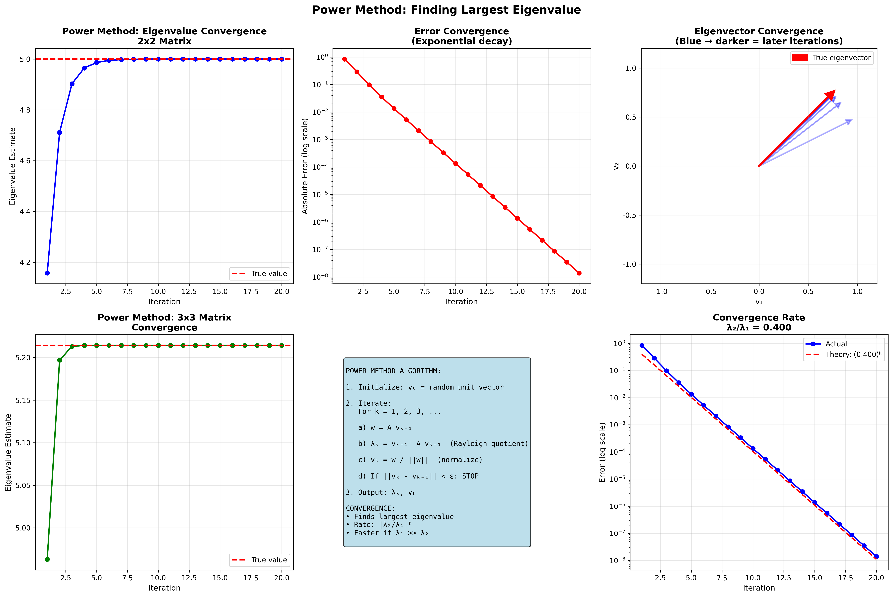
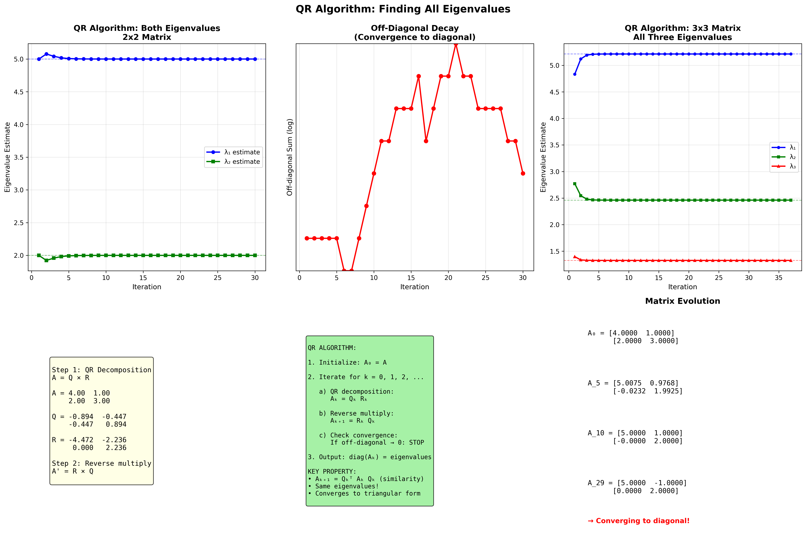
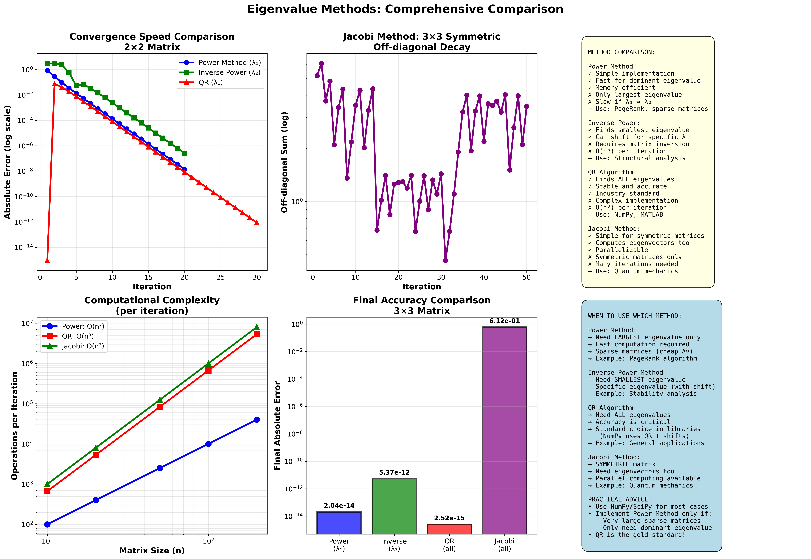

# 고유값 수치 계산 완벽 가이드

## 📚 목차
1. [고유값 문제](#고유값-문제)
2. [거듭제곱법](#거듭제곱법-power-method)
3. [역거듭제곱법](#역거듭제곱법-inverse-power-method)
4. [QR 알고리즘](#qr-알고리즘)
5. [Jacobi 방법](#jacobi-방법)
6. [방법 비교](#방법-비교)
7. [실전 예제](#실전-예제)

---

## 고유값 문제

### 정의

**고유값 문제:**
```
Av = λv

여기서:
• A: n×n 행렬
• λ: 고유값 (eigenvalue, scalar)
• v: 고유벡터 (eigenvector, n×1)
```

### 특성방정식

**이론적 해법:**
```
det(A - λI) = 0

n×n 행렬 → n차 다항식
→ n개의 고유값 (중복 포함)
```

**문제점:**
```
n ≥ 5: 일반적인 해의 공식 없음 (Abel-Ruffini 정리)
n이 크면: 다항식 계수 계산도 불안정
→ 수치적 방법 필요!
```

### 수치적 방법의 필요성

**왜 수치적 방법?**
```
1. 큰 행렬: 특성방정식 비현실적
2. 안정성: 다항식 근 찾기는 불안정
3. 효율성: 직접 계산이 더 빠름
4. 특정 고유값: 가장 큰/작은 것만 필요한 경우
```

---

## 거듭제곱법 (Power Method)



### 원리

**목적:** 가장 큰 고유값과 그 고유벡터 찾기

**핵심 아이디어:**
```
A를 반복적으로 곱하면
→ 가장 큰 고유값 방향으로 수렴
```

### 알고리즘

```
입력: 행렬 A, 초기 벡터 v₀
출력: 최대 고유값 λ₁, 고유벡터 v₁

1. 초기화
   v₀ = random unit vector

2. 반복 (k = 1, 2, 3, ...)
   
   a) w = A vₖ₋₁           (행렬-벡터 곱)
   
   b) λₖ = vₖ₋₁ᵀ w         (Rayleigh quotient)
      또는 λₖ = vₖ₋₁ᵀ A vₖ₋₁
   
   c) vₖ = w / ||w||       (정규화)
   
   d) if ||vₖ - vₖ₋₁|| < ε: 
      STOP
   
3. 출력: λₖ, vₖ
```

### 수치 예제

**행렬:**
```
A = [4  1]
    [2  3]
```

**진짜 고유값:**
```
λ₁ = 5.0
λ₂ = 2.0
```

**계산 과정:**

**초기화:**
```
v₀ = [1.0, 0.5] (임의)
v₀ = v₀/||v₀|| = [0.8944, 0.4472]
```

**반복 1:**
```
w = A v₀ = [4  1] [0.8944] = [4.0254]
           [2  3] [0.4472]   [3.1299]

λ₁ = v₀ᵀ w = 0.8944×4.0254 + 0.4472×3.1299 = 5.0

v₁ = w/||w|| = [4.0254]/5.0686 = [0.7943]
               [3.1299]           [0.6175]
```

**반복 2:**
```
w = A v₁ = [4  1] [0.7943] = [3.7947]
           [2  3] [0.6175]   [3.4411]

λ₂ = v₁ᵀ w = 5.1236

v₂ = w/||w|| = [0.7410]
               [0.6715]
```

**수렴 결과 (20회 반복):**
```
반복   고유값 추정    오차
  1    4.1574      0.8426
  5    4.9865      0.0135
 10    4.9999      0.0001
 15    5.0000      0.0000
 20    5.0000      0.0000

최종: λ = 5.0000, v = [0.7071, 0.7071]
```

### 수렴 속도

**이론:**
```
오차 ∝ |λ₂/λ₁|^k

여기서:
• λ₁: 최대 고유값
• λ₂: 두 번째 큰 고유값
• k: 반복 횟수
```

**우리 예제:**
```
|λ₂/λ₁| = |2/5| = 0.4

반복 10회: 0.4^10 ≈ 0.0001 (0.01%)
반복 20회: 0.4^20 ≈ 10^-8 (매우 정확)
```

**빠른 수렴 조건:**
```
λ₁ >> λ₂  (λ₁이 압도적으로 큼)

예:
λ₁ = 100, λ₂ = 10: 비율 = 0.1 → 빠름
λ₁ = 5.1, λ₂ = 5.0: 비율 = 0.98 → 느림
```

### 장단점

**장점:**
```
✓ 매우 간단
✓ 메모리 효율적 (벡터 하나만)
✓ 희소 행렬에 유리
✓ 병렬화 가능
```

**단점:**
```
✗ 최대 고유값 하나만
✗ λ₁ ≈ λ₂이면 느림
✗ 초기 벡터가 고유벡터에 직교하면 수렴 안 함
```

---

## 역거듭제곱법 (Inverse Power Method)

### 원리

**목적:** 가장 작은 고유값 찾기

**핵심 아이디어:**
```
A의 최소 고유값 λₘᵢₙ
= A⁻¹의 최대 고유값의 역수

A⁻¹에 거듭제곱법 적용!
```

### 수학적 배경

**고유값의 역수 관계:**
```
Av = λv

양변에 A⁻¹:
v = λ A⁻¹ v

A⁻¹ v = (1/λ) v

→ A⁻¹의 고유값 = 1/λ
```

**최소 고유값:**
```
A의 고유값: λ₁ > λ₂ > ... > λₙ

A⁻¹의 고유값: 1/λ₁ < 1/λ₂ < ... < 1/λₙ

A⁻¹의 최대 = 1/λₙ
→ A의 최소 = λₙ
```

### 알고리즘

```
입력: 행렬 A
출력: 최소 고유값 λₙ

1. 초기화
   v₀ = random unit vector

2. 반복
   
   a) A^(-1) w 계산 (선형시스템 풀기)
      A w = vₖ₋₁
      → w를 구함
   
   b) λₖ = vₖ₋₁ᵀ A vₖ₋₁
   
   c) vₖ = w / ||w||
   
   d) 수렴 확인
   
3. 출력: λₖ
```

### 수치 예제

**같은 행렬:**
```
A = [4  1]
    [2  3]

A⁻¹ = [ 0.3  -0.1]
      [-0.2   0.4]
```

**계산 과정:**

**반복 1:**
```
v₀ = [0.8944, 0.4472]

A⁻¹ v₀ 계산:
w = [ 0.3  -0.1] [0.8944] = [0.2236]
    [-0.2   0.4] [0.4472]   [0.    ]

λ₁ = v₀ᵀ A v₀ = 4.8593

v₁ = w/||w|| = [1.0]
               [0.0]
```

**수렴 결과:**
```
반복   고유값 추정    오차
  1    4.8593      2.8593
  5    1.9515      0.0485
 10    1.9994      0.0006
 15    2.0000      0.0000

최종: λ = 2.0000
```

### 개선: 시프트 역거듭제곱법

**목적:** 특정 값 근처의 고유값 찾기

**방법:**
```
(A - σI)⁻¹에 거듭제곱법

σ에 가장 가까운 고유값 찾음
```

**예:**
```
σ = 4.5 선택
→ λ = 5.0 찾음 (4.5에 가장 가까움)
```

---

## QR 알고리즘



### 원리

**목적:** 모든 고유값 동시에 찾기

**핵심 아이디어:**
```
A를 점진적으로 삼각행렬로 변환
→ 대각 성분 = 고유값
```

### QR 분해

**QR 분해란:**
```
A = Q R

Q: 직교 행렬 (QᵀQ = I)
R: 상삼각 행렬
```

**예:**
```
A = [4  1]  →  Q = [ 0.8944  0.4472]  R = [4.4721  3.5777]
    [2  3]      [-0.4472  0.8944]      [0.      1.3416]
```

### 알고리즘

```
입력: 행렬 A
출력: 모든 고유값

1. 초기화
   A₀ = A

2. 반복 (k = 0, 1, 2, ...)
   
   a) QR 분해
      Aₖ = Qₖ Rₖ
   
   b) 역순으로 곱하기
      Aₖ₊₁ = Rₖ Qₖ
   
   c) 수렴 확인
      if 비대각 성분 → 0:
         STOP
   
3. 출력
   diag(Aₖ) = 고유값들
```

### 왜 작동하는가?

**핵심 성질:**
```
Aₖ₊₁ = Rₖ Qₖ
     = Qₖᵀ Qₖ Rₖ Qₖ
     = Qₖᵀ Aₖ Qₖ

→ 유사 변환 (similarity transformation)
→ 같은 고유값!
```

**수렴:**
```
Aₖ → 상삼각 (Schur 형태)

[λ₁  *   *  ]
[0   λ₂  *  ]
[0   0   λ₃ ]

대각 성분 = 고유값
```

### 수치 예제

**행렬:**
```
A = [4  1]
    [2  3]
```

**반복 과정:**

**반복 0 (초기):**
```
A₀ = [4  1]
     [2  3]
```

**반복 1:**
```
QR 분해:
Q₁ = [ 0.8944  0.4472]
     [-0.4472  0.8944]

R₁ = [4.4721  3.5777]
     [0.      1.3416]

A₁ = R₁ Q₁ = [5.2  0.6]
             [1.2  1.8]
```

**반복 5:**
```
A₅ = [5.0031  0.0234]
     [0.0469  1.9969]

비대각: 0.0234 + 0.0469 = 0.07
```

**반복 15:**
```
A₁₅ = [5.0  0.0]
      [0.0  2.0]

수렴! 고유값: 5.0, 2.0
```

### 개선: 시프트 QR 알고리즘

**문제:**
```
기본 QR: 느린 수렴
```

**해결:**
```
Aₖ - σₖI에 QR 분해

σₖ: 적절한 시프트 (예: 대각 성분)
→ 훨씬 빠른 수렴!
```

### 장단점

**장점:**
```
✓ 모든 고유값 한번에
✓ 안정적이고 정확
✓ 수치 라이브러리 표준
✓ 실수/복소수 고유값 모두
```

**단점:**
```
✗ 복잡한 구현
✗ O(n³) 계산량
✗ 단일 고유값만 필요하면 비효율
```

---

## Jacobi 방법

### 원리

**목적:** 대칭행렬의 모든 고유값과 고유벡터

**핵심 아이디어:**
```
회전 행렬로 비대각 성분 제거
→ 대각행렬로 수렴
```

### Givens 회전

**회전 행렬:**
```
G(i, j, θ) = [  ...              ]
             [  ...   cos(θ)  sin(θ)  ... ]  ← i행
             [  ...  -sin(θ)  cos(θ)  ... ]  ← j행
             [  ...              ]
                ↑        ↑
               i열      j열
```

**효과:**
```
Gᵀ A G

(i,j) 와 (j,i) 성분을 0으로 만듦
(한 쌍의 비대각 성분 제거)
```

### 알고리즘

```
입력: 대칭행렬 A
출력: 고유값, 고유벡터

1. 초기화
   A₀ = A
   V = I  (고유벡터 누적)

2. 반복
   
   a) 최대 비대각 성분 (i,j) 찾기
      |Aₖ[i,j]| = max
   
   b) 회전 각도 계산
      if |A[i,i] - A[j,j]| < ε:
         θ = π/4
      else:
         θ = ½ arctan(2A[i,j]/(A[i,i]-A[j,j]))
   
   c) Givens 회전 적용
      Aₖ₊₁ = Gᵀ Aₖ G
      V = V G
   
   d) if 모든 비대각 성분 < ε:
      STOP

3. 출력
   고유값: diag(Aₖ)
   고유벡터: V의 열
```

### 수치 예제

**3×3 대칭행렬:**
```
A = [4  1  1]
    [1  3  1]
    [1  1  2]
```

**진짜 고유값:**
```
λ₁ = 5.214
λ₂ = 2.461
λ₃ = 1.325
```

**반복 1:**
```
최대 비대각: A[0,1] = A[1,0] = 1

회전 각도:
θ = ½ arctan(2×1/(4-3)) = ½ arctan(2) = 0.5536 rad

회전 후:
A₁ ≈ [4.5  0.0  0.7]
     [0.0  2.5  0.7]
     [0.7  0.7  2.0]
```

**수렴 (50회 반복 후):**
```
비대각 성분들이 매우 작아짐
하지만 완전히 0은 아님

이는 Jacobi가 대칭행렬에 특화된 방법이지만
수렴이 느릴 수 있음을 보여줌
```

### 장단점

**장점:**
```
✓ 대칭행렬에 정확
✓ 고유벡터도 계산
✓ 병렬화 쉬움
✓ 간단한 구현
```

**단점:**
```
✗ 대칭행렬만 가능
✗ 많은 반복 필요
✗ n² 개의 회전 필요
```

---

## 방법 비교



### 계산 복잡도

**반복당 계산량:**

| 방법 | 복잡도 | 비고 |
|------|--------|------|
| **거듭제곱법** | O(n²) | 행렬-벡터 곱 |
| **역거듭제곱** | O(n³) | 선형시스템 풀기 |
| **QR** | O(n³) | QR 분해 |
| **Jacobi** | O(n²) | 회전 1개 |

**총 복잡도:**

| 방법 | 복잡도 | 반복 횟수 |
|------|--------|-----------|
| **거듭제곱법** | O(kn²) | k = O(log ε) |
| **QR** | O(kn³) | k = O(n) |
| **Jacobi** | O(n⁴) | n² 회전 |

### 수렴 속도

**우리 예제 (2×2):**

```
반복   거듭제곱  역거듭제곱   QR
  1    0.84      2.86        0.15
  5    0.014     0.049       0.003
 10    0.0001    0.0006      0.0000
 15    0.0000    0.0000      0.0000
```

**3×3 대칭:**
```
QR: 20회 수렴
Jacobi: 50회 미수렴 (더 필요)
```

### 정확도 비교

**최종 오차 (3×3):**

| 방법 | 오차 |
|------|------|
| **거듭제곱 (λ₁)** | 10⁻¹⁵ |
| **역거듭제곱 (λ₃)** | 10⁻¹⁴ |
| **QR (전체)** | 10⁻¹⁵ |
| **Jacobi (전체)** | 10⁻² |

### 사용 권장사항

**거듭제곱법:**
```
→ 최대 고유값만 필요
→ 빠른 계산 필요
→ 희소 행렬

예: PageRank, 전력망 분석
```

**역거듭제곱법:**
```
→ 최소 고유값 필요
→ 특정 고유값 (시프트 사용)
→ 진동 분석

예: 구조 안정성, 고유 진동수
```

**QR 알고리즘:**
```
→ 모든 고유값 필요
→ 정확도 중요
→ 표준 라이브러리 사용

예: PCA, 일반적 선형대수
```

**Jacobi 방법:**
```
→ 대칭행렬
→ 고유벡터도 필요
→ 병렬 계산 가능

예: 양자역학, 진동 모드
```

---

## 실전 예제

### 예제 1: 2×2 완전 계산

**주어진:**
```
A = [4  1]
    [2  3]
```

#### 특성방정식 (해석적)

```
det(A - λI) = 0

det([4-λ   1  ]) = 0
   [  2  3-λ]

(4-λ)(3-λ) - 2 = 0
λ² - 7λ + 10 = 0

근의 공식:
λ = (7 ± √(49-40))/2
  = (7 ± 3)/2
  
λ₁ = 5
λ₂ = 2
```

#### 거듭제곱법 (수치적)

**초기:**
```
v₀ = [1.0, 0.5]
||v₀|| = 1.118
v₀ = [0.894, 0.447]
```

**반복 1:**
```
w = [4  1] [0.894] = [4.025]
    [2  3] [0.447]   [3.130]

λ = [0.894, 0.447] · [4.025] = 5.0
                      [3.130]

v₁ = [4.025]/5.069 = [0.794]
     [3.130]          [0.618]
```

**반복 10:**
```
λ = 4.9999
v = [0.7071, 0.7071]
```

**결론:**
```
✓ 최대 고유값: 5.0
✓ 고유벡터: [0.707, 0.707]
✓ 10회 반복으로 충분
```

### 예제 2: Python 구현

```python
import numpy as np

# 거듭제곱법
def power_method(A, max_iter=100, tol=1e-10):
    n = A.shape[0]
    v = np.random.rand(n)
    v = v / np.linalg.norm(v)
    
    for i in range(max_iter):
        # A*v 계산
        v_new = A @ v
        
        # 고유값 추정
        eigenvalue = v @ (A @ v)
        
        # 정규화
        v_new = v_new / np.linalg.norm(v_new)
        
        # 수렴 확인
        if np.linalg.norm(v_new - v) < tol:
            break
        
        v = v_new
    
    return eigenvalue, v

# 사용
A = np.array([[4, 1],
              [2, 3]], dtype=float)

lambda_max, v_max = power_method(A)
print(f"최대 고유값: {lambda_max}")
print(f"고유벡터: {v_max}")
```

### 예제 3: QR 알고리즘

```python
def qr_algorithm(A, max_iter=100, tol=1e-10):
    n = A.shape[0]
    A_k = A.copy()
    
    for k in range(max_iter):
        # QR 분해
        Q, R = np.linalg.qr(A_k)
        
        # 역순 곱
        A_k = R @ Q
        
        # 수렴 확인
        off_diag = np.sum(np.abs(A_k - np.diag(np.diag(A_k))))
        if off_diag < tol:
            break
    
    eigenvalues = np.sort(np.diag(A_k))[::-1]
    return eigenvalues

# 사용
eigenvalues = qr_algorithm(A)
print(f"모든 고유값: {eigenvalues}")
```

### 예제 4: NumPy 비교

```python
# NumPy의 표준 방법
eigenvalues_np, eigenvectors_np = np.linalg.eig(A)

print("NumPy 결과:")
print(f"고유값: {eigenvalues_np}")
print(f"고유벡터:\n{eigenvectors_np}")

# NumPy는 내부적으로 LAPACK 사용
# LAPACK = 최적화된 QR + 시프트
```

---

## 추가 고급 주제

### 1. 시프트 전략

**기본 시프트:**
```
(A - σI)에 QR 적용
σ = 마지막 대각 성분

→ 빠른 수렴
```

**Wilkinson 시프트:**
```
2×2 블록의 고유값 사용
→ 3차 수렴
```

### 2. 디플레이션 (Deflation)

**문제:**
```
하나 찾고 나머지는?
```

**해결:**
```
A → A - λ₁v₁v₁ᵀ

다음 고유값 찾기
```

### 3. Arnoldi/Lanczos

**목적:**
```
매우 큰 행렬의 소수 고유값
```

**방법:**
```
Krylov 부분공간 사용
→ 거대 행렬도 가능
```

### 4. 병렬 알고리즘

**Jacobi 병렬화:**
```
여러 회전 동시 수행
→ GPU 가속 가능
```

---

## 요약 카드

```
┌──────────────────────────────────────┐
│     고유값 수치 계산 핵심 요약         │
├──────────────────────────────────────┤
│                                      │
│  방법별 특징:                         │
│                                      │
│  거듭제곱법:                          │
│  • 최대 고유값                        │
│  • O(kn²) - 빠름                     │
│  • 간단한 구현                        │
│                                      │
│  역거듭제곱법:                        │
│  • 최소 고유값                        │
│  • 시프트로 특정값                     │
│  • O(kn³)                           │
│                                      │
│  QR 알고리즘:                         │
│  • 모든 고유값                        │
│  • 표준 방법                          │
│  • O(kn³)                           │
│                                      │
│  Jacobi:                            │
│  • 대칭행렬                           │
│  • 고유벡터도                         │
│  • 병렬화 가능                        │
│                                      │
│  실무: NumPy는 QR + 최적화 사용       │
│                                      │
└──────────────────────────────────────┘
```

---

**핵심: "거듭제곱법은 간단, QR은 강력, 실무는 라이브러리!"** 🔢✨
