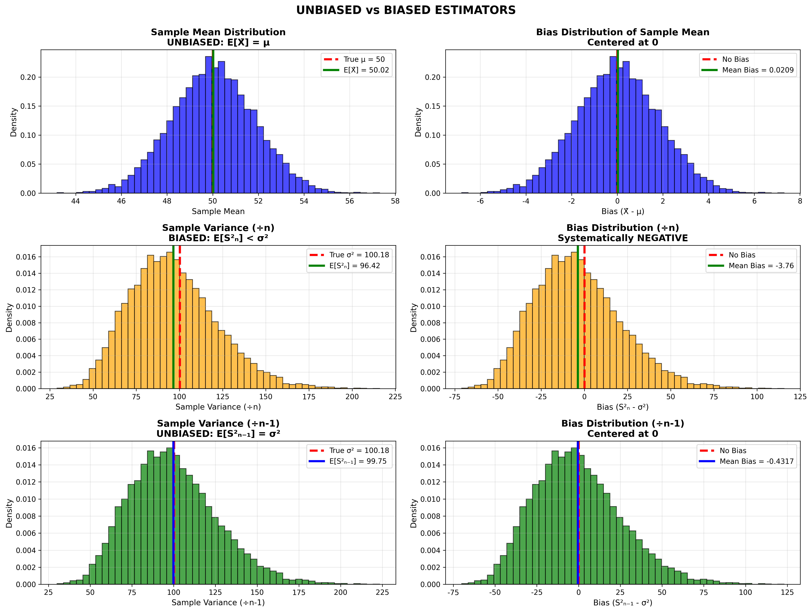
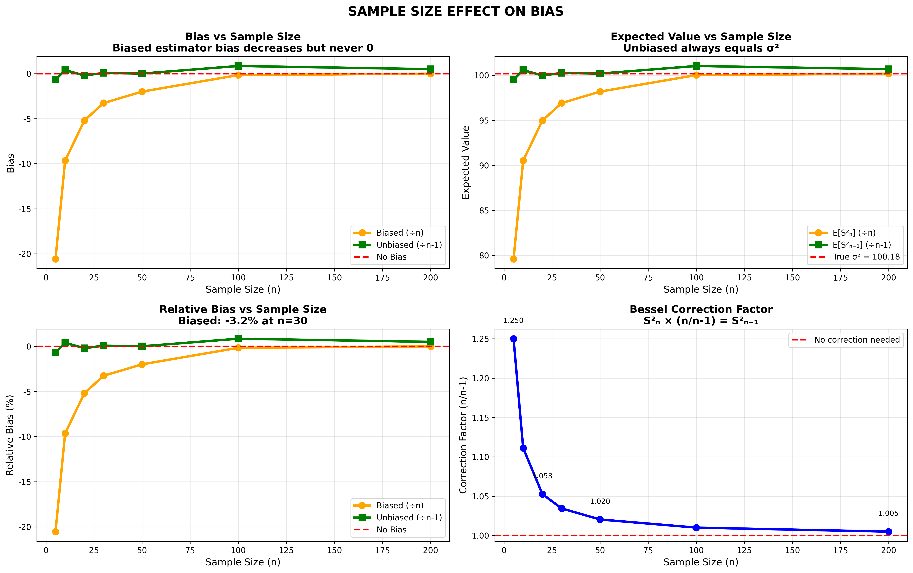
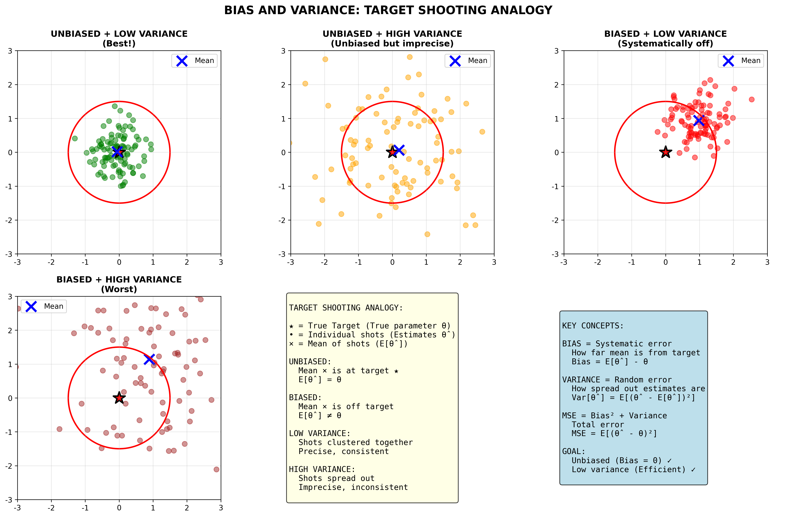

# 불편 추정량(Unbiased Estimator) 완벽 가이드

## 📚 목차
1. [불편 추정량이란?](#불편-추정량이란)
2. [편향(Bias)의 정의](#편향bias의-정의)
3. [불편 추정량의 예시](#불편-추정량의-예시)
4. [왜 n-1로 나누는가?](#왜-n-1로-나누는가)
5. [불편성 vs 효율성](#불편성-vs-효율성)
6. [시각적 이해](#시각적-이해)
7. [시험 대비 핵심](#시험-대비-핵심)

---

## 불편 추정량이란?

### 핵심 정의

```
불편 추정량 (Unbiased Estimator)

추정량 θ̂의 기댓값이 모수 θ와 같을 때,
θ̂를 불편 추정량이라 한다.

수식: E[θ̂] = θ
```

### 직관적 이해

**불편 추정량:**
- 평균적으로 정확함
- 여러 번 추정하면 평균이 참값
- 체계적인 오차(bias)가 없음

**편향 추정량:**
- 평균적으로 참값에서 벗어남
- 여러 번 추정해도 평균이 참값과 다름
- 체계적인 오차가 있음

---

## 편향(Bias)의 정의

### 수학적 정의

```
Bias(θ̂) = E[θ̂] - θ

여기서:
- θ̂ : 추정량 (estimator)
- θ : 모수 (parameter, 참값)
- E[θ̂] : 추정량의 기댓값
```

### 편향의 해석

| Bias(θ̂) | 의미 | 상태 |
|----------|------|------|
| **= 0** | E[θ̂] = θ | **불편 추정량** ✓ |
| **> 0** | E[θ̂] > θ | **과대추정** (overestimate) |
| **< 0** | E[θ̂] < θ | **과소추정** (underestimate) |

### 예시

```
모수 θ = 100

추정량 A: E[θ̂ₐ] = 100 → Bias = 0  ✓ 불편
추정량 B: E[θ̂ᵦ] = 105 → Bias = +5 ✗ 편향 (과대)
추정량 C: E[θ̂ᵨ] = 97  → Bias = -3 ✗ 편향 (과소)
```

---

## 불편 추정량의 예시

### 1. 표본평균 (Sample Mean)

**정의:**
```
X̄ = (X₁ + X₂ + ... + Xₙ) / n = (1/n)ΣXᵢ
```

**불편성 증명:**
```
E[X̄] = E[(1/n)ΣXᵢ]
     = (1/n)Σ E[Xᵢ]
     = (1/n) × n × μ
     = μ

∴ E[X̄] = μ  → 불편 추정량! ✓
```

**의미:**
- 표본평균은 모평균의 불편 추정량
- 여러 표본을 뽑아 평균을 구하면 모평균과 일치

### 2. 표본분산 (Sample Variance)

#### ❌ 편향 추정량: S²ₙ (n으로 나눔)

**정의:**
```
S²ₙ = (1/n)Σ(Xᵢ - X̄)² 
```

**편향 확인:**
```
E[S²ₙ] = ((n-1)/n) × σ²
       = σ² - σ²/n
       < σ²

Bias(S²ₙ) = E[S²ₙ] - σ²
          = -σ²/n
          < 0

∴ 과소추정! ✗ 편향 추정량
```

**편향의 크기:**
```
n = 30일 때: Bias = -σ²/30 ≈ -3.3%
n = 100일 때: Bias = -σ²/100 ≈ -1%
n → ∞일 때: Bias → 0 (일치성은 만족)
```

#### ✓ 불편 추정량: S²ₙ₋₁ (n-1로 나눔)

**정의:**
```
S²ₙ₋₁ = (1/(n-1))Σ(Xᵢ - X̄)²
```

**불편성 증명:**
```
E[S²ₙ₋₁] = E[(n/(n-1)) × S²ₙ]
         = (n/(n-1)) × E[S²ₙ]
         = (n/(n-1)) × ((n-1)/n) × σ²
         = σ²

∴ E[S²ₙ₋₁] = σ²  → 불편 추정량! ✓
```

**베셀 보정(Bessel's Correction):**
```
S²ₙ₋₁ = (n/(n-1)) × S²ₙ

보정 계수: n/(n-1)

n = 2:   2/1 = 2.000 (100% 증가)
n = 5:   5/4 = 1.250 (25% 증가)
n = 10:  10/9 = 1.111 (11% 증가)
n = 30:  30/29 = 1.034 (3.4% 증가)
n = 100: 100/99 = 1.010 (1% 증가)
n → ∞:   → 1 (보정 불필요)
```

### 3. 표본비율 (Sample Proportion)

**정의:**
```
p̂ = X/n

여기서 X = 성공 횟수
```

**불편성:**
```
E[p̂] = E[X/n]
     = E[X]/n
     = np/n
     = p

∴ E[p̂] = p  → 불편 추정량! ✓
```

### 4. 기타 불편 추정량

| 모수 | 불편 추정량 | 기호 |
|------|------------|------|
| 모평균 μ | 표본평균 | X̄ |
| 모분산 σ² | 표본분산 (n-1) | S²ₙ₋₁ |
| 모비율 p | 표본비율 | p̂ |
| 회귀계수 β | 최소제곱 추정량 | β̂ |

**주의:**
- 모표준편차 σ의 불편 추정량은 √S²ₙ₋₁이 **아님**!
- E[√S²ₙ₋₁] ≠ σ (Jensen 부등식)

---

## 왜 n-1로 나누는가?

### 직관적 설명

**문제:**
```
S²ₙ = (1/n)Σ(Xᵢ - X̄)²

X̄를 사용하면 자유도 손실!
```

**이유:**
```
1. X̄는 표본에서 계산됨 (모평균 μ가 아님)
2. (Xᵢ - X̄)의 합은 항상 0
3. n개 편차 중 n-1개만 독립
4. 마지막 1개는 자동 결정
```

**예시:**
```
표본: [2, 4, 6]
평균: X̄ = 4

편차: [2-4, 4-4, 6-4] = [-2, 0, 2]

두 개만 알면:
  -2, 0을 알면 → 마지막은 +2 (합=0)
  -2, 2를 알면 → 중간은 0 (합=0)

→ 자유도 = n - 1 = 2
```

### 수학적 증명

**핵심:**
```
E[Σ(Xᵢ - X̄)²] = (n-1)σ²

증명:
Σ(Xᵢ - X̄)² = Σ(Xᵢ - μ + μ - X̄)²
            = Σ(Xᵢ - μ)² - n(X̄ - μ)²

E[Σ(Xᵢ - X̄)²] = E[Σ(Xᵢ - μ)²] - E[n(X̄ - μ)²]
                = nσ² - n(σ²/n)
                = nσ² - σ²
                = (n-1)σ²

따라서:
E[(1/(n-1))Σ(Xᵢ - X̄)²] = σ²  ✓
```

### 시뮬레이션 결과



**실험 조건:**
- 모집단: N(50, 10²)
- 표본 크기: n = 30
- 반복 횟수: 10,000번

**결과:**
```
표본평균:
  E[X̄] = 50.02  ← 참값 μ = 50
  Bias = 0.02 ≈ 0 ✓

표본분산 (÷n):
  E[S²ₙ] = 96.42  ← 참값 σ² = 100.18
  Bias = -3.76 ≈ -3.8% ✗

표본분산 (÷n-1):
  E[S²ₙ₋₁] = 99.75  ← 참값 σ² = 100.18
  Bias = -0.43 ≈ 0 ✓
```

---

## 표본 크기와 편향



### 편향의 변화

| 표본 크기 n | Bias(S²ₙ) | Bias(S²ₙ₋₁) | 보정 계수 |
|------------|-----------|-------------|----------|
| 5 | -20.0% | ≈0 | 1.250 |
| 10 | -10.0% | ≈0 | 1.111 |
| 30 | -3.3% | ≈0 | 1.034 |
| 50 | -2.0% | ≈0 | 1.020 |
| 100 | -1.0% | ≈0 | 1.010 |
| 200 | -0.5% | ≈0 | 1.005 |

### 핵심 관찰

**편향 추정량 (S²ₙ):**
- 항상 과소추정 (Bias < 0)
- n이 증가하면 편향 감소
- 하지만 0이 되지는 않음
- 일치성은 만족 (n→∞일 때 Bias→0)

**불편 추정량 (S²ₙ₋₁):**
- 모든 n에서 Bias ≈ 0
- n과 무관하게 불편
- 완벽한 보정

---

## 불편성 vs 효율성

### 개념 비교

| 개념 | 정의 | 수식 | 의미 |
|------|------|------|------|
| **불편성** | 평균이 참값 | E[θ̂] = θ | 체계적 오차 없음 |
| **효율성** | 분산이 작음 | Var[θ̂] 작음 | 랜덤 오차 작음 |
| **일치성** | n→∞일 때 수렴 | θ̂ → θ | 큰 표본에서 정확 |

### 타겟 사격 비유



#### 1. 불편 + 효율적 (최고!)
```
●●●●
 ●★●  ← 중심에 밀집
●●●●

E[θ̂] = θ  ✓ (불편)
Var[θ̂] 작음 ✓ (효율적)
```

#### 2. 불편 + 비효율적
```
●   ●
  ★    ← 중심 주변 분산
●   ●

E[θ̂] = θ  ✓ (불편)
Var[θ̂] 큼 ✗ (비효율적)
```

#### 3. 편향 + 효율적
```
     ●●●●
      ●●●  ← 체계적 편향
★    ●●●●

E[θ̂] ≠ θ  ✗ (편향)
Var[θ̂] 작음 ✓ (효율적)
```

#### 4. 편향 + 비효율적 (최악)
```
     ●   ●
        ●   ← 편향되고 분산
★    ●   ●

E[θ̂] ≠ θ  ✗ (편향)
Var[θ̂] 큼 ✗ (비효율적)
```

### MSE (평균제곱오차)

**정의:**
```
MSE(θ̂) = E[(θ̂ - θ)²]
```

**분해:**
```
MSE(θ̂) = Bias²(θ̂) + Var(θ̂)

MSE = 체계적 오차² + 랜덤 오차
```

**예시:**
```
추정량 A:
  Bias = 0, Var = 10
  MSE = 0² + 10 = 10

추정량 B:
  Bias = 2, Var = 5
  MSE = 2² + 5 = 9  ← 더 작은 MSE!

→ 편향이 있어도 MSE가 작을 수 있음
→ 하지만 일반적으로 불편 추정량 선호
```

---

## 실전 예제

### 예제 1: 표본평균 계산

**데이터:**
```
표본: [52, 48, 55, 49, 51]
n = 5
```

**계산:**
```
X̄ = (52 + 48 + 55 + 49 + 51) / 5
  = 255 / 5
  = 51

→ 모평균 μ의 불편 추정값: 51
```

### 예제 2: 표본분산 계산

**데이터:**
```
표본: [52, 48, 55, 49, 51]
X̄ = 51
```

**편향 추정량 (÷n):**
```
S²ₙ = [(52-51)² + (48-51)² + (55-51)² + (49-51)² + (51-51)²] / 5
    = [1 + 9 + 16 + 4 + 0] / 5
    = 30 / 5
    = 6

→ 편향 추정! ✗
```

**불편 추정량 (÷n-1):**
```
S²ₙ₋₁ = 30 / (5-1)
      = 30 / 4
      = 7.5

→ 불편 추정! ✓
```

**관계:**
```
S²ₙ₋₁ = (n/(n-1)) × S²ₙ
      = (5/4) × 6
      = 7.5  ✓
```

### 예제 3: Python 구현

```python
import numpy as np

# 데이터
data = np.array([52, 48, 55, 49, 51])

# 표본평균 (불편)
mean_unbiased = np.mean(data)
print(f"표본평균: {mean_unbiased}")  # 51.0

# 표본분산 (편향, ddof=0)
var_biased = np.var(data, ddof=0)
print(f"표본분산 (÷n): {var_biased}")  # 6.0

# 표본분산 (불편, ddof=1)
var_unbiased = np.var(data, ddof=1)
print(f"표본분산 (÷n-1): {var_unbiased}")  # 7.5

# 표준편차 (불편 아님!)
std_unbiased = np.std(data, ddof=1)
print(f"표본표준편차: {std_unbiased}")  # 2.74 (≠ √σ)
```

**주의: ddof (Delta Degrees of Freedom)**
```
ddof=0 → n으로 나눔 (편향)
ddof=1 → n-1로 나눔 (불편) ← 기본값!
```

---

## 시험 대비 핵심

### ✅ 반드시 암기

**불편 추정량 정의:**
```
E[θ̂] = θ  ← 기댓값이 참값과 같음
```

**주요 불편 추정량:**
```
1. E[X̄] = μ  (표본평균)
2. E[S²ₙ₋₁] = σ²  (표본분산, n-1로 나눔)
3. E[p̂] = p  (표본비율)
```

**편향 추정량:**
```
E[S²ₙ] = ((n-1)/n)σ² < σ²  (n으로 나눔)

Bias = -σ²/n  (항상 음수)
```

**베셀 보정:**
```
S²ₙ₋₁ = (n/(n-1)) × S²ₙ

보정 계수 n/(n-1)는:
- n이 작을수록 큼
- n이 클수록 1에 가까움
```

### ✅ 자주 나오는 문제

**문제 1:**
```
Q: 표본분산을 n으로 나누면 불편 추정량인가?

A: ✗ 아니다
이유: E[S²ₙ] = ((n-1)/n)σ² < σ²
     편향 = -σ²/n < 0 (과소추정)
```

**문제 2:**
```
Q: 왜 n-1로 나누는가?

A: 자유도 손실 때문
   X̄ 계산에 n개 데이터 사용
   → (Xᵢ-X̄)는 n-1개만 독립
   → n-1로 나누어야 불편
```

**문제 3:**
```
Q: 표본평균은 불편 추정량인가?

A: ✓ 맞다
이유: E[X̄] = E[(1/n)ΣXᵢ]
          = (1/n)Σ E[Xᵢ]
          = (1/n) × nμ
          = μ
```

**문제 4:**
```
Q: E[√S²ₙ₋₁] = σ인가?

A: ✗ 아니다
이유: Jensen 부등식
     E[√S²ₙ₋₁] < √E[S²ₙ₋₁] = √σ² = σ
     (볼록 함수의 성질)
```

**문제 5:**
```
Q: 표본 크기 n=10일 때, 
   S²ₙ을 불편 추정량으로 만들려면?

A: (10/9)를 곱한다
   S²ₙ₋₁ = (n/(n-1)) × S²ₙ
         = (10/9) × S²ₙ
```

### ✅ 계산 문제 유형

**유형 1: 편향 계산**
```
주어진:
  θ̂ 의 기댓값 E[θ̂] = 15
  참값 θ = 12

구하기: Bias(θ̂)

풀이:
  Bias = E[θ̂] - θ
       = 15 - 12
       = 3 (과대추정)
```

**유형 2: 불편성 판단**
```
주어진:
  E[θ̂₁] = θ
  E[θ̂₂] = θ + 5
  E[θ̂₃] = 0.9θ

판단:
  θ̂₁: 불편 ✓ (E[θ̂₁] = θ)
  θ̂₂: 편향 ✗ (Bias = 5)
  θ̂₃: 편향 ✗ (Bias = -0.1θ)
```

**유형 3: 베셀 보정**
```
주어진:
  S²ₙ = 8 (n=25)

구하기: S²ₙ₋₁

풀이:
  S²ₙ₋₁ = (n/(n-1)) × S²ₙ
        = (25/24) × 8
        = 8.333
```

---

## 오개념 정리

### ❌ 흔한 오해

**오해 1: "불편 = 정확"**
```
✗ 틀림: 불편 추정량이 항상 정확한 것은 아님
✓ 사실: 불편은 "평균적으로" 정확
        개별 추정값은 틀릴 수 있음
        
예: 표본평균 51이 모평균 50의 불편 추정이지만
    이번 추정은 +1 오차
```

**오해 2: "불편 = 최고"**
```
✗ 틀림: 불편이 항상 최선은 아님
✓ 사실: 때로는 약간 편향되어도 분산이 작은 게 나음
        (Bias-Variance Tradeoff)
        
MSE = Bias² + Variance
→ 작은 편향 + 작은 분산 > 0 편향 + 큰 분산
```

**오해 3: "E[√S²ₙ₋₁] = σ"**
```
✗ 틀림: 제곱근의 기댓값 ≠ 기댓값의 제곱근
✓ 사실: E[√S²ₙ₋₁] < σ (Jensen 부등식)
        √S²ₙ₋₁은 σ의 편향 추정량
```

**오해 4: "n이 크면 n과 n-1은 같다"**
```
✗ 틀림: 실무에서는 다름
✓ 사실: n=100일 때도 1% 차이
        항상 n-1 사용이 원칙
        
n=100: 100/99 = 1.0101 (1% 차이)
n=1000: 1000/999 = 1.001 (0.1% 차이)
```

---

## 요약 카드

```
┌─────────────────────────────────────┐
│      불편 추정량 핵심 요약           │
├─────────────────────────────────────┤
│                                     │
│  정의: E[θ̂] = θ                     │
│                                     │
│  불편 추정량:                        │
│  • 표본평균: E[X̄] = μ               │
│  • 표본분산: E[S²ₙ₋₁] = σ² (÷n-1)   │
│  • 표본비율: E[p̂] = p               │
│                                     │
│  편향 추정량:                        │
│  • S²ₙ (÷n): Bias = -σ²/n          │
│                                     │
│  베셀 보정:                          │
│  • S²ₙ₋₁ = (n/(n-1)) × S²ₙ         │
│                                     │
│  왜 n-1?                            │
│  • 자유도 = n - 1                   │
│  • X̄ 사용으로 1 손실                │
│                                     │
└─────────────────────────────────────┘
```

---

**핵심: "불편 = 평균적으로 정확" - E[θ̂] = θ 📊✨**
