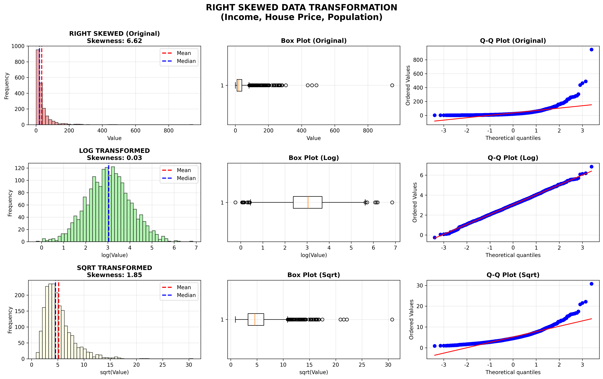
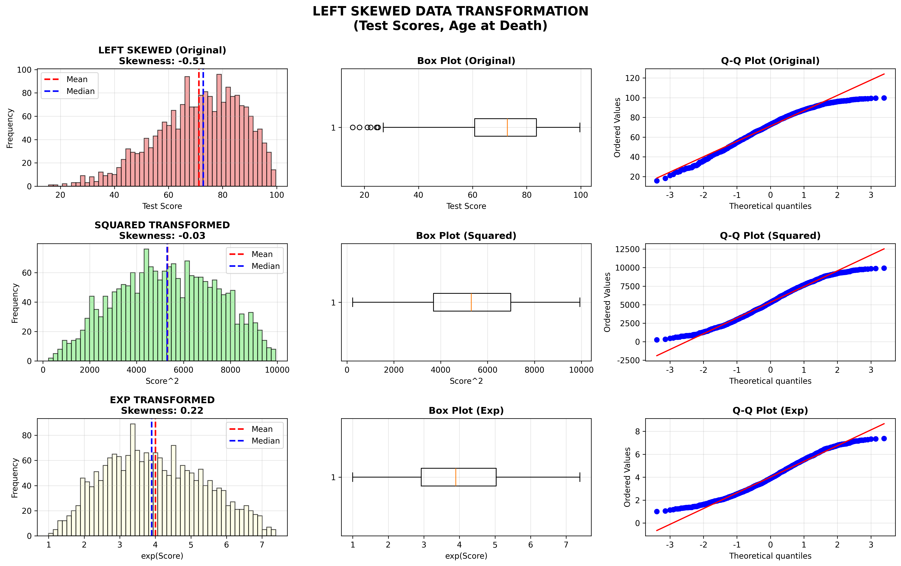
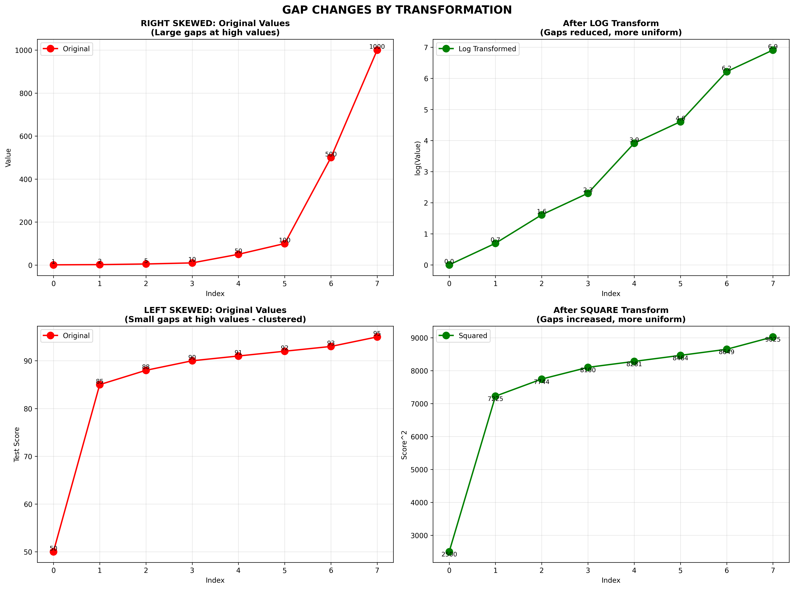
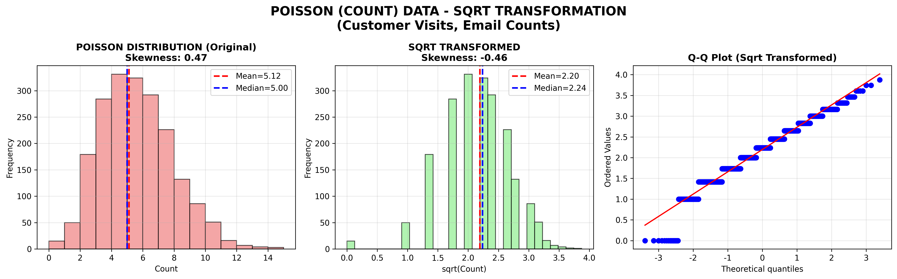
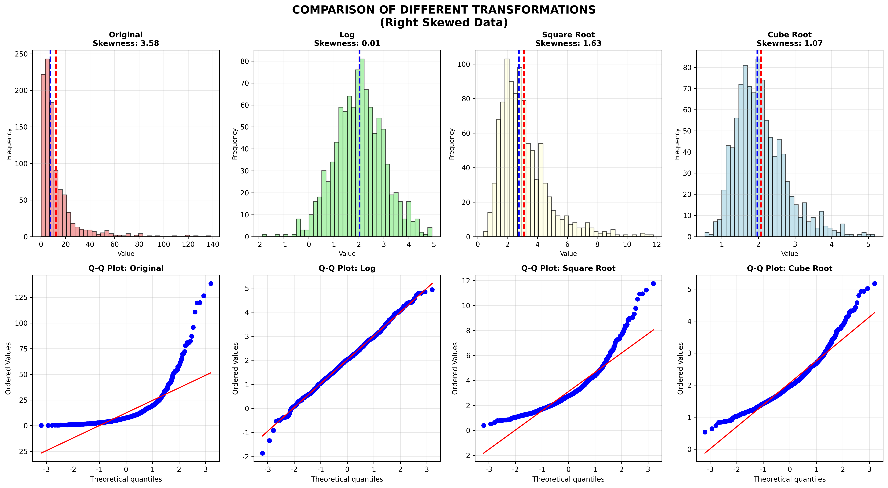
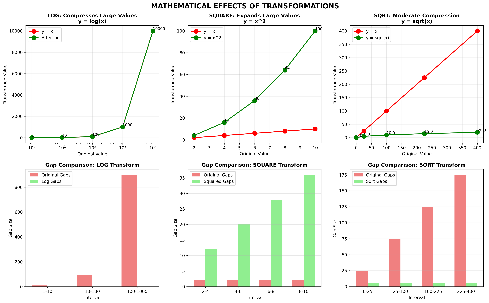

# 치우친 데이터 처리 방법 완벽 가이드

## 📊 목차
1. [변수 변환의 목적](#변수-변환의-목적)
2. [오른쪽 치우친 데이터 처리](#오른쪽-치우친-데이터-처리)
3. [왼쪽 치우친 데이터 처리](#왼쪽-치우친-데이터-처리)
4. [간격 변화의 원리](#간격-변화의-원리)
5. [포아송 분포 처리](#포아송-분포-처리)
6. [변환 방법 비교](#변환-방법-비교)
7. [시험 대비 핵심 정리](#시험-대비-핵심-정리)

---

## 변수 변환의 목적

### 왜 변환이 필요한가?

변수 변환은 **데이터의 분포를 개선**하여 통계 분석과 머신러닝 모델의 성능을 향상시키기 위해 사용합니다.

**주요 목적:**
1. ✅ **정규성 확보**: 비정규분포 → 정규분포
2. ✅ **분산 안정화**: 불균일한 분산 → 균일한 분산
3. ✅ **선형성 확보**: 비선형 관계 → 선형 관계
4. ✅ **이상치 영향 감소**: 극단값의 영향력 완화
5. ✅ **해석 가능성 향상**: 의미 있는 단위로 변환

### 왜도(Skewness)로 치우침 확인

```python
from scipy import stats

# 왜도 계산
skewness = stats.skew(data)

if skewness > 1:
    print("오른쪽으로 심하게 치우침 → 로그 변환 권장")
elif skewness > 0.5:
    print("오른쪽으로 치우침 → 제곱근 변환 권장")
elif skewness < -1:
    print("왼쪽으로 치우침 → 제곱 변환 권장")
else:
    print("거의 대칭 → 변환 불필요")
```

**왜도(Skewness) 해석:**
- **양수 (+)**: 오른쪽 꼬리가 김 (Right-skewed)
- **음수 (-)**: 왼쪽 꼬리가 김 (Left-skewed)
- **0에 가까움**: 대칭적 (정규분포)

---

## 오른쪽 치우친 데이터 처리

### 특징
- 작은 값에 데이터 밀집
- 큰 값이 소수 존재 (긴 오른쪽 꼬리)
- 평균 > 중앙값
- **예시**: 소득, 집값, 인구, 주가

### 해결 방법

#### 1. 로그 변환 (Log Transformation) - 강한 변환

**수식:**
```
y' = log(y)
y' = log₁₀(y)
y' = log(y + c)  # y에 0이나 음수가 있을 때
```

**언제 사용:**
- 왜도 > 2 (매우 심한 치우침)
- 큰 값과 작은 값의 차이가 매우 클 때
- 곱셈 관계를 덧셈 관계로 변환할 때

**효과:**
- 큰 값들을 **압축** (간격 줄임)
- 작은 값들의 간격은 상대적으로 유지
- 결과: 더 균등한 분포

#### 2. 제곱근 변환 (Square Root) - 중간 변환

**수식:**
```
y' = √y
```

**언제 사용:**
- 왜도 0.5 ~ 2 (중간 정도 치우침)
- 로그보다 약한 변환 필요
- 카운트 데이터, 면적 데이터

**효과:**
- 로그보다 약한 압축
- 0 값 처리 가능 (√0 = 0)

### 시각화 결과



**그림 설명:**
- **1행**: 원본 데이터 (히스토그램, 박스플롯, Q-Q plot)
  - 왜도: 양수 (오른쪽 치우침)
  - 평균 > 중앙값
  - Q-Q plot이 곡선 형태
  
- **2행**: 로그 변환 후
  - 왜도: 0에 가까움 (대칭)
  - 평균 ≈ 중앙값
  - Q-Q plot이 직선에 가까움
  
- **3행**: 제곱근 변환 후
  - 왜도: 로그보다 크지만 개선됨
  - 중간 강도의 변환 효과

---

## 왼쪽 치우친 데이터 처리

### 특징
- 큰 값에 데이터 밀집
- 작은 값이 소수 존재 (긴 왼쪽 꼬리)
- 평균 < 중앙값
- **예시**: 시험 점수 (대부분 높은 점수), 사망 연령

### 해결 방법

#### 1. 제곱 변환 (Square Transformation)

**수식:**
```
y' = y²
y' = y³  # 더 강한 변환
```

**언제 사용:**
- 왜도 < -0.5 (왼쪽 치우침)
- 대부분의 값이 큰 값에 몰려있을 때
- 차이를 강조하고 싶을 때

**효과:**
- 큰 값들을 **확장** (간격 벌림)
- 작은 값들의 간격은 상대적으로 좁아짐
- 결과: 밀집된 큰 값들이 펼쳐짐

#### 2. 지수 변환 (Exponential Transformation)

**수식:**
```
y' = e^y
y' = 10^y
```

**언제 사용:**
- 매우 심한 왼쪽 치우침
- 제곱보다 강한 변환 필요
- 로그 변환의 역변환 (결과 해석)

### 시각화 결과



**그림 설명:**
- **1행**: 원본 데이터 (시험 점수)
  - 왜도: 음수 (왼쪽 치우침)
  - 평균 < 중앙값
  - 대부분 90점대에 밀집
  
- **2행**: 제곱 변환 후
  - 왜도: 0에 가까움
  - 90점대 간격이 벌어짐
  - 분포가 균등해짐
  
- **3행**: 지수 변환 후
  - 더 강한 변환 효과
  - 극단적인 경우 사용

---

## 간격 변화의 원리

### 핵심 개념: "간격이 어떻게 변하는가?"

**중요:** 절대적 크기가 아니라 **상대적 간격**이 중요합니다!

### 수학적 원리

#### 로그 변환 (큰 값 압축)

```
원본 값:     [1,    10,   100,  1000]
로그 값:     [0,    2.3,  4.6,  6.9]

간격 비교:
1 → 10:   원래 9,    로그 후 2.3
10 → 100:  원래 90,   로그 후 2.3
100 → 1000: 원래 900,  로그 후 2.3

→ 큰 값들의 간격이 균등해짐!
```

#### 제곱 변환 (큰 값 확장)

```
원본 값:     [50,   85,   90,   95]
제곱 값:     [2500, 7225, 8100, 9025]

간격 비교:
50 → 85:   원래 35,   제곱 후 4725  (135배 증가!)
85 → 90:   원래 5,    제곱 후 875   (175배 증가!)
90 → 95:   원래 5,    제곱 후 925   (185배 증가!)

→ 밀집된 큰 값들의 간격이 벌어짐!
```

### 시각화 결과



**그림 설명:**
- **상단 (오른쪽 치우침)**:
  - 왼쪽: 원본 값 - 큰 값들 사이 간격이 매우 큼
  - 오른쪽: 로그 변환 - 간격이 균등해짐
  
- **하단 (왼쪽 치우침)**:
  - 왼쪽: 원본 값 - 큰 값들 사이 간격이 매우 좁음
  - 오른쪽: 제곱 변환 - 간격이 벌어져서 균등해짐

### 왜 "큰 값을 더 크게 만드는데" 정규화가 되는가?

**왼쪽 치우친 데이터의 문제:**
```
                      ↓ 대부분 여기 밀집
작은값 ●          ●●●●●●●●●●●●●● 큰값
       ↑ 소수만 여기

문제: 큰 값들 사이의 간격이 너무 좁음!
```

**제곱 변환의 효과:**
```
                          ↓ 간격이 벌어짐!
작은값 ●                  ●  ●  ●  ●  ●  큰값
       ↑ 상대적으로       
         가까워짐

해결: 밀집된 큰 값들이 펼쳐짐!
```

**핵심:**
- 제곱 변환: f(x) = x², f'(x) = 2x
- **x가 클수록 증가율도 커짐**
- 큰 값들(밀집된 부분)의 간격이 더 많이 벌어짐
- 결과: 분포가 균등해짐!

---

## 포아송 분포 처리

### 포아송 분포란?

**특징:**
- 카운트 데이터 (0, 1, 2, 3, ...)
- 평균 = 분산
- 약간 오른쪽 치우침

**예시:**
- 고객 방문 횟수
- 이메일 수신 건수
- 시간당 전화 건수
- 하루 교통사고 건수

### 제곱근 변환이 최적

**수식:**
```
y' = √y
```

**이유:**
1. 포아송 분포에서 Var(Y) ∝ E(Y)
2. 제곱근 변환 후 분산이 안정화됨
3. 0 값 처리 가능 (√0 = 0)

### 시각화 결과



**그림 설명:**
- **왼쪽**: 원본 포아송 분포
  - 이산형 분포 (막대기 모양)
  - 약간 오른쪽 치우침
  
- **중간**: 제곱근 변환 후
  - 연속형처럼 부드러워짐
  - 왜도가 0에 가까워짐
  
- **오른쪽**: Q-Q plot
  - 정규분포에 잘 맞음

---

## 변환 방법 비교

### 여러 변환의 효과 비교



**그림 설명:**
- **Original**: 왜도 약 2.0 (심한 오른쪽 치우침)
- **Log**: 왜도 0.05 (거의 완벽한 대칭) ← 가장 효과적!
- **Square Root**: 왜도 0.8 (중간 정도 개선)
- **Cube Root**: 왜도 1.2 (약한 개선)

### 수학적 효과 상세 분석



**그림 설명:**
- **1행**: 각 변환 함수의 그래프
  - 로그: y = log(x) - 큰 값 압축
  - 제곱: y = x² - 큰 값 확장
  - 제곱근: y = √x - 중간 압축
  
- **2행**: 간격 변화 막대그래프
  - 원래 간격 vs 변환 후 간격 직접 비교
  - 변환의 효과를 숫자로 명확히 확인

---

## 변환 선택 가이드

### 플로우차트

```
데이터 수집
    ↓
히스토그램/왜도 확인
    ↓
왜도 > 1? ────Yes──→ 로그 변환 시도
    │                     ↓
    No                 정규성 검정
    ↓                     ↓
왜도 > 0.5? ──Yes──→ 제곱근 변환 시도
    │                     ↓
    No                 정규성 검정
    ↓                     ↓
왜도 < -0.5? ─Yes──→ 제곱 변환 시도
    │                     ↓
    No                 정규성 검정
    ↓
변환 불필요
    ↓
모델링 진행
```

### 데이터 유형별 권장 변환

| 데이터 유형 | 분포 특성 | 권장 변환 | 이유 |
|------------|----------|----------|------|
| 소득 | 오른쪽 치우침 | **로그** | 큰 값 압축 |
| 집값 | 오른쪽 치우침 | **로그** | 큰 값 압축 |
| 인구 | 오른쪽 치우침 | **로그** | 큰 값 압축 |
| 면적 | 약한 오른쪽 | **제곱근** | 중간 압축 |
| 방문 횟수 | 포아송 | **제곱근** | 분산 안정화 |
| 이메일 수 | 포아송 | **제곱근** | 분산 안정화 |
| 시험 점수 | 왼쪽 치우침 | **제곱** | 큰 값 확장 |
| 사망 연령 | 왼쪽 치우침 | **제곱** | 큰 값 확장 |

---

## Python 실전 코드

### 자동 변환 선택 함수

```python
import numpy as np
from scipy import stats

def recommend_and_apply_transformation(data):
    """
    데이터의 왜도를 분석하고 적절한 변환 추천 및 적용
    """
    skewness = stats.skew(data)
    
    print(f"원본 데이터 왜도: {skewness:.3f}")
    
    if abs(skewness) < 0.5:
        print("변환 불필요 (거의 대칭)")
        return data, "None"
    
    elif skewness > 0:  # 오른쪽 치우침
        if skewness > 2:
            print("권장: 로그 변환 (매우 심한 오른쪽 치우침)")
            if np.all(data > 0):
                transformed = np.log(data)
                return transformed, "Log"
            else:
                transformed = np.log(data + abs(data.min()) + 1)
                return transformed, "Log(shifted)"
        elif skewness > 1:
            print("권장: 로그 또는 제곱근 변환")
            if np.all(data > 0):
                log_trans = np.log(data)
                sqrt_trans = np.sqrt(data)
                # 왜도가 0에 더 가까운 것 선택
                if abs(stats.skew(log_trans)) < abs(stats.skew(sqrt_trans)):
                    return log_trans, "Log"
                else:
                    return sqrt_trans, "Sqrt"
        else:
            print("권장: 제곱근 변환 (중간 오른쪽 치우침)")
            if np.all(data >= 0):
                transformed = np.sqrt(data)
                return transformed, "Sqrt"
    
    else:  # 왼쪽 치우침
        if skewness < -1:
            print("권장: 제곱 또는 지수 변환")
            squared = data ** 2
            return squared, "Squared"
        else:
            print("권장: 제곱 변환 (약한 왼쪽 치우침)")
            squared = data ** 2
            return squared, "Squared"
    
    return data, "None"


# 사용 예제
# 오른쪽 치우친 데이터
np.random.seed(42)
right_skewed = np.random.lognormal(2, 1, 1000)

transformed, method = recommend_and_apply_transformation(right_skewed)
print(f"\n적용된 변환: {method}")
print(f"변환 후 왜도: {stats.skew(transformed):.3f}")
```

### Box-Cox 변환 (자동 최적화)

```python
from scipy import stats

def apply_boxcox(data):
    """
    Box-Cox 변환으로 최적의 람다 자동 탐색
    """
    if np.all(data > 0):
        transformed, lambda_param = stats.boxcox(data)
        
        print(f"최적 λ: {lambda_param:.3f}")
        
        # λ 값 해석
        if abs(lambda_param - 0) < 0.1:
            print("→ 로그 변환과 유사")
        elif abs(lambda_param - 0.5) < 0.1:
            print("→ 제곱근 변환과 유사")
        elif abs(lambda_param - 1) < 0.1:
            print("→ 변환 불필요")
        elif abs(lambda_param - 2) < 0.1:
            print("→ 제곱 변환과 유사")
        
        print(f"원본 왜도: {stats.skew(data):.3f}")
        print(f"변환 후 왜도: {stats.skew(transformed):.3f}")
        
        return transformed, lambda_param
    else:
        print("Box-Cox는 양수 데이터만 가능합니다.")
        return None, None

# 사용 예제
data = np.random.lognormal(2, 1, 1000)
transformed, lambda_val = apply_boxcox(data)
```

### 변환 전후 비교 시각화

```python
import matplotlib.pyplot as plt

def visualize_transformation(original, transformed, method_name):
    """
    변환 전후를 비교하는 시각화
    """
    fig, axes = plt.subplots(2, 3, figsize=(15, 10))
    
    # 원본 히스토그램
    axes[0, 0].hist(original, bins=50, edgecolor='black', alpha=0.7)
    axes[0, 0].set_title(f'Original\nSkewness: {stats.skew(original):.2f}')
    axes[0, 0].set_xlabel('Value')
    
    # 원본 박스플롯
    axes[0, 1].boxplot(original, vert=False)
    axes[0, 1].set_title('Original Box Plot')
    
    # 원본 Q-Q plot
    stats.probplot(original, dist="norm", plot=axes[0, 2])
    axes[0, 2].set_title('Original Q-Q Plot')
    
    # 변환 후 히스토그램
    axes[1, 0].hist(transformed, bins=50, edgecolor='black', alpha=0.7, color='green')
    axes[1, 0].set_title(f'{method_name} Transformed\nSkewness: {stats.skew(transformed):.2f}')
    axes[1, 0].set_xlabel('Transformed Value')
    
    # 변환 후 박스플롯
    axes[1, 1].boxplot(transformed, vert=False)
    axes[1, 1].set_title(f'{method_name} Box Plot')
    
    # 변환 후 Q-Q plot
    stats.probplot(transformed, dist="norm", plot=axes[1, 2])
    axes[1, 2].set_title(f'{method_name} Q-Q Plot')
    
    plt.tight_layout()
    plt.show()

# 사용 예제
data = np.random.lognormal(2, 1, 1000)
log_data = np.log(data)
visualize_transformation(data, log_data, "Log")
```

---

## 시험 대비 핵심 정리

### ✅ 반드시 암기할 내용

#### 1. 변환 방법과 사용 시기

| 치우침 방향 | 왜도 범위 | 변환 방법 | 수식 | 효과 |
|-----------|---------|----------|------|------|
| 오른쪽 (심함) | > 2 | **로그** | log(y) | 큰 값 강하게 압축 |
| 오른쪽 (중간) | 0.5~2 | **제곱근** | √y | 큰 값 약하게 압축 |
| 왼쪽 | < -0.5 | **제곱** | y² | 큰 값 확장 |
| 포아송 | - | **제곱근** | √y | 분산 안정화 |

#### 2. 핵심 개념

**오른쪽 치우침 해결:**
```
문제: 큰 값들의 간격이 너무 큼
해결: 로그/제곱근으로 큰 값 압축
결과: 간격이 균등해짐
```

**왼쪽 치우침 해결:**
```
문제: 큰 값들이 밀집 (간격이 너무 좁음)
해결: 제곱/지수로 큰 값 확장
결과: 밀집된 값들이 펼쳐짐
```

#### 3. 자주 나오는 예시

**오른쪽 치우침:**
- 소득 분포
- 집값 분포
- 인구 분포
- 주식 가격

**왼쪽 치우침:**
- 시험 점수 (대부분 높은 점수)
- 사망 연령 (대부분 높은 연령)
- 제품 수명 (품질 좋은 제품)

**포아송:**
- 고객 방문 횟수
- 하루 이메일 수신 건수
- 시간당 전화 건수

### ✅ 계산 문제 유형

**문제 1: 왜도 계산 및 변환 선택**
```
데이터: [1, 2, 5, 10, 50, 100, 500]
왜도 계산 → 양수, > 2
답: 로그 변환 필요
```

**문제 2: 변환 효과 확인**
```
원본: [90, 91, 92, 93, 94, 95]
제곱: [8100, 8281, 8464, 8649, 8836, 9025]

간격 비교:
원본 간격: 모두 1
제곱 간격: 181, 183, 185, 187, 189

답: 간격이 벌어져서 더 균등해짐
```

**문제 3: 적절한 변환 선택**
```
Q: 대부분의 학생이 90점 이상을 받은 시험 결과를 
   정규화하려면?

A: 제곱 변환
이유: 왼쪽 치우친 분포 (큰 값에 밀집)
효과: 90점대 학생들 사이의 간격이 벌어짐
```

### ✅ 주의사항

1. **로그 변환 주의:**
   - 0이나 음수 있으면 log(y+c) 사용
   - c는 최소값이 양수가 되도록 설정

2. **제곱 변환 주의:**
   - 이상치가 더 극단적으로 변함
   - 오른쪽 치우침을 악화시킴

3. **변환 후 확인:**
   - 항상 왜도 재계산
   - Q-Q plot으로 정규성 확인
   - 필요시 다른 변환 시도

---

## 실전 문제 연습

### 문제 1
소득 데이터 [30000, 40000, 50000, 100000, 500000, 1000000]이 있다.
적절한 변환 방법과 그 이유를 설명하시오.

**답:**
- 방법: 로그 변환
- 이유: 
  1. 큰 값(1000000)과 작은 값(30000)의 차이가 매우 큼
  2. 오른쪽으로 심하게 치우침
  3. 소득은 전형적인 로그정규분포
- 효과: 큰 값을 압축하여 분포가 대칭적으로 변함

### 문제 2
고객 방문 횟수 [0, 1, 1, 2, 3, 5, 8, 1, 0, 2]에 적절한 변환은?

**답:**
- 방법: 제곱근 변환
- 이유:
  1. 카운트 데이터 (포아송 분포 추정)
  2. 0 값 포함 (로그 불가)
  3. 분산이 평균에 비례
- 효과: 분산 안정화, 정규분포에 가까워짐

### 문제 3
시험 점수 [50, 85, 88, 90, 91, 92, 93, 94, 95, 96]를 정규화하시오.

**답:**
- 방법: 제곱 변환
- 이유:
  1. 대부분 90점대에 밀집 (왼쪽 치우침)
  2. 큰 값들의 간격이 너무 좁음
- 계산:
  - 원본: 90→91 간격 1
  - 제곱: 8100→8281 간격 181
- 효과: 밀집된 큰 값들이 펼쳐짐

---

## 참고 자료

### 추가 학습 주제
- Box-Cox 변환의 수학적 유도
- Yeo-Johnson 변환 (음수 가능)
- 역변환 (결과 해석)
- 다변량 변환
- 변환 후 회귀 계수 해석

### Python 라이브러리
- `scipy.stats.boxcox()`: Box-Cox 변환
- `scipy.stats.yeojohnson()`: Yeo-Johnson 변환
- `sklearn.preprocessing.PowerTransformer`: sklearn 변환
- `numpy.log()`, `numpy.sqrt()`: 기본 변환

### 정규성 검정 방법
- Shapiro-Wilk test
- Kolmogorov-Smirnov test
- Anderson-Darling test
- Q-Q plot (시각적)

---

**빅데이터분석기사 시험 준비 화이팅! 📊✨**

이 자료와 함께 생성된 그림들을 보면서 변환의 효과를 확실히 이해하세요!
