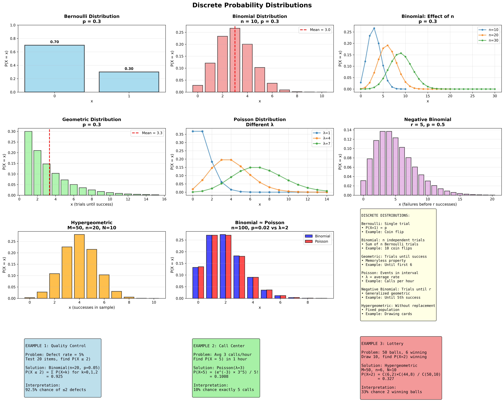
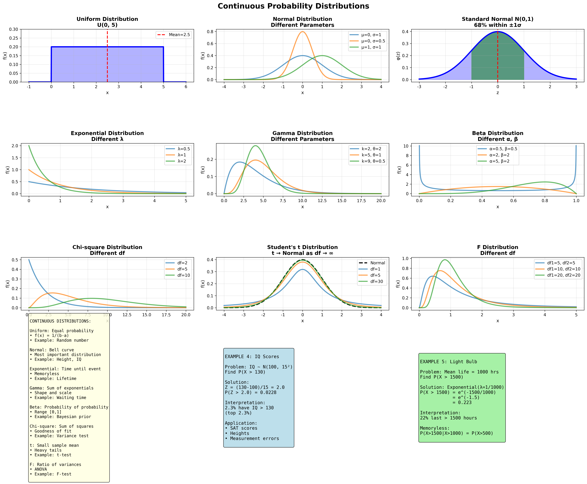
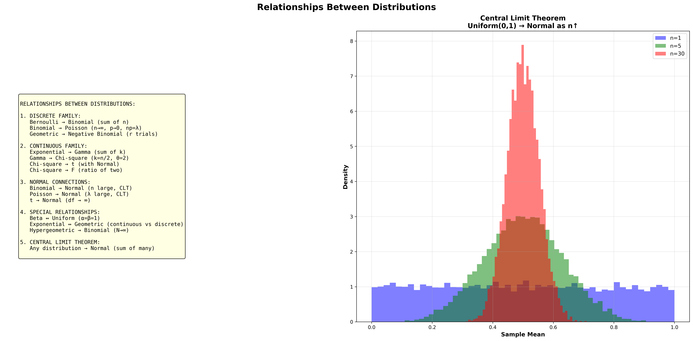

# 확률분포 완벽 가이드

## 📚 목차
1. [이산 확률분포](#이산-확률분포)
2. [연속 확률분포](#연속-확률분포)
3. [분포 간 관계](#분포-간-관계)
4. [분포 선택 가이드](#분포-선택-가이드)
5. [종합 비교표](#종합-비교표)

---

## 이산 확률분포



### 1. 베르누이 분포 (Bernoulli Distribution)

#### 정의
**단 한 번의 시행에서 성공(1) 또는 실패(0)의 결과**

#### 확률질량함수 (PMF)
```
P(X = k) = p^k (1-p)^(1-k),  k ∈ {0, 1}

또는:
P(X = 1) = p
P(X = 0) = 1 - p
```

#### 모수
- **p**: 성공 확률 (0 ≤ p ≤ 1)

#### 평균과 분산
```
평균 (E[X]): μ = p
분산 (Var(X)): σ² = p(1-p)
```

#### 언제 사용하는가?

**사용 조건:**
```
• 시행이 단 한 번
• 결과가 2가지 (성공/실패, 참/거짓)
• 성공 확률이 일정
```

**실제 예시:**
```
1. 동전 던지기
   • 앞면(1) = 성공, 뒷면(0) = 실패
   • p = 0.5

2. 제품 검사
   • 불량(1), 정상(0)
   • p = 불량률

3. 광고 클릭
   • 클릭(1), 무시(0)
   • p = 클릭률

4. 시험 문제
   • 정답(1), 오답(0)
   • p = 정답률

5. 의학 진단
   • 양성(1), 음성(0)
   • p = 발병률
```

---

### 2. 이항분포 (Binomial Distribution)

#### 정의
**n번의 독립적인 베르누이 시행에서 성공 횟수**

#### 확률질량함수 (PMF)
```
P(X = k) = C(n,k) × p^k × (1-p)^(n-k)

여기서:
C(n,k) = n! / (k!(n-k)!) (조합)
k = 0, 1, 2, ..., n
```

#### 모수
- **n**: 시행 횟수
- **p**: 각 시행의 성공 확률

#### 평균과 분산
```
평균: μ = np
분산: σ² = np(1-p)
표준편차: σ = √(np(1-p))
```

#### 언제 사용하는가?

**사용 조건:**
```
• n번의 독립 시행
• 각 시행은 베르누이 (성공/실패)
• 성공 확률 p가 모든 시행에서 동일
• 시행들이 서로 독립
```

**실제 예시:**
```
1. 품질 관리
   • 100개 제품 중 불량품 수
   • n=100, p=불량률
   • X ~ Binomial(100, 0.05)

2. 여론 조사
   • 1000명 중 찬성자 수
   • n=1000, p=찬성률
   • "표본 크기 n명 중 k명 찬성"

3. 의약품 효과
   • 20명 환자 중 치료 성공 수
   • n=20, p=치료 성공률
   • 임상시험 결과 분석

4. 마케팅 캠페인
   • 500명 이메일 수신자 중 클릭 수
   • n=500, p=클릭률
   • 전환율 측정

5. 시험 성적
   • 10문제 중 맞힌 문제 수
   • n=10, p=0.7 (실력)
   • "10문제 중 8문제 이상 맞을 확률?"
```

**계산 예제:**
```
문제: 동전을 10번 던질 때 앞면이 정확히 6번 나올 확률?

해답: n=10, p=0.5, k=6
P(X=6) = C(10,6) × (0.5)^6 × (0.5)^4
       = 210 × 0.015625 × 0.0625
       = 0.205 (20.5%)
```

---

### 3. 기하분포 (Geometric Distribution)

#### 정의
**첫 번째 성공까지 걸리는 시행 횟수**

#### 확률질량함수 (PMF)
```
P(X = k) = (1-p)^(k-1) × p,  k = 1, 2, 3, ...

첫 (k-1)번 실패하고 k번째에 성공
```

#### 모수
- **p**: 각 시행의 성공 확률

#### 평균과 분산
```
평균: μ = 1/p
분산: σ² = (1-p)/p²
```

#### 무기억성 (Memoryless Property)
```
P(X > n+m | X > n) = P(X > m)

"이미 n번 실패했다는 정보는 미래에 영향 없음"
```

#### 언제 사용하는가?

**사용 조건:**
```
• 성공할 때까지 계속 시행
• 각 시행은 독립적
• 성공 확률 p가 일정
• "몇 번 만에 성공?"
```

**실제 예시:**
```
1. 주사위 게임
   • 6이 나올 때까지 몇 번?
   • p = 1/6
   • E[X] = 6번

2. 고객 확보
   • 첫 고객 획득까지 전화 통화 수
   • p = 전환율
   • "평균 몇 통화 필요?"

3. 복권
   • 첫 당첨까지 구매 횟수
   • p = 당첨 확률
   • E[X] = 1/p

4. 구직 활동
   • 첫 면접 통과까지 지원 수
   • p = 통과율
   • 평균 지원 횟수 추정

5. 기계 고장
   • 첫 고장까지 가동 시간 (이산)
   • p = 고장 확률/시간
```

**계산 예제:**
```
문제: 불량률 10%인 제품에서 첫 불량품을 발견하기까지 
      평균 몇 개 검사?

해답: p = 0.1
E[X] = 1/0.1 = 10개
```

---

### 4. 음이항분포 (Negative Binomial Distribution)

#### 정의
**r번째 성공까지 발생한 실패 횟수**

#### 확률질량함수 (PMF)
```
P(X = k) = C(k+r-1, k) × p^r × (1-p)^k

k = 0, 1, 2, ... (실패 횟수)
r = 목표 성공 횟수
```

#### 모수
- **r**: 원하는 성공 횟수
- **p**: 각 시행의 성공 확률

#### 평균과 분산
```
평균: μ = r(1-p)/p
분산: σ² = r(1-p)/p²
```

#### 언제 사용하는가?

**사용 조건:**
```
• r번 성공할 때까지 시행
• 기하분포의 일반화 (r=1이면 기하분포)
• 각 시행은 독립적
```

**실제 예시:**
```
1. 영업 활동
   • 5명 고객 확보까지 거절 수
   • r=5, p=성공률
   • "평균 몇 번 거절당하나?"

2. 스포츠
   • 3승까지 패배 경기 수
   • r=3, p=승률
   • 시리즈 게임 분석

3. 품질 관리
   • 불량품 10개 발견까지 정상품 수
   • r=10, p=불량률
   • 검사 계획 수립

4. 모금 활동
   • 목표액 달성까지 거절당한 횟수
   • r=목표 기부자 수
```

---

### 5. 포아송 분포 (Poisson Distribution)

#### 정의
**일정한 시간/공간 구간에서 발생하는 사건의 횟수**

#### 확률질량함수 (PMF)
```
P(X = k) = (e^(-λ) × λ^k) / k!

k = 0, 1, 2, ...
e ≈ 2.71828
```

#### 모수
- **λ (lambda)**: 단위 구간당 평균 발생 횟수

#### 평균과 분산
```
평균: μ = λ
분산: σ² = λ
표준편차: σ = √λ

특이점: 평균 = 분산
```

#### 언제 사용하는가?

**사용 조건:**
```
• 사건이 일정한 평균 비율로 발생
• 사건들이 독립적
• 동시에 2개 발생 확률 ≈ 0
• 희귀 사건 (p 작고 n 큼)
```

**실제 예시:**
```
1. 콜센터
   • 1시간당 전화 수
   • λ = 시간당 평균 통화 수
   • "다음 시간에 전화 10통 올 확률?"

2. 교통 사고
   • 하루당 사고 건수
   • λ = 일평균 사고 수
   • 교통 안전 정책 평가

3. 웹사이트 트래픽
   • 분당 방문자 수
   • λ = 분당 평균 방문
   • 서버 용량 계획

4. 방사능 붕괴
   • 단위 시간당 붕괴 수
   • λ = 붕괴 상수
   • 물리학 실험

5. 제조 결함
   • 직물 1m²당 결함 수
   • λ = 평균 결함 밀도
   • 품질 기준 설정

6. 고객 도착
   • 은행 창구에 10분당 도착 수
   • λ = 10분당 평균 고객
   • 대기열 이론

7. 이메일 수신
   • 하루 스팸메일 수
   • λ = 일평균 스팸
```

**계산 예제:**
```
문제: 콜센터에 시간당 평균 4통의 전화. 
      다음 시간에 정확히 6통 올 확률?

해답: λ = 4
P(X=6) = (e^(-4) × 4^6) / 6!
       = (0.0183 × 4096) / 720
       = 0.104 (10.4%)
```

**포아송 근사:**
```
이항분포 → 포아송 근사 조건:
• n이 크고 (n ≥ 20)
• p가 작고 (p ≤ 0.05)
• np = λ가 적당 (λ < 10)

예: Binomial(100, 0.02) ≈ Poisson(2)
```

---

### 6. 초기하분포 (Hypergeometric Distribution)

#### 정의
**비복원 추출에서 성공 횟수 (유한 모집단)**

#### 확률질량함수 (PMF)
```
P(X = k) = C(K, k) × C(N-K, n-k) / C(N, n)

여기서:
N = 전체 모집단 크기
K = 모집단 내 성공 개수
n = 추출 개수
k = 추출된 성공 개수
```

#### 모수
- **N**: 전체 크기
- **K**: 성공 개수
- **n**: 추출 개수

#### 평균과 분산
```
평균: μ = n(K/N) = np  (여기서 p=K/N)
분산: σ² = np(1-p) × [(N-n)/(N-1)]

(N-n)/(N-1) = 유한모집단 수정계수
```

#### 이항분포와의 차이
```
이항분포: 복원 추출 (독립)
초기하분포: 비복원 추출 (종속)

N → ∞ 이면 초기하 → 이항
```

#### 언제 사용하는가?

**사용 조건:**
```
• 유한 모집단에서 추출
• 비복원 추출 (한 번 뽑으면 안 돌려놓음)
• 모집단 크기가 작음
• "N개 중 n개 뽑을 때"
```

**실제 예시:**
```
1. 카드 게임
   • 52장 중 5장 뽑을 때 하트 개수
   • N=52, K=13, n=5
   • "하트가 2장 나올 확률?"

2. 불량품 검사
   • 100개 중 10개 샘플링, 불량 2개 있을 때
   • N=100, K=2, n=10
   • "샘플에 불량품 1개 나올 확률?"

3. 복권
   • 총 45개 번호 중 6개 선택
   • N=45, K=6(당첨번호), n=6
   • "3개 맞을 확률?"

4. 인사 선발
   • 남자 30명, 여자 20명 중 10명 선발
   • 여자가 정확히 4명일 확률
   • N=50, K=20, n=10, k=4

5. 품질 관리 (샘플링)
   • 로트 크기 작을 때
   • 비복원 샘플링
   • 수리 샘플링 계획
```

**계산 예제:**
```
문제: 50명(남30, 여20) 중 10명 뽑을 때 여자 4명 확률?

해답: N=50, K=20, n=10, k=4
P(X=4) = C(20,4) × C(30,6) / C(50,10)
       = 4845 × 593775 / 10272278170
       = 0.280 (28%)
```

---

## 연속 확률분포



### 7. 균등분포 (Uniform Distribution)

#### 정의
**구간 [a, b]에서 모든 값이 동일한 확률**

#### 확률밀도함수 (PDF)
```
f(x) = 1/(b-a),  a ≤ x ≤ b
     = 0,        otherwise
```

#### 모수
- **a**: 최솟값
- **b**: 최댓값

#### 평균과 분산
```
평균: μ = (a+b)/2
분산: σ² = (b-a)²/12
```

#### 누적분포함수 (CDF)
```
F(x) = 0,           x < a
     = (x-a)/(b-a), a ≤ x ≤ b
     = 1,           x > b
```

#### 언제 사용하는가?

**사용 조건:**
```
• 모든 값이 똑같이 가능
• 최솟값과 최댓값만 알고 있음
• 특별한 편향 없음
```

**실제 예시:**
```
1. 난수 생성
   • 컴퓨터 random(): U(0,1)
   • 모든 숫자가 동일 확률
   • 시뮬레이션 기초

2. 버스 대기 시간
   • 10분 간격 버스
   • 도착 시간 모를 때
   • U(0, 10분)

3. 각도
   • 룰렛 정지 각도
   • U(0°, 360°)
   • 모든 각도 동일 확률

4. 제조 오차
   • 사양: 100±0.5mm
   • 균등 분포 가정
   • U(99.5, 100.5)

5. 시뮬레이션
   • 몬테카를로 방법
   • 기준 난수 생성
```

---

### 8. 정규분포 (Normal/Gaussian Distribution)

#### 정의
**가장 중요한 연속 확률분포, 종 모양(bell curve)**

#### 확률밀도함수 (PDF)
```
f(x) = (1/(σ√(2π))) × exp(-(x-μ)²/(2σ²))

-∞ < x < ∞
```

#### 모수
- **μ (mu)**: 평균 (위치 모수)
- **σ (sigma)**: 표준편차 (척도 모수)

#### 표기
```
X ~ N(μ, σ²)
```

#### 표준정규분포
```
Z = (X - μ) / σ
Z ~ N(0, 1)

표준화 변환
```

#### 68-95-99.7 규칙
```
P(μ - σ ≤ X ≤ μ + σ) ≈ 0.68 (68%)
P(μ - 2σ ≤ X ≤ μ + 2σ) ≈ 0.95 (95%)
P(μ - 3σ ≤ X ≤ μ + 3σ) ≈ 0.997 (99.7%)
```

#### 평균과 분산
```
평균: μ
분산: σ²
왜도: 0 (대칭)
첨도: 3
```

#### 언제 사용하는가?

**사용 조건:**
```
• 자연 현상의 측정값
• 많은 독립 요인의 합
• 중심극한정리 (표본 평균)
• 대칭적 분포
```

**실제 예시:**
```
1. 신체 측정
   • 키: N(170, 10²) cm
   • 몸무게: N(65, 15²) kg
   • IQ: N(100, 15²)
   • 자연스러운 변동

2. 측정 오차
   • 실험 측정값
   • 기기 오차
   • N(0, σ²) 가정

3. 시험 점수
   • SAT, GRE 점수
   • 표준화 시험
   • 평가 기준

4. 금융
   • 주가 수익률
   • 포트폴리오 이론
   • 리스크 관리

5. 품질 관리
   • 제품 규격
   • 공정 능력
   • 6 시그마

6. 자연 과학
   • 분자 속도
   • 측정 불확실성
   • 실험 데이터

7. 사회 과학
   • 소득 분포 (로그정규)
   • 여론 조사
   • 심리학 연구
```

**계산 예제:**
```
문제: IQ ~ N(100, 15²). P(IQ > 130)?

해답: 
Z = (130 - 100) / 15 = 2.0
P(Z > 2.0) = 0.0228
→ 상위 2.28%
```

**중요성:**
```
1. 중심극한정리
   • 어떤 분포든 평균은 정규분포
   • 표본 크기 충분하면

2. 통계 검정
   • t-test, ANOVA
   • 회귀분석
   • 신뢰구간

3. 자연의 법칙
   • 가장 흔한 분포
   • 많은 현상 설명
```

---

### 9. 지수분포 (Exponential Distribution)

#### 정의
**사건 발생까지의 대기 시간 (연속형)**

#### 확률밀도함수 (PDF)
```
f(x) = λe^(-λx),  x ≥ 0
     = 0,         x < 0

λ = 발생률 (rate)
```

#### 모수
- **λ (lambda)**: 단위 시간당 발생률
- 또는 **θ = 1/λ**: 평균 대기 시간

#### 평균과 분산
```
평균: μ = 1/λ
분산: σ² = 1/λ²
```

#### 누적분포함수 (CDF)
```
F(x) = 1 - e^(-λx),  x ≥ 0
```

#### 무기억성 (Memoryless)
```
P(X > s+t | X > s) = P(X > t)

"이미 s시간 기다렸어도 앞으로 t시간 더 기다릴 확률은 똑같다"
```

#### 언제 사용하는가?

**사용 조건:**
```
• 사건 간 시간 간격
• 포아송 과정의 연속 버전
• 무기억 성질
• 양의 값만
```

**실제 예시:**
```
1. 전자 부품 수명
   • 평균 수명 1000시간
   • λ = 1/1000
   • "500시간 이상 작동 확률?"

2. 고객 서비스
   • 다음 고객까지 대기 시간
   • λ = 고객 도착률
   • 대기열 이론

3. 방사능 붕괴
   • 붕괴까지 시간
   • 반감기와 관련
   • 물리학

4. 전화 통화
   • 통화 시작 간 시간
   • 콜센터 분석
   • 평균 통화 간격

5. 지진 발생
   • 다음 지진까지 시간
   • 재해 예측
   • 보험 수리

6. 교통 흐름
   • 차량 간 시간 간격
   • 교통 공학
```

**계산 예제:**
```
문제: 전구 평균 수명 1000시간. 1500시간 이상?

해답: λ = 1/1000 = 0.001
P(X > 1500) = e^(-0.001×1500)
            = e^(-1.5)
            = 0.223 (22.3%)
```

**포아송과의 관계:**
```
포아송: 단위 시간 내 사건 횟수
지수분포: 사건 간 시간 간격

λ가 같으면 서로 대응
```

---

### 10. 감마분포 (Gamma Distribution)

#### 정의
**k개 독립 지수분포의 합**

#### 확률밀도함수 (PDF)
```
f(x) = (1/(θ^k Γ(k))) × x^(k-1) × e^(-x/θ),  x > 0

Γ(k) = (k-1)! (k가 정수일 때)
```

#### 모수
- **k (shape)**: 형태 모수 (사건 횟수)
- **θ (scale)**: 척도 모수 (평균 간격)

#### 평균과 분산
```
평균: μ = kθ
분산: σ² = kθ²
```

#### 특수 경우
```
k = 1: 지수분포
k = n/2, θ = 2: 카이제곱 분포(df=n)
```

#### 언제 사용하는가?

**사용 조건:**
```
• k번째 사건까지의 총 대기 시간
• 지수분포의 일반화
• 긴꼬리 분포 필요
```

**실제 예시:**
```
1. 대기열
   • k명의 고객 서비스 완료 시간
   • k번의 포아송 사건
   • 은행, 병원

2. 보험
   • k건의 청구까지 시간
   • 리스크 모델링
   • 손실 분포

3. 신뢰성 공학
   • k번 고장까지 시간
   • 수리 가능 시스템
   • 예비 부품

4. 강수량
   • 누적 강수량
   • 기상 모델
   • k = shape

5. 재무
   • 누적 손실
   • 꼬리 위험
```

---

### 11. 베타분포 (Beta Distribution)

#### 정의
**[0, 1] 구간의 확률에 대한 확률분포**

#### 확률밀도함수 (PDF)
```
f(x) = (1/B(α,β)) × x^(α-1) × (1-x)^(β-1),  0 ≤ x ≤ 1

B(α,β) = Γ(α)Γ(β) / Γ(α+β) (베타 함수)
```

#### 모수
- **α (alpha)**: 성공 횟수 + 1
- **β (beta)**: 실패 횟수 + 1

#### 평균과 분산
```
평균: μ = α/(α+β)
분산: σ² = αβ / ((α+β)²(α+β+1))
```

#### 특수 경우
```
α = β = 1: 균등분포 U(0,1)
α = β: 대칭
α > β: 오른쪽 치우침
α < β: 왼쪽 치우침
```

#### 언제 사용하는가?

**사용 조건:**
```
• 확률 자체가 불확실
• [0, 1] 범위의 값
• 베이지안 추론
• 비율, 백분율
```

**실제 예시:**
```
1. 베이지안 통계
   • 이항분포의 사전분포
   • 성공률 추정
   • Beta(α, β)

2. 프로젝트 관리
   • 완료 비율
   • 진척도 모델링
   • PERT

3. 야구 타율
   • 선수의 진짜 타율
   • 시즌 초반 예측
   • 베이지안 업데이트

4. 광고 클릭률
   • 실제 CTR 분포
   • A/B 테스트
   • 사전 정보 반영

5. 품질 비율
   • 합격률 추정
   • 사전 지식 활용

6. 의학
   • 치료 성공률
   • 임상시험 설계
```

**베이지안 예제:**
```
사전 분포: Beta(2, 2) (약간 균등)
관측: 10번 중 7번 성공
사후 분포: Beta(2+7, 2+3) = Beta(9, 5)

사후 평균 = 9/(9+5) = 0.643
```

---

### 12. 카이제곱 분포 (Chi-square Distribution)

#### 정의
**독립 표준정규분포 제곱의 합**

#### 확률밀도함수 (PDF)
```
χ² = Z₁² + Z₂² + ... + Zₖ²

f(x) = (1/(2^(k/2) Γ(k/2))) × x^(k/2-1) × e^(-x/2)

x ≥ 0
```

#### 모수
- **k (df)**: 자유도 (degrees of freedom)

#### 평균과 분산
```
평균: μ = k
분산: σ² = 2k
```

#### 언제 사용하는가?

**사용 조건:**
```
• 분산의 추정
• 적합도 검정
• 독립성 검정
• k개 정규변수 제곱합
```

**실제 예시:**
```
1. 적합도 검정 (Goodness-of-fit)
   • 관측 vs 기대 빈도
   • χ² = Σ(O-E)²/E
   • "데이터가 분포에 맞나?"

2. 독립성 검정
   • 분할표 분석
   • 두 변수 독립?
   • 예: 성별과 선호도

3. 분산 검정
   • 모집단 분산 추정
   • s²/σ² ~ χ²(n-1)
   • 품질 관리

4. 회귀 분석
   • 잔차 제곱합
   • 모형 적합도
   • RSS ~ χ²

5. 유전학
   • 멘델 법칙 검정
   • 관측 비율 vs 이론

6. 기계 학습
   • 특징 선택
   • 범주형 변수
```

**계산 예제:**
```
문제: 주사위 공정성 검정
관측: 1(12), 2(15), 3(9), 4(13), 5(10), 6(11)
기대: 각 10회 (총 60회)

χ² = (12-10)²/10 + (15-10)²/10 + ... + (11-10)²/10
   = 0.4 + 2.5 + 0.1 + 0.9 + 0 + 0.1
   = 4.0

df = 6-1 = 5
임계값 (α=0.05): 11.07
4.0 < 11.07 → 공정하다고 봄
```

---

### 13. t-분포 (Student's t Distribution)

#### 정의
**소표본에서 표본평균의 분포**

#### 확률밀도함수 (PDF)
```
t = (X̄ - μ) / (s/√n)

여기서:
X̄ = 표본평균
s = 표본표준편차
n = 표본 크기
```

#### 모수
- **ν (nu, df)**: 자유도 = n - 1

#### 평균과 분산
```
평균: μ = 0 (ν > 1)
분산: σ² = ν/(ν-2) (ν > 2)
```

#### 특징
```
• 정규분포보다 꼬리가 두꺼움
• df → ∞ 이면 t → N(0,1)
• df가 작으면 더 퍼짐
```

#### 언제 사용하는가?

**사용 조건:**
```
• 표본 크기 작음 (n < 30)
• 모분산 σ² 모름
• 표본평균 검정
• 신뢰구간 구성
```

**실제 예시:**
```
1. 단일 표본 t-검정
   • 모평균 검정
   • H₀: μ = μ₀
   • "평균이 100인가?"

2. 두 표본 t-검정
   • 두 집단 평균 비교
   • H₀: μ₁ = μ₂
   • "신약이 효과있나?"

3. 대응 표본 t-검정
   • 전후 비교
   • H₀: μd = 0
   • "훈련 전후 차이?"

4. 회귀 계수 검정
   • β̂ / SE(β̂) ~ t
   • 변수 유의성
   • "기울기가 0인가?"

5. 신뢰구간
   • X̄ ± t(α/2) × (s/√n)
   • n 작을 때
   • 더 넓은 구간

6. 실험 설계
   • 파일럿 연구
   • 소규모 임상시험
   • 예비 조사
```

**계산 예제:**
```
문제: 신약 복용 10명, 평균 혈압 감소 8mmHg, s=3
      유의한 감소인가? (α=0.05)

해답:
H₀: μ = 0 (효과 없음)
t = 8 / (3/√10) = 8.43
df = 9
임계값: t₀.₀₂₅(9) = 2.262
8.43 > 2.262 → 기각
유의한 감소!
```

---

### 14. F-분포 (F Distribution)

#### 정의
**두 카이제곱 분포의 비**

#### 확률밀도함수 (PDF)
```
F = (χ₁²/df₁) / (χ₂²/df₂)

두 독립 χ² 분포의 비율
```

#### 모수
- **df₁**: 분자 자유도
- **df₂**: 분모 자유도

#### 평균과 분산
```
평균: μ = df₂/(df₂-2) (df₂ > 2)
분산: 복잡한 공식
```

#### 특징
```
• 항상 양수 (F > 0)
• 오른쪽 꼬리가 긴 분포
• df에 따라 모양 변화
```

#### 언제 사용하는가?

**사용 조건:**
```
• 두 분산 비교
• 분산분석 (ANOVA)
• 회귀모형 검정
• 비율의 비
```

**실제 예시:**
```
1. 분산 동질성 검정
   • H₀: σ₁² = σ₂²
   • F = s₁²/s₂²
   • "두 집단 분산이 같나?"

2. ANOVA (분산분석)
   • 여러 집단 평균 비교
   • F = MSB/MSW
   • "집단 간 차이 있나?"

3. 회귀 모형 검정
   • 전체 모형 유의성
   • F = MSR/MSE
   • "회귀식이 유의한가?"

4. 반복측정 ANOVA
   • 시간에 따른 변화
   • 집단×시간 상호작용

5. 실험 설계
   • 요인 설계
   • 주효과와 상호작용
   • 2-way, 3-way ANOVA

6. 품질 관리
   • 공정 비교
   • 여러 기계 비교
```

**계산 예제:**
```
문제: 3개 교육 방법 효과 비교
집단1: n₁=10, 평균=85, s₁=5
집단2: n₂=10, 평균=80, s₂=6
집단3: n₃=10, 평균=75, s₃=5

ANOVA:
집단 간 분산 / 집단 내 분산 = F
F = MSB/MSW

계산...
F = 25.0
df₁=2, df₂=27
임계값(α=0.05): 3.35
25.0 > 3.35 → 유의한 차이!
```

---

## 분포 간 관계



### 주요 관계

#### 1. 이산분포 가족

```
Bernoulli(p)
    ↓ (n번 반복)
Binomial(n, p)
    ↓ (n→∞, p→0, np=λ)
Poisson(λ)

Geometric(p)
    ↓ (r번 성공까지)
Negative Binomial(r, p)
```

#### 2. 연속분포 가족

```
Exponential(λ)
    ↓ (k개 합)
Gamma(k, θ)
    ↓ (k=ν/2, θ=2)
Chi-square(ν)

Chi-square(ν)
    ↓ (정규분포와 결합)
t-distribution(ν)

Chi-square(ν₁) / Chi-square(ν₂)
    ↓
F-distribution(ν₁, ν₂)
```

#### 3. 정규분포 연결

```
Binomial(n,p) → N(np, np(1-p))  [n 큼]
Poisson(λ) → N(λ, λ)  [λ 큼]

(X̄ - μ)/(σ/√n) ~ N(0,1)  [중심극한정리]

t(ν) → N(0,1)  [ν→∞]
```

#### 4. 중심극한정리 (CLT)

```
X₁, X₂, ..., Xₙ ~ 어떤 분포(μ, σ²)

X̄ = (X₁ + ... + Xₙ)/n

n이 충분히 크면:
X̄ ~ N(μ, σ²/n)

→ 평균은 항상 정규분포!
```

#### 5. 특수 관계

```
Beta(1, 1) = Uniform(0, 1)
Gamma(1, θ) = Exponential(1/θ)
Chi-square(2) = Exponential(1/2)
```

---

## 분포 선택 가이드

### 의사결정 트리

```
                        START
                          |
        ┌─────────────────┴─────────────────┐
        │                                   │
    이산형?                              연속형?
        │                                   │
   ┌────┴────┐                         ┌────┴────┐
   │         │                         │         │
 횟수?    시행?                      범위?    시간?
   │         │                         │         │
포아송   이항분포                    정규분포   지수분포
```

### 질문별 선택

**Q1: 데이터가 이산형인가 연속형인가?**
```
이산형 → 이산 확률분포
연속형 → 연속 확률분포
```

**Q2: 무엇을 세는가?**
```
성공 횟수 → 이항분포
사건 발생 수 → 포아송분포
시행 횟수 → 기하분포
```

**Q3: 무엇을 측정하는가?**
```
시간 → 지수/감마분포
길이/무게 → 정규분포
비율 → 베타분포
```

**Q4: 특수 조건?**
```
복원 추출? → 이항분포
비복원 추출? → 초기하분포
소표본? → t-분포
분산 비교? → F-분포
```

---

## 종합 비교표

### 이산 확률분포 비교

| 분포 | 표기 | PMF | 평균 | 분산 | 사용 시기 |
|------|------|-----|------|------|-----------|
| **베르누이** | Bern(p) | p^k(1-p)^(1-k) | p | p(1-p) | 단일 시행 |
| **이항** | Bin(n,p) | C(n,k)p^k(1-p)^(n-k) | np | np(1-p) | n번 독립시행 |
| **기하** | Geo(p) | (1-p)^(k-1)p | 1/p | (1-p)/p² | 첫 성공까지 |
| **음이항** | NB(r,p) | C(k+r-1,k)p^r(1-p)^k | r(1-p)/p | r(1-p)/p² | r번 성공까지 |
| **포아송** | Pois(λ) | e^(-λ)λ^k/k! | λ | λ | 희귀 사건 |
| **초기하** | Hyper(N,K,n) | C(K,k)C(N-K,n-k)/C(N,n) | np | np(1-p)(N-n)/(N-1) | 비복원 추출 |

### 연속 확률분포 비교

| 분포 | 표기 | 평균 | 분산 | 사용 시기 | 비고 |
|------|------|------|------|-----------|------|
| **균등** | U(a,b) | (a+b)/2 | (b-a)²/12 | 동일 확률 | 난수 생성 |
| **정규** | N(μ,σ²) | μ | σ² | 자연 현상 | 가장 중요 |
| **지수** | Exp(λ) | 1/λ | 1/λ² | 대기 시간 | 무기억성 |
| **감마** | Gamma(k,θ) | kθ | kθ² | k개 합 | 지수 일반화 |
| **베타** | Beta(α,β) | α/(α+β) | αβ/((α+β)²(α+β+1)) | [0,1] 값 | 베이지안 |
| **카이제곱** | χ²(k) | k | 2k | 분산 검정 | k개 제곱합 |
| **t** | t(ν) | 0 | ν/(ν-2) | 소표본 평균 | 두꺼운 꼬리 |
| **F** | F(ν₁,ν₂) | ν₂/(ν₂-2) | 복잡 | 분산 비교 | ANOVA |

### 주요 특성 비교

| 분포 | 모수 개수 | 치역 | 대칭성 | 특이점 |
|------|-----------|------|--------|--------|
| **베르누이** | 1 (p) | {0,1} | 일반적으로 비대칭 | 가장 단순 |
| **이항** | 2 (n,p) | {0,1,...,n} | p=0.5일 때 대칭 | 베르누이 합 |
| **포아송** | 1 (λ) | {0,1,2,...} | λ 클 때 대칭 | E=Var=λ |
| **정규** | 2 (μ,σ) | (-∞,∞) | 대칭 | 중심극한정리 |
| **지수** | 1 (λ) | [0,∞) | 비대칭 | 무기억성 |
| **카이제곱** | 1 (df) | [0,∞) | 비대칭 | 정규 제곱합 |
| **t** | 1 (df) | (-∞,∞) | 대칭 | 두꺼운 꼬리 |

### 실무 적용 가이드

| 분야 | 주로 사용하는 분포 | 예시 |
|------|-------------------|------|
| **품질 관리** | 이항, 정규, 포아송 | 불량률, 공정 능력 |
| **신뢰성 공학** | 지수, 감마, 와이블 | 수명 분석 |
| **금융** | 정규, 로그정규 | 주가 수익률 |
| **보험** | 포아송, 감마, 파레토 | 청구 건수, 손실액 |
| **의학** | 이항, t, 카이제곱 | 임상시험, 유전 |
| **마케팅** | 베르누이, 이항, 포아송 | 클릭률, 구매 |
| **통신** | 포아송, 지수 | 호 도착, 대기 시간 |
| **기계 학습** | 정규, 베타, 디리클레 | 가우시안 프로세스 |

---

## 요약 카드

```
┌──────────────────────────────────────────┐
│       확률분포 핵심 요약                   │
├──────────────────────────────────────────┤
│                                          │
│  이산형:                                  │
│  • 베르누이: 단일 시행                     │
│  • 이항: n번 시행                         │
│  • 포아송: 희귀 사건                       │
│  • 기하: 첫 성공까지                       │
│                                          │
│  연속형:                                  │
│  • 정규: 가장 중요 (CLT)                  │
│  • 지수: 대기 시간                        │
│  • t: 소표본 평균                         │
│  • F: 분산 비교                          │
│                                          │
│  선택 가이드:                             │
│  1. 이산 vs 연속?                        │
│  2. 무엇을 세나/측정하나?                  │
│  3. 특수 조건?                           │
│                                          │
│  핵심: 상황에 맞는 분포 선택!              │
│                                          │
└──────────────────────────────────────────┘
```

---

**핵심: "데이터 특성과 상황에 따라 적절한 확률분포를 선택하는 것이 통계 분석의 시작!"** 📊🎲✨
